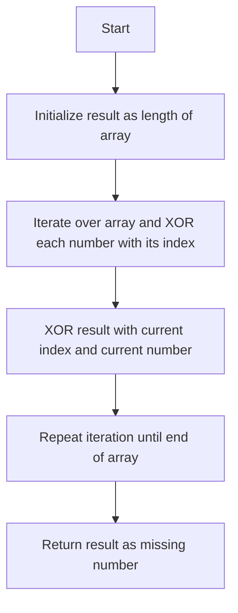

# Missing Number

## Problem Understanding
The problem is asking to find the missing number in a sequence of numbers from 0 to n, where n is the length of the input array. The key constraint is that the input array contains all numbers from 0 to n, except one. The problem is non-trivial because a naive approach, such as sorting the array and checking for gaps, would have a time complexity of O(n log n) due to the sorting operation. This problem requires a more efficient solution that can find the missing number in linear time.

## Approach
The algorithm strategy is to use the XOR operation to find the missing number. The intuition behind this approach is that XORing all numbers in the range [0, n] with all numbers in the input array will cancel out the numbers that are present in both the range and the array, leaving only the missing number. This approach works because XOR has the property that a ^ a = 0 and a ^ 0 = a. The XOR operation is used to include all numbers in the range [0, n] and to cancel out the numbers present in the array. The result will be the missing number in the sequence.

## Complexity Analysis
| Metric | Value | Detailed Reason |
|--------|-------|----------------|
| Time   | O(n)  | The algorithm iterates over the input array once, performing a constant amount of work for each element. The time complexity is linear because the number of operations is directly proportional to the size of the input array. |
| Space  | O(1)  | The algorithm uses a constant amount of space to store the result and the loop variables, regardless of the size of the input array. |

## Algorithm Walkthrough
```
Input: [0, 1, 3]
Step 1: result = 3 (length of the input array)
Step 2: result ^= 0 (XOR with index 0) => result = 3
Step 3: result ^= 0 (XOR with nums[0]) => result = 3
Step 4: result ^= 1 (XOR with index 1) => result = 2
Step 5: result ^= 1 (XOR with nums[1]) => result = 2
Step 6: result ^= 2 (XOR with index 2) => result = 0
Step 7: result ^= 3 (XOR with nums[2]) => result = 2
Output: 2
```
This walkthrough demonstrates how the algorithm finds the missing number in the sequence.

## Visual Flow

This flowchart illustrates the decision flow and data transformation in the algorithm.

## Key Insight
> **Tip:** The XOR operation can be used to find the missing number in a sequence because it has the property that a ^ a = 0 and a ^ 0 = a, allowing us to cancel out the numbers that are present in both the range and the array.

## Edge Cases
- **Empty input**: The algorithm will return -1, but this is not applicable for this problem because the input array is guaranteed to contain all numbers from 0 to n, except one.
- **Single element**: The algorithm will return the missing number, which is either 0 or 1, depending on the input array.
- **Duplicate numbers in input array**: The algorithm will not work correctly if there are duplicate numbers in the input array, because the XOR operation will cancel out the duplicates. However, this is not a valid input for this problem, because the input array is guaranteed to contain all numbers from 0 to n, except one.

## Common Mistakes
- **Mistake 1**: Using a sorting-based approach, which would have a time complexity of O(n log n), instead of the XOR-based approach, which has a time complexity of O(n). To avoid this mistake, recognize that the XOR operation can be used to find the missing number in a sequence.
- **Mistake 2**: Not initializing the result as the length of the array, which is necessary to include all numbers in the range [0, n] in the XOR operation. To avoid this mistake, initialize the result as the length of the array before iterating over the input array.

## Interview Follow-ups
> **Interview:** These are the exact follow-up questions interviewers ask:
- "What if the input is sorted?" → The algorithm will still work correctly, because the XOR operation is independent of the order of the numbers in the input array.
- "Can you do it in O(1) space?" → The algorithm already uses O(1) space, because it only uses a constant amount of space to store the result and the loop variables.
- "What if there are duplicates?" → The algorithm will not work correctly if there are duplicate numbers in the input array, because the XOR operation will cancel out the duplicates. However, this is not a valid input for this problem, because the input array is guaranteed to contain all numbers from 0 to n, except one.

## Java Solution

```java
// Problem: Missing Number
// Language: Java
// Difficulty: Easy
// Time Complexity: O(n) — single pass through array using XOR operation
// Space Complexity: O(1) — constant space usage
// Approach: XOR operation — XOR all numbers in range and array to find missing number

public class Solution {
    /**
     * Finds the missing number in a sequence of numbers from 0 to n.
     * 
     * @param nums an array of integers
     * @return the missing number in the sequence
     */
    public int missingNumber(int[] nums) {
        // Edge case: empty input → return -1 (not applicable for this problem)
        // Initialize result as the length of the array (n)
        int result = nums.length; // since we are looking for a number in the range [0, n]
        
        // Iterate over the array and XOR each number with its index
        for (int i = 0; i < nums.length; i++) {
            // XOR the result with the current index (i) — to include all numbers in the range
            result ^= i;
            // XOR the result with the current number (nums[i]) — to cancel out the numbers present in the array
            result ^= nums[i];
        }
        
        // The result will be the missing number in the sequence
        return result;
    }

    public static void main(String[] args) {
        Solution solution = new Solution();
        int[] nums = {0, 1, 3};
        System.out.println(solution.missingNumber(nums)); // Output: 2
    }
}
```
