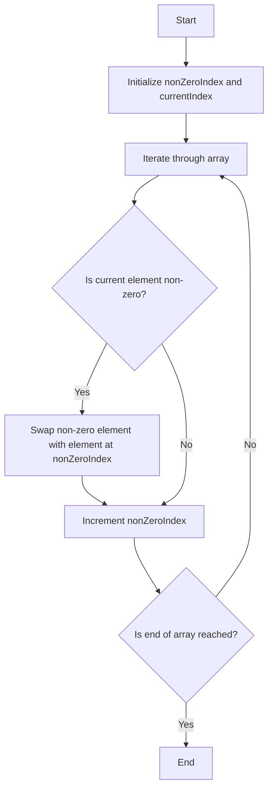

# Move Zeroes

## Problem Understanding
The problem requires moving all zeroes to the end of the array while maintaining the relative order of non-zero elements. The key constraint is that the solution should not use any extra space, meaning it must be done in-place. This problem is non-trivial because a naive approach would involve using additional space to store non-zero elements, but the constraint demands a more efficient solution. The problem's difficulty lies in achieving this in a single pass through the array.

## Approach
The algorithm strategy used here is the two-pointer technique, where one pointer tracks the position of the next non-zero element and the other pointer iterates through the array. The intuition behind this approach is to swap non-zero elements with the element at the non-zero index, effectively moving non-zero elements to the front of the array while maintaining their relative order. This approach works because it ensures that all non-zero elements are moved to the front in a single pass, and the relative order is preserved due to the iterative nature of the algorithm. The data structure used is an array, and it is chosen because the problem requires an in-place solution.

## Complexity Analysis
| Metric | Value | Detailed Reason |
|--------|-------|----------------|
| Time   | O(n)  | The algorithm iterates through the array once, where n is the number of elements in the array. Each operation within the loop (comparing and swapping) takes constant time, so the overall time complexity is linear. |
| Space  | O(1)  | The algorithm uses a constant amount of space to store the pointers (nonZeroIndex and currentIndex) and a temporary variable for swapping, regardless of the size of the input array. |

## Algorithm Walkthrough
```
Input: [0, 1, 0, 3, 12]
Step 1: nonZeroIndex = 0, currentIndex = 0, nums[0] = 0 (do nothing)
Step 2: nonZeroIndex = 0, currentIndex = 1, nums[1] = 1 (swap nums[0] and nums[1]), nonZeroIndex = 1, nums = [1, 0, 0, 3, 12]
Step 3: nonZeroIndex = 1, currentIndex = 2, nums[2] = 0 (do nothing)
Step 4: nonZeroIndex = 1, currentIndex = 3, nums[3] = 3 (swap nums[1] and nums[3]), nonZeroIndex = 2, nums = [1, 3, 0, 0, 12]
Step 5: nonZeroIndex = 2, currentIndex = 4, nums[4] = 12 (swap nums[2] and nums[4]), nonZeroIndex = 3, nums = [1, 3, 12, 0, 0]
Output: [1, 3, 12, 0, 0]
```

## Visual Flow


## Key Insight
> The key to solving this problem efficiently is using the two-pointer technique to track and swap non-zero elements in a single pass through the array.

## Edge Cases
- **Empty input**: The algorithm handles this case by simply not entering the loop, as the condition `currentIndex < nums.length` is immediately false, and no action is needed.
- **Single element**: If the single element is non-zero, the algorithm does not change the array. If the single element is zero, the algorithm also does not change the array, as there are no non-zero elements to move.
- **Array with all zeroes**: The algorithm leaves the array unchanged, as there are no non-zero elements to move.

## Common Mistakes
- **Mistake 1: Using extra space**: Attempting to solve the problem by using additional arrays or lists to store non-zero elements, which violates the space complexity constraint. To avoid this, ensure that the solution only uses a constant amount of extra space.
- **Mistake 2: Not preserving relative order**: Failing to maintain the relative order of non-zero elements. To avoid this, ensure that non-zero elements are moved to the front of the array in the order they appear in the original array.

## Interview Follow-ups
> **Interview:** These are the exact follow-up questions interviewers ask:
- "What if the input is sorted?" → The algorithm still works in O(n) time because it iterates through the array once, regardless of the initial order.
- "Can you do it in O(1) space?" → The given solution already achieves this, using only a constant amount of space for pointers and a temporary variable.
- "What if there are duplicates?" → The algorithm handles duplicates correctly by maintaining the relative order of all non-zero elements, including duplicates.

## Java Solution

```java
// Problem: Move Zeroes
// Language: Java
// Difficulty: Easy
// Time Complexity: O(n) — single pass through array
// Space Complexity: O(1) — no extra space used, only pointers
// Approach: Two-pointer technique — track non-zero elements and swap with zeroes

public class Solution {
    /**
     * Move all zeroes to the end of the array while maintaining the relative order of non-zero elements.
     * 
     * @param nums The input array containing zeroes and non-zero elements.
     */
    public void moveZeroes(int[] nums) {
        // Initialize two pointers: one for non-zero elements and one for the current element being processed
        int nonZeroIndex = 0; // Index of the next non-zero element
        for (int currentIndex = 0; currentIndex < nums.length; currentIndex++) {
            // Check if the current element is non-zero
            if (nums[currentIndex] != 0) {
                // Swap the non-zero element with the element at the nonZeroIndex
                // This effectively moves the non-zero element to the front of the array
                int temp = nums[nonZeroIndex]; 
                nums[nonZeroIndex] = nums[currentIndex]; // Swap non-zero element with current element
                nums[currentIndex] = temp; // Swap current element with non-zero element
                // Increment the nonZeroIndex to track the next position for a non-zero element
                nonZeroIndex++;
            }
            // Edge case: empty input → return immediately (already handled by the loop condition)
            // Edge case: single element → no action needed (already handled by the loop condition)
        }
    }

    public static void main(String[] args) {
        Solution solution = new Solution();
        int[] nums = {0, 1, 0, 3, 12};
        solution.moveZeroes(nums);
        for (int num : nums) {
            System.out.print(num + " ");
        }
    }
}
```
