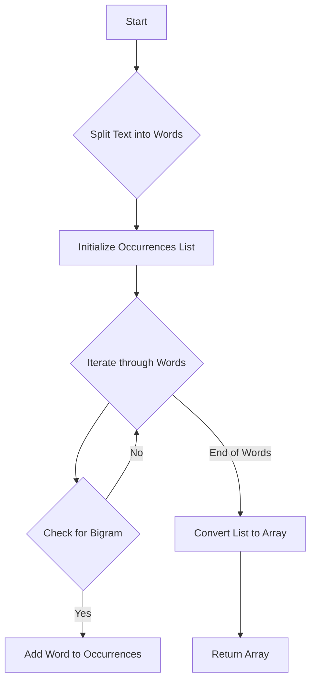

# Occurrences After Bigram

## Problem Understanding
The problem "Occurrences After Bigram" is asking to find all the words that occur after a specific bigram (a sequence of two words) in a given text. The key constraint here is that we need to find the words that occur immediately after the bigram, not just any word that occurs later in the text. What makes this problem non-trivial is that we need to efficiently parse the text and identify the bigram, and then find the words that occur after it. A naive approach might involve checking every pair of words in the text, which would be inefficient.

## Approach
The algorithm strategy used here is a simple string parsing approach, where we split the text into words and then iterate through the words to find the bigram. The intuition behind this approach is that we can efficiently find the bigram by checking each pair of adjacent words, and then add the word after the bigram to the list of occurrences. We use an ArrayList to store the occurrences, which allows us to dynamically add elements as we find them. This approach works because it takes advantage of the fact that the bigram is a fixed sequence of two words, and we can use this to efficiently identify the words that occur after it.

## Complexity Analysis
| Metric | Value | Detailed Reason |
|--------|-------|----------------|
| Time   | O(n)  | We make a single pass through the string, where n is the number of words in the string. Each operation (splitting, iterating, comparing) takes constant time, so the overall time complexity is linear. |
| Space  | O(n)  | We store the occurrences of words in an ArrayList, which can grow up to the size of the input string in the worst case (if every pair of words matches the bigram). Therefore, the space complexity is also linear. |

## Algorithm Walkthrough
```
Input: text = "we will we will rock you", first = "we", second = "will"
Step 1: Split the text into words = ["we", "will", "we", "will", "rock", "you"]
Step 2: Initialize an empty list to store occurrences
Step 3: Iterate through the words:
  - i = 0: words[0] = "we", words[1] = "will", words[2] = "we" (matches bigram), add "we" to occurrences
  - i = 1: words[1] = "will", words[2] = "we", words[3] = "will" (matches bigram), add "will" to occurrences
  - i = 2: words[2] = "we", words[3] = "will", words[4] = "rock" (matches bigram), add "rock" to occurrences
  - i = 3: words[3] = "will", words[4] = "rock", words[5] = "you" (no match)
Step 4: Convert the list to an array and return it = ["we", "will", "rock"]
Output: ["we", "will", "rock"]
```
This walkthrough demonstrates how the algorithm identifies the bigram and adds the word after it to the list of occurrences.

## Visual Flow

This flowchart shows the decision flow and data transformation of the algorithm.

## Key Insight
> **Tip:** The key insight here is to use a simple string parsing approach to efficiently identify the bigram and add the word after it to the list of occurrences.

## Edge Cases
- **Empty input**: If the input string is empty, the algorithm will return an empty array, which is the correct result.
- **Single element**: If the input string contains only one word, the algorithm will return an empty array, because there is no bigram to match.
- **No matches**: If the input string does not contain the bigram, the algorithm will return an empty array, which is the correct result.

## Common Mistakes
- **Mistake 1**: Not checking for the end of the words array when iterating through the words, which can cause an ArrayIndexOutOfBoundsException.
- **Mistake 2**: Not using a dynamic data structure (such as an ArrayList) to store the occurrences, which can cause an ArrayIndexOutOfBoundsException if the number of occurrences exceeds the initial capacity.

## Interview Follow-ups
> **Interview:** These are the exact follow-up questions interviewers ask:
- "What if the input is sorted?" → The algorithm will still work correctly, because it only checks for the bigram and adds the word after it to the list of occurrences, regardless of the order of the words.
- "Can you do it in O(1) space?" → No, because we need to store the occurrences of words, which requires at least O(n) space in the worst case.
- "What if there are duplicates?" → The algorithm will still work correctly, because it adds each occurrence of the word after the bigram to the list of occurrences, regardless of whether there are duplicates or not.

## Java Solution

```java
// Problem: Occurrences After Bigram
// Language: Java
// Difficulty: Easy
// Time Complexity: O(n) — single pass through string
// Space Complexity: O(n) — storing the occurrences of words
// Approach: Simple string parsing — split the string into words and count occurrences

public class Solution {
    public String[] findOcurrences(String text, String first, String second) {
        // Split the text into words
        String[] words = text.split(" ");
        
        // Initialize an array to store the occurrences
        java.util.List<String> occurrences = new java.util.ArrayList<>();
        
        // Iterate through the words
        for (int i = 0; i < words.length - 2; i++) {
            // Check if the current and next word match the given bigram
            if (words[i].equals(first) && words[i + 1].equals(second)) {
                // If it matches, add the word after the bigram to the occurrences
                occurrences.add(words[i + 2]); // Add the word after the bigram
            }
        }
        
        // Convert the list to an array and return it
        return occurrences.toArray(new String[0]); // Convert to array and return
    }
    
    public static void main(String[] args) {
        Solution solution = new Solution();
        String text = "we will we will rock you";
        String first = "we";
        String second = "will";
        String[] occurrences = solution.findOcurrences(text, first, second);
        
        // Print the occurrences
        for (String occurrence : occurrences) {
            System.out.println(occurrence);
        }
    }
}
```
