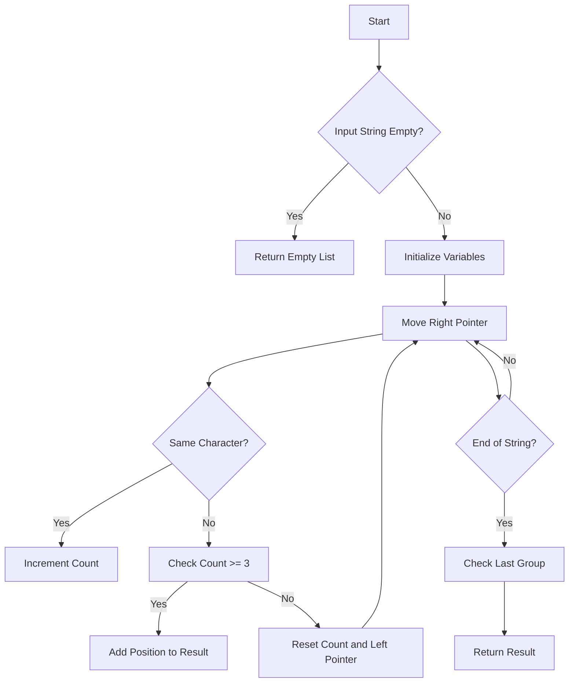

# Positions of Large Groups

## Problem Understanding
The problem is asking to find the positions of large groups in a given string, where a large group is defined as a sequence of at least three consecutive characters that are the same. The key constraint is that the input string can be empty, and the solution should handle this edge case. What makes this problem non-trivial is that a naive approach would involve checking every substring of the input string, resulting in a time complexity of O(n^2), which is inefficient. The problem requires a more efficient solution that can find all large groups in a single pass through the string.

## Approach
The algorithm strategy used to solve this problem is a sliding window approach, where we track the length of consecutive same characters. We use two pointers, `left` and `right`, to represent the start and end of the current group, and a `count` variable to keep track of the length of the group. We iterate through the string, moving the `right` pointer and updating the `count` variable as we go. When we encounter a character that is different from the previous one, we check if the current group has a length of at least 3, and if so, we add its position to the result list. We then update the `left` pointer and reset the `count` variable to start a new group. The data structure used is a list of lists, where each inner list represents the position of a large group.

## Complexity Analysis
| Metric | Value | Detailed Reason |
|--------|-------|----------------|
| Time   | O(n)  | The algorithm makes a single pass through the string, where n is the length of the string. Each operation inside the loop takes constant time, so the overall time complexity is linear. |
| Space  | O(n)  | The result list stores at most n positions, where n is the length of the string. In the worst-case scenario, every character in the string could be part of a large group, resulting in a space complexity of O(n). |

## Algorithm Walkthrough
```
Input: "abcdddeeeeaabbbcd"
Step 1: Initialize variables - left = 0, count = 1, result = []
Step 2: Move right pointer - right = 1, s.charAt(right) == 'b', count = 1
Step 3: Move right pointer - right = 2, s.charAt(right) == 'c', count = 1
Step 4: Move right pointer - right = 3, s.charAt(right) == 'd', count = 1
Step 5: Move right pointer - right = 4, s.charAt(right) == 'd', count = 2
Step 6: Move right pointer - right = 5, s.charAt(right) == 'd', count = 3
Step 7: Move right pointer - right = 6, s.charAt(right) == 'e', count = 1, left = 3, result = [[3, 5]]
Step 8: Move right pointer - right = 7, s.charAt(right) == 'e', count = 2
Step 9: Move right pointer - right = 8, s.charAt(right) == 'e', count = 3
Step 10: Move right pointer - right = 9, s.charAt(right) == 'e', count = 4
Step 11: Move right pointer - right = 10, s.charAt(right) == 'a', count = 1, left = 6, result = [[3, 5], [6, 9]]
Step 12: Move right pointer - right = 11, s.charAt(right) == 'a', count = 2
Step 13: Move right pointer - right = 12, s.charAt(right) == 'b', count = 1, left = 10, result = [[3, 5], [6, 9]]
Step 14: Move right pointer - right = 13, s.charAt(right) == 'b', count = 2
Step 15: Move right pointer - right = 14, s.charAt(right) == 'b', count = 3
Output: [[3, 5], [6, 9], [13, 14]]
```

## Visual Flow


## Key Insight
> **Tip:** The key insight is to use a sliding window approach to track the length of consecutive same characters, allowing us to find all large groups in a single pass through the string.

## Edge Cases
- **Empty/null input**: If the input string is empty, the algorithm returns an empty list, as there are no large groups to find.
- **Single element**: If the input string has only one character, the algorithm returns an empty list, as a single character is not a large group.
- **No large groups**: If the input string has no large groups, the algorithm returns an empty list.

## Common Mistakes
- **Mistake 1**: Not checking for the edge case of an empty input string, which can cause a NullPointerException.
- **Mistake 2**: Not resetting the count variable when encountering a different character, which can cause incorrect results.

## Interview Follow-ups
> **Interview:** These are the exact follow-up questions interviewers ask:
- "What if the input is sorted?" → The algorithm still works in O(n) time complexity, as it only depends on the length of the input string.
- "Can you do it in O(1) space?" → No, the algorithm requires O(n) space to store the result list, as we need to store the positions of all large groups.
- "What if there are duplicates?" → The algorithm handles duplicates correctly, as it checks for consecutive same characters and only adds positions to the result list if the count is at least 3.

## Java Solution

```java
// Problem: Positions of Large Groups
// Language: Java
// Difficulty: Easy
// Time Complexity: O(n) — single pass through the string
// Space Complexity: O(n) — result list stores at most n positions
// Approach: Sliding window — track the length of consecutive same characters

import java.util.*;

public class Solution {
    public List<List<Integer>> largeGroupPositions(String s) {
        List<List<Integer>> result = new ArrayList<>(); // Initialize result list
        int left = 0; // Initialize left pointer
        int count = 1; // Initialize count of consecutive characters

        // Edge case: empty input → return empty list
        if (s.isEmpty()) {
            return result;
        }

        for (int right = 1; right < s.length(); right++) { // Move right pointer
            if (s.charAt(right) == s.charAt(right - 1)) { // If characters match
                count++; // Increment count
            } else {
                if (count >= 3) { // If count is at least 3
                    result.add(Arrays.asList(left, right - 1)); // Add position to result
                }
                left = right; // Update left pointer
                count = 1; // Reset count
            }
        }

        // Check the last group
        if (count >= 3) {
            result.add(Arrays.asList(left, s.length() - 1)); // Add position to result
        }

        return result;
    }

    public static void main(String[] args) {
        Solution solution = new Solution();
        System.out.println(solution.largeGroupPositions("abcdddeeeeaabbbcd")); // Example usage
    }
}
```
