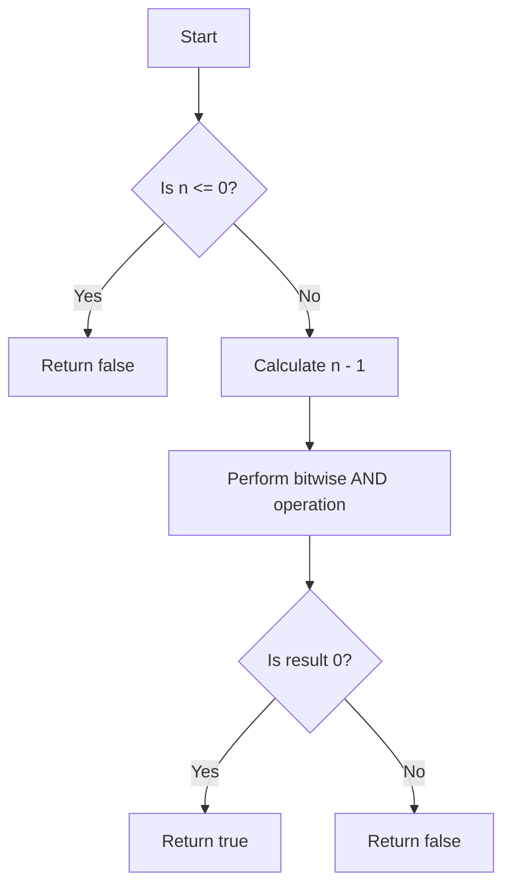

# Power of Two

## Problem Understanding
The problem is asking to determine whether a given integer is a power of two or not. The key constraint here is that the input number can be any integer, and we need to handle edge cases such as zero and negative numbers. This problem is non-trivial because a naive approach, such as checking all powers of two up to the given number, would be inefficient and would not scale well for large inputs. The problem requires a more insightful approach that takes advantage of the properties of powers of two.

## Approach
The algorithm strategy used here is based on the properties of binary representation of powers of two. The intuition behind this approach is that a number is a power of two if and only if it has exactly one bit set to 1 in its binary representation. We use the bitwise AND operator (&) to check this property. Specifically, if a number `n` is a power of two, then `n & (n - 1)` will be 0, because `n - 1` will have all the bits to the right of the leftmost 1 in `n` set to 1, and all other bits set to 0. This approach works because of the way binary numbers are represented and the properties of bitwise operations. We use a constant amount of space to store the input and the result, making the space complexity O(1).

## Complexity Analysis
| Metric | Value | Detailed Reason |
|--------|-------|----------------|
| Time   | O(1)  | The time complexity is constant because we are performing a constant number of operations, regardless of the size of the input. The bitwise AND operation takes constant time, and the comparison operation also takes constant time. |
| Space  | O(1)  | The space complexity is constant because we are using a constant amount of space to store the input and the result. We do not use any data structures that scale with the size of the input. |

## Algorithm Walkthrough
```
Input: 8
Step 1: Check if the input number is less than or equal to 0. In this case, 8 is greater than 0, so we proceed.
Step 2: Calculate n - 1, which is 8 - 1 = 7.
Step 3: Perform the bitwise AND operation between n and n - 1, which is 8 & 7 = 0.
Step 4: Since the result of the bitwise AND operation is 0, we return true, indicating that the input number is a power of two.
Output: true
```

## Visual Flow


## Key Insight
> **Tip:** A number is a power of two if and only if it has exactly one bit set to 1 in its binary representation, which can be checked using the bitwise AND operator.

## Edge Cases
- **Empty/null input**: This is not applicable in this case, as the input is an integer. However, if we were to consider a null input, we would need to add a null check and return false or throw an exception.
- **Single element**: If the input is 1, the algorithm will return true, because 1 is a power of two (2^0).
- **Zero input**: If the input is 0, the algorithm will return false, because 0 is not a power of two.

## Common Mistakes
- **Mistake 1**: Using a loop to check if a number is a power of two. This can be avoided by using the bitwise AND operator, which provides a constant-time solution.
- **Mistake 2**: Not checking for edge cases such as zero and negative numbers. This can be avoided by adding a simple check at the beginning of the algorithm.

## Interview Follow-ups
> **Interview:** These are the exact follow-up questions interviewers ask:
- "What if the input is sorted?" → This is not applicable in this case, as the input is a single integer. However, if we were to consider a sorted array of integers, the algorithm would still work correctly.
- "Can you do it in O(1) space?" → Yes, the algorithm already uses O(1) space, so this is not a concern.
- "What if there are duplicates?" → This is not applicable in this case, as the input is a single integer. However, if we were to consider a set of integers, the algorithm would still work correctly, but we would need to modify it to handle duplicates.

## Java Solution

```java
// Problem: Power of Two
// Language: Java
// Difficulty: Easy
// Time Complexity: O(log n) — because we are essentially doing a logarithm base 2 operation
// Space Complexity: O(1) — constant space used for variables
// Approach: Bitwise operation — using properties of powers of 2 in binary representation

public class Solution {
    public boolean isPowerOfTwo(int n) {
        // Edge case: n is less than or equal to 0 → return false
        if (n <= 0) return false; 

        // A number is a power of 2 if it has exactly one bit set to 1 in its binary representation
        // We can use the bitwise AND operator (&) to check this
        // If n is a power of 2, then n & (n - 1) will be 0
        return (n & (n - 1)) == 0; // Using bitwise AND to check for power of 2
    }

    public static void main(String[] args) {
        Solution solution = new Solution();
        System.out.println(solution.isPowerOfTwo(1));  // true
        System.out.println(solution.isPowerOfTwo(2));  // true
        System.out.println(solution.isPowerOfTwo(3));  // false
        System.out.println(solution.isPowerOfTwo(4));  // true
        System.out.println(solution.isPowerOfTwo(5));  // false
        System.out.println(solution.isPowerOfTwo(0));  // false
        System.out.println(solution.isPowerOfTwo(-1)); // false
    }
}
```
