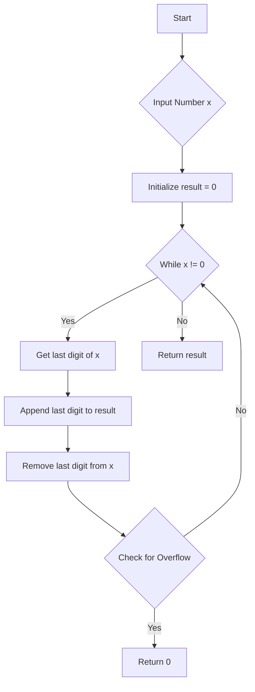

# Reverse a Number

## Problem Understanding
The problem asks to reverse a given 32-bit integer, which means rearranging its digits in reverse order while preserving the sign. The key constraint is that the reversed number must also be a 32-bit integer, implying that potential overflows need to be handled. What makes this problem non-trivial is the requirement to detect and handle overflows, as simply reversing the digits can result in a number that exceeds the 32-bit integer range. Additionally, the problem requires a solution that operates within a constant space complexity, meaning that no data structures that scale with input size can be used.

## Approach
The algorithm strategy involves using simple arithmetic operations to reverse the number. This approach works by iteratively taking the last digit of the input number (using the modulus operator), appending it to the result (by shifting the current result to the left and adding the new digit), and then removing the last digit from the input number (using integer division). The intuition behind this approach is to simulate the process of reversing a string but with numbers, where each digit is treated as a character. A `long` data type is used for the result to handle potential overflows before casting it back to an `int` for the final return. This approach efficiently handles the key constraint of potential overflows by checking the result after each iteration.

## Complexity Analysis
| Metric | Value | Detailed Reason |
|--------|-------|----------------|
| Time   | O(log(n)) | The time complexity is proportional to the number of digits in the input number `n`, because each digit is processed exactly once. Since the number of digits in a number is logarithmic in its value (base 10), the time complexity is O(log(n)). |
| Space  | O(1) | The space complexity is constant because only a fixed amount of space is used to store the variables `result`, `x`, and `lastDigit`, regardless of the input size. |

## Algorithm Walkthrough
```
Input: x = 123
Step 1: 
  - lastDigit = 123 % 10 = 3
  - result = 0 * 10 + 3 = 3
  - x = 123 / 10 = 12
Step 2: 
  - lastDigit = 12 % 10 = 2
  - result = 3 * 10 + 2 = 32
  - x = 12 / 10 = 1
Step 3: 
  - lastDigit = 1 % 10 = 1
  - result = 32 * 10 + 1 = 321
  - x = 1 / 10 = 0
Output: result = 321
```

## Visual Flow


## Key Insight
> **Tip:** The single most important insight is to use a `long` for the result to handle potential overflows before casting it back to an `int`, ensuring that the function can correctly identify and handle numbers that would overflow when reversed.

## Edge Cases
- **Empty/null input**: This case is not applicable since the input is a number, but if `x = 0`, the function returns `0` as there are no digits to reverse.
- **Single element**: If `x` is a single-digit number, the function simply returns `x` because reversing a single digit does not change its value.
- **Negative number**: The function handles negative numbers by preserving the sign. It does this implicitly because the arithmetic operations involved do not depend on the sign of the number, and the sign is preserved when the result is cast back to an `int`.

## Common Mistakes
- **Mistake 1**: Not checking for overflow. This can be avoided by using a `long` for the result and checking if it exceeds `Integer.MAX_VALUE` or is less than `Integer.MIN_VALUE` after each iteration.
- **Mistake 2**: Not handling the sign correctly. This can be avoided by ensuring that the sign is preserved throughout the operations, which in this implementation is handled implicitly by the arithmetic operations.

## Interview Follow-ups
> **Interview:** 
- "What if the input is sorted?" → The input being sorted does not affect the algorithm since it operates on individual digits rather than the sequence of the input.
- "Can you do it in O(1) space?" → The current solution already uses O(1) space, making it space-efficient.
- "What if there are duplicates?" → The presence of duplicate digits does not impact the reversal process, as each digit is treated individually.

## Java Solution

```java
// Problem: Reverse a Number
// Language: Java
// Difficulty: Easy
// Time Complexity: O(log(n)) — number of digits in the input number
// Space Complexity: O(1) — constant space used
// Approach: Simple arithmetic operations — reversing the number by taking the last digit and appending it to the result

public class Solution {
    public int reverse(int x) {
        // Initialize the result variable to store the reversed number
        long result = 0; // using long to handle potential overflow
        
        // Continue the process until the input number becomes 0
        while (x != 0) {
            // Get the last digit of the input number
            int lastDigit = x % 10; // last digit is the remainder when divided by 10
            
            // Append the last digit to the result
            result = result * 10 + lastDigit; // shifting the current result to the left and adding the new digit
            
            // Remove the last digit from the input number
            x = x / 10; // integer division to remove the last digit
            
            // Edge case: overflow detection
            if (result > Integer.MAX_VALUE || result < Integer.MIN_VALUE) {
                // If overflow occurs, return 0
                return 0;
            }
        }
        
        // Return the reversed number
        return (int) result; // cast to int before returning
    }

    public static void main(String[] args) {
        Solution solution = new Solution();
        System.out.println(solution.reverse(123)); // Output: 321
        System.out.println(solution.reverse(-123)); // Output: -321
        System.out.println(solution.reverse(120)); // Output: 21
        System.out.println(solution.reverse(0)); // Output: 0
    }
}
```
