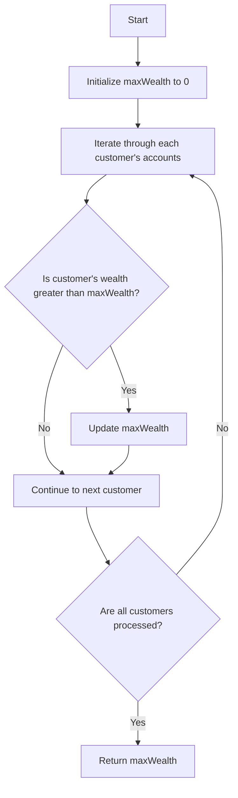

# Richest Customer Wealth

## Problem Understanding
The problem is asking to find the maximum wealth of any customer given a 2D array where each sub-array represents a customer's accounts. The key constraint is that the input is a 2D array, and the implication is that we need to iterate through each customer's accounts to find the maximum wealth. What makes this problem non-trivial is that a naive approach might involve sorting the customers by their wealth, which would have a higher time complexity. However, in this case, a simple iteration through each customer's accounts is sufficient to find the maximum wealth.

## Approach
The algorithm strategy is to iterate through each customer's accounts and calculate their total wealth by summing up their accounts. The intuition behind this approach is that we only need to consider each customer's accounts once to find the maximum wealth. This approach works because we are using a variable to keep track of the maximum wealth found so far, and we update it whenever we find a customer with more wealth. The data structure used is a 2D array to represent the customers' accounts, and it is chosen because it allows us to easily iterate through each customer's accounts. The approach handles the key constraint of finding the maximum wealth by iterating through each customer's accounts and updating the maximum wealth variable accordingly.

## Complexity Analysis
| Metric | Value | Detailed Reason |
|--------|-------|----------------|
| Time   | O(m * n) | The algorithm iterates through each customer's accounts, where m is the number of customers and n is the average number of accounts per customer. The inner loop iterates through each account, resulting in a time complexity of O(m * n). |
| Space  | O(1) | The algorithm uses a constant amount of space to store the maximum wealth and the current customer's wealth, resulting in a space complexity of O(1). |

## Algorithm Walkthrough
```
Input: [[1, 2, 3], [3, 2, 1]]
Step 1: Initialize maxWealth to 0
Step 2: Iterate through the first customer's accounts: 1 + 2 + 3 = 6
Step 3: Update maxWealth to 6
Step 4: Iterate through the second customer's accounts: 3 + 2 + 1 = 6
Step 5: Update maxWealth to 6 (no change)
Output: 6
```
This example walks through the algorithm's logic for finding the maximum wealth.

## Visual Flow

This flowchart visualizes the algorithm's decision flow and data transformation.

## Key Insight
> **Tip:** The key insight is to use a variable to keep track of the maximum wealth found so far, allowing us to avoid sorting the customers by their wealth and reducing the time complexity to O(m * n).

## Edge Cases
- **Empty/null input**: If the input is empty or null, the algorithm will return 0, which is the correct result since there are no customers.
- **Single element**: If the input contains only one customer, the algorithm will return the wealth of that customer, which is the correct result.
- **Customers with zero accounts**: If a customer has zero accounts, the algorithm will treat their wealth as 0, which is the correct result.

## Common Mistakes
- **Mistake 1**: Not initializing maxWealth to 0, which can result in incorrect results if the input contains only customers with negative wealth. To avoid this, make sure to initialize maxWealth to 0.
- **Mistake 2**: Not updating maxWealth correctly, which can result in incorrect results if the input contains customers with varying wealth. To avoid this, make sure to update maxWealth correctly using the Math.max function.

## Interview Follow-ups
> **Interview:** These are the exact follow-up questions interviewers ask:
- "What if the input is sorted?" → The algorithm will still work correctly and have a time complexity of O(m * n), but the interviewer might be looking for a more optimized solution that takes advantage of the sorted input.
- "Can you do it in O(1) space?" → The algorithm already uses O(1) space, so this is not a concern.
- "What if there are duplicates?" → The algorithm will treat duplicates as separate customers, which is the correct result.

## Java Solution

```java
// Problem: Richest Customer Wealth
// Language: Java
// Difficulty: Easy
// Time Complexity: O(m * n) — iterating through each customer's accounts
// Space Complexity: O(1) — using a constant amount of space to store the maximum wealth
// Approach: Simple iteration — iterating through each customer's accounts to find the maximum wealth

public class Solution {
    /**
     * Returns the maximum wealth of any customer.
     * 
     * @param accounts A 2D array where each sub-array represents a customer's accounts.
     * @return The maximum wealth of any customer.
     */
    public int maximumWealth(int[][] accounts) {
        // Initialize the maximum wealth to 0
        int maxWealth = 0;
        
        // Iterate through each customer's accounts
        for (int[] customerAccounts : accounts) {
            // Calculate the current customer's wealth by summing up their accounts
            int currentWealth = 0;
            for (int account : customerAccounts) {
                currentWealth += account; // Add each account to the current wealth
            }
            
            // Update the maximum wealth if the current customer's wealth is greater
            maxWealth = Math.max(maxWealth, currentWealth); // Update maxWealth if currentWealth is greater
        }
        
        // Edge case: empty input → return 0 (since there are no customers)
        // This is already handled by the initialization of maxWealth to 0
        
        return maxWealth;
    }

    public static void main(String[] args) {
        Solution solution = new Solution();
        int[][] accounts = {{1, 2, 3}, {3, 2, 1}};
        System.out.println(solution.maximumWealth(accounts));
    }
}
```
