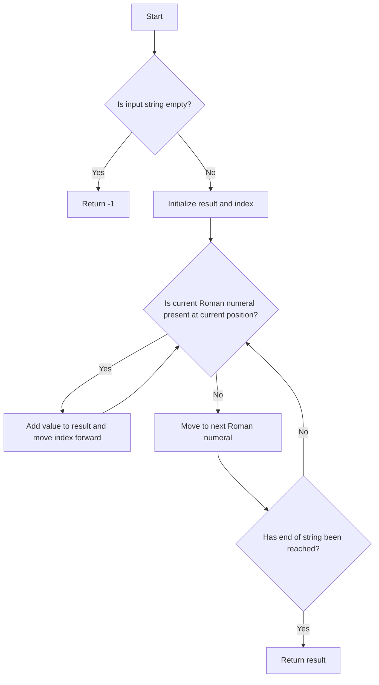

# Roman to Integer

## Problem Understanding
The problem asks to convert a Roman numeral to an integer, where the input is a string representing a Roman numeral. The key constraint is that the input string should be a valid Roman numeral, and the output should be the corresponding integer value. This problem is non-trivial because the Roman numeral system has its own rules for representing numbers, such as subtractive notation (e.g., IV for 4, IX for 9), which requires careful handling to avoid incorrect conversions.

## Approach
The algorithm strategy is to map Roman numerals to their integer values and sum them up based on their positions in the input string. This approach works by iterating over the Roman numerals in descending order of their values and checking if the current numeral is present at the current position in the string. If it is, the corresponding value is added to the result, and the position is moved forward. The data structure used is an array to store the Roman numerals and their values, which allows for efficient lookups and iterations. The approach handles key constraints by checking for valid Roman numerals and returning an error for invalid inputs.

## Complexity Analysis
| Metric | Value | Detailed Reason |
|--------|-------|----------------|
| Time   | O(n)  | The algorithm iterates over the input string once, where n is the length of the input string. The while loop inside the for loop may seem like it could increase the time complexity, but since we are moving the index `i` forward in each iteration, the total number of iterations is still proportional to the length of the input string. |
| Space  | O(1)  | The algorithm uses a constant amount of space to store the Roman numerals and their values, regardless of the size of the input string. |

## Algorithm Walkthrough
```
Input: "MCMXCIV"
Step 1: Initialize result = 0, i = 0, and the arrays of Roman numerals and values.
Step 2: Check if the current Roman numeral "M" is present at position i = 0. Since it is, add 1000 to the result and move i forward by 1.
Step 3: Check if the current Roman numeral "CM" is present at position i = 1. Since it is, add 900 to the result and move i forward by 2.
Step 4: Check if the current Roman numeral "XC" is present at position i = 3. Since it is, add 90 to the result and move i forward by 2.
Step 5: Check if the current Roman numeral "IV" is present at position i = 5. Since it is, add 4 to the result and move i forward by 2.
Step 6: Since i has reached the end of the string, return the result, which is 1994.
Output: 1994
```

## Visual Flow


## Key Insight
> **Tip:** The key insight to solving this problem is to iterate over the Roman numerals in descending order of their values and use a while loop to check for consecutive occurrences of the same numeral.

## Edge Cases
- **Empty input**: If the input string is empty, the algorithm returns -1, indicating an invalid input.
- **Single-element input**: If the input string consists of a single Roman numeral, the algorithm correctly converts it to an integer.
- **Invalid input**: If the input string contains invalid Roman numerals, the algorithm returns -1, indicating an error.

## Common Mistakes
- **Mistake 1**: Not handling subtractive notation correctly, leading to incorrect conversions. To avoid this, make sure to check for pairs of Roman numerals that represent subtractive notation.
- **Mistake 2**: Not checking for invalid input, leading to incorrect results or errors. To avoid this, always validate the input string before attempting to convert it.

## Interview Follow-ups
> **Interview:** These are the exact follow-up questions interviewers ask:
- "What if the input is sorted?" → The algorithm still works correctly, as it checks for each Roman numeral in descending order of their values.
- "Can you do it in O(1) space?" → The algorithm already uses O(1) space, as it only uses a constant amount of space to store the Roman numerals and their values.
- "What if there are duplicates?" → The algorithm correctly handles duplicates by checking for consecutive occurrences of the same numeral and adding their values accordingly.

## Java Solution

```java
// Problem: Roman to Integer
// Language: Java
// Difficulty: Easy
// Time Complexity: O(n) — single pass through string where n is length of input string
// Space Complexity: O(1) — constant space used to store Roman numerals and their values
// Approach: Mapping Roman numerals to integers and summing them up based on their positions

public class Solution {
    public int romanToInt(String s) {
        // Edge case: empty input → return -1
        if (s == null || s.isEmpty()) {
            return -1;
        }

        // Mapping Roman numerals to their integer values
        int[] values = {1000, 900, 500, 400, 100, 90, 50, 40, 10, 9, 5, 4, 1};
        String[] romanNumerals = {"M", "CM", "D", "CD", "C", "XC", "L", "XL", "X", "IX", "V", "IV", "I"};

        // Initialize result variable to store the integer value
        int result = 0;

        // Initialize index to keep track of the current position in the string
        int i = 0;

        // Iterate over Roman numerals in descending order of their values
        for (int j = 0; j < values.length; j++) {
            // Continue iterating until the current Roman numeral is not found at the current position
            while (i + romanNumerals[j].length() <= s.length() && s.substring(i, i + romanNumerals[j].length()).equals(romanNumerals[j])) {
                // Add the value of the current Roman numeral to the result
                result += values[j];
                // Move to the next position in the string
                i += romanNumerals[j].length();
            }
        }

        // Edge case: invalid input → return -1
        if (i < s.length()) {
            return -1;
        }

        return result;
    }

    public static void main(String[] args) {
        Solution solution = new Solution();
        System.out.println(solution.romanToInt("III"));  // Output: 3
        System.out.println(solution.romanToInt("IV"));  // Output: 4
        System.out.println(solution.romanToInt("IX"));  // Output: 9
        System.out.println(solution.romanToInt("LVIII"));  // Output: 58
        System.out.println(solution.romanToInt("MCMXCIV"));  // Output: 1994
    }
}
```
