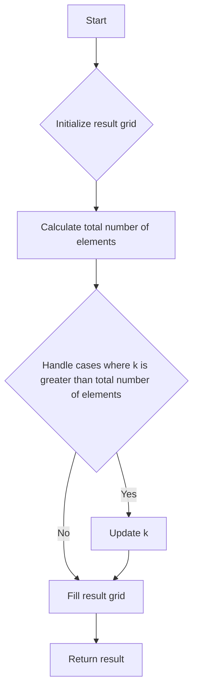

# Shift 2D Grid

## Problem Understanding
The problem asks to shift the elements of a 2D grid to the right by a certain number of steps, k. The key constraint is that the grid is considered as a sequence of elements when shifting, i.e., the last element of each row is followed by the first element of the next row. What makes this problem non-trivial is the need to handle cases where k is greater than the total number of elements in the grid. A naive approach would involve physically shifting the elements in the grid, which would be inefficient and prone to errors.

## Approach
The algorithm strategy is to calculate the new position of each element in the grid after shifting. This is done by first calculating the total number of elements in the grid and then handling cases where k is greater than this total. The approach works by using the modulo operator to ensure that k is within the range of the total number of elements. A 2D array is used to store the result, and the grid is filled by iterating through each element and assigning it to its new position. The intuition behind this approach is to treat the grid as a sequence of elements and shift them accordingly.

## Complexity Analysis
| Metric | Value | Detailed Reason |
|--------|-------|----------------|
| Time   | O(m*n) | The algorithm iterates through each element in the grid once, where m is the number of rows and n is the number of columns. The time complexity is linear with respect to the total number of elements in the grid. |
| Space  | O(m*n) | The algorithm uses a new 2D array to store the result, which requires space proportional to the size of the input grid. |

## Algorithm Walkthrough
```
Input: grid = [[1, 2, 3], [4, 5, 6], [7, 8, 9]], k = 1
Step 1: Calculate the total number of elements: totalElements = 3 * 3 = 9
Step 2: Handle cases where k is greater than the total number of elements: k = 1 % 9 = 1
Step 3: Initialize the result grid: result = [[0, 0, 0], [0, 0, 0], [0, 0, 0]]
Step 4: Fill the result grid:
  - index = 9 - 1 = 8, newIndex = 8, newRow = 2, newCol = 2, result[2][2] = grid[0][0] = 1
  - index = 8, newIndex = 0, newRow = 0, newCol = 0, result[0][0] = grid[0][1] = 2
  - index = 0, newIndex = 1, newRow = 0, newCol = 1, result[0][1] = grid[0][2] = 3
  - index = 1, newIndex = 2, newRow = 0, newCol = 2, result[0][2] = grid[1][0] = 4
  - index = 2, newIndex = 3, newRow = 1, newCol = 0, result[1][0] = grid[1][1] = 5
  - index = 3, newIndex = 4, newRow = 1, newCol = 1, result[1][1] = grid[1][2] = 6
  - index = 4, newIndex = 5, newRow = 1, newCol = 2, result[1][2] = grid[2][0] = 7
  - index = 5, newIndex = 6, newRow = 2, newCol = 0, result[2][0] = grid[2][1] = 8
  - index = 6, newIndex = 7, newRow = 2, newCol = 1, result[2][1] = grid[2][2] = 9
Output: result = [[9, 1, 2], [3, 4, 5], [6, 7, 8]]
```

## Visual Flow


## Key Insight
> **Tip:** The key insight is to treat the grid as a sequence of elements and use the modulo operator to handle cases where k is greater than the total number of elements.

## Edge Cases
- **Empty/null input**: If the input grid is empty or null, the function will return an empty grid, as there are no elements to shift.
- **Single element**: If the input grid contains only one element, shifting it by any number of steps will result in the same element.
- **k is greater than the total number of elements**: The algorithm handles this case by using the modulo operator to ensure that k is within the range of the total number of elements.

## Common Mistakes
- **Mistake 1**: Failing to handle cases where k is greater than the total number of elements, which can result in incorrect shifting.
- **Mistake 2**: Physically shifting the elements in the grid, which can be inefficient and prone to errors.

## Interview Follow-ups
> **Interview:** These are the exact follow-up questions interviewers ask:
- "What if the input is sorted?" → The algorithm will still work correctly, as it treats the grid as a sequence of elements and shifts them accordingly.
- "Can you do it in O(1) space?" → No, the algorithm requires O(m*n) space to store the result grid.
- "What if there are duplicates?" → The algorithm will handle duplicates correctly, as it treats each element as a separate entity and shifts them accordingly.

## Java Solution

```java
// Problem: Shift 2D Grid
// Language: Java
// Difficulty: Easy
// Time Complexity: O(m*n) — iterating through each element in the grid
// Space Complexity: O(m*n) — storing the result in a new 2D array
// Approach: Brute force iteration — shifting each row and then the entire grid

public class Solution {
    public int[][] shiftGrid(int[][] grid, int k) {
        int rows = grid.length; // Get the number of rows
        int cols = grid[0].length; // Get the number of columns
        int[][] result = new int[rows][cols]; // Initialize the result grid

        // Edge case: empty grid → return empty grid
        if (rows == 0 || cols == 0) {
            return result;
        }

        int totalElements = rows * cols; // Calculate the total number of elements
        k = k % totalElements; // Handle cases where k is greater than the total number of elements

        // Fill the result grid
        int index = totalElements - k; // Start index
        for (int i = 0; i < rows; i++) {
            for (int j = 0; j < cols; j++) {
                // Calculate the new position of the current element
                int newIndex = (index++) % totalElements;
                int newRow = newIndex / cols;
                int newCol = newIndex % cols;
                result[newRow][newCol] = grid[i][j]; // Assign the value to the new position
            }
        }

        return result;
    }

    public static void main(String[] args) {
        Solution solution = new Solution();
        int[][] grid = {{1, 2, 3}, {4, 5, 6}, {7, 8, 9}};
        int k = 1;
        int[][] result = solution.shiftGrid(grid, k);
        for (int[] row : result) {
            for (int num : row) {
                System.out.print(num + " "); // Print the result
            }
            System.out.println();
        }
    }
}
```
