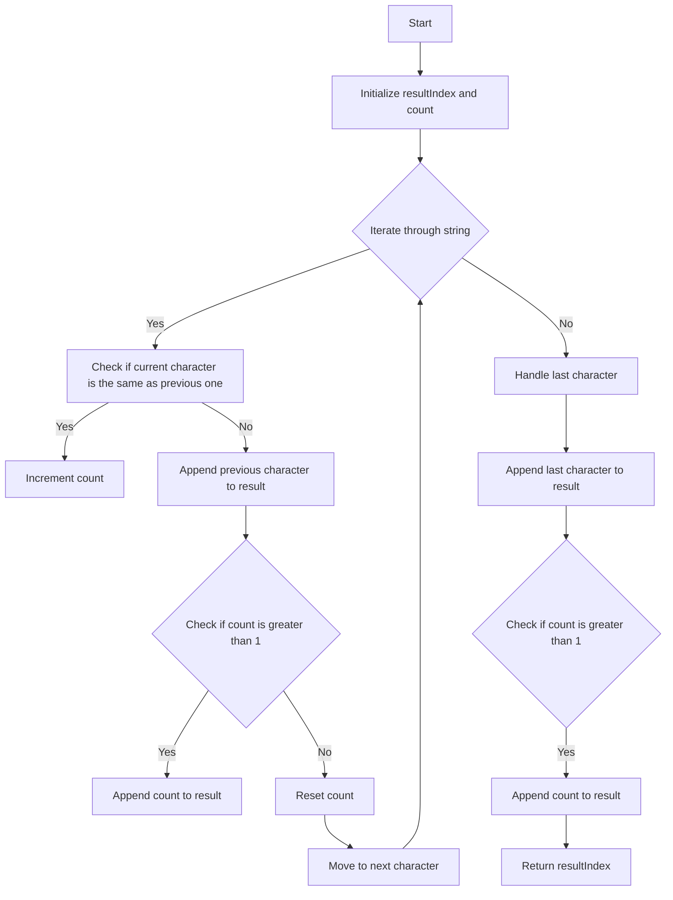

# String Compression

## Problem Understanding
The problem of string compression involves removing duplicate characters from a given string and replacing them with the character and its count. For example, the string "aaabbbccc" would be compressed to "a3b3c3". The key constraint is that the compressed string should be shorter than the original string. The problem becomes non-trivial because a naive approach of simply iterating through the string and appending non-repeating characters would not handle cases where the count of consecutive occurrences of a character is greater than 1. The problem requires a strategy to efficiently iterate through the string, count consecutive occurrences of characters, and append the character and its count to the result.

## Approach
The algorithm strategy used to solve this problem is to iterate through the string using two pointers: one for the result and one for the current character. The intuition behind this approach is to keep track of the count of consecutive occurrences of a character and append the character and its count to the result when a different character is encountered. A StringBuilder or a character array is used to store the compressed string. This approach works because it efficiently handles cases where the count of consecutive occurrences of a character is greater than 1. The key to this approach is to reset the count when a different character is encountered and to append the previous character and its count to the result.

## Complexity Analysis
| Metric | Value | Detailed Reason |
|--------|-------|----------------|
| Time   | O(n)  | The algorithm makes a single pass through the string, where n is the length of the string. Each character is visited once, resulting in a time complexity of O(n). |
| Space  | O(n)  | The algorithm uses a character array to store the compressed string, which can be at most n characters long in the worst case (when all characters are unique). Therefore, the space complexity is O(n). |

## Algorithm Walkthrough
```
Input: ['a', 'a', 'b', 'b', 'c', 'c', 'c']
Step 1: Initialize resultIndex = 0, count = 1
Step 2: Iterate through the string, i = 1, chars[i] = 'a', chars[i-1] = 'a', count = 2
Step 3: Iterate through the string, i = 2, chars[i] = 'b', chars[i-1] = 'a', append 'a' to result, count = 1
Step 4: Iterate through the string, i = 3, chars[i] = 'b', chars[i-1] = 'b', count = 2
Step 5: Iterate through the string, i = 4, chars[i] = 'c', chars[i-1] = 'b', append 'b' to result, append '2' to result, count = 1
Step 6: Iterate through the string, i = 5, chars[i] = 'c', chars[i-1] = 'c', count = 2
Step 7: Iterate through the string, i = 6, chars[i] = 'c', chars[i-1] = 'c', count = 3
Step 8: Handle the last character, append 'c' to result, append '3' to result
Output: ['a', '2', 'b', '2', 'c', '3']
```
## Visual Flow

## Key Insight
> **Tip:** The key insight to this problem is to use two pointers to keep track of the result and the current character, and to reset the count when a different character is encountered.

## Edge Cases
- **Empty/null input**: If the input string is empty or null, the function should return 0, as there are no characters to compress.
- **Single element**: If the input string has only one character, the function should return 1, as there is only one character to compress.
- **No consecutive duplicates**: If the input string has no consecutive duplicates, the function should return the length of the input string, as no compression is possible.

## Common Mistakes
- **Mistake 1**: Not checking for consecutive duplicates correctly, resulting in incorrect compression.
- **Mistake 2**: Not handling the last character correctly, resulting in incorrect compression.

## Interview Follow-ups
> **Interview:** These are the exact follow-up questions interviewers ask:
- "What if the input is sorted?" → The algorithm will still work correctly, as it only checks for consecutive duplicates.
- "Can you do it in O(1) space?" → No, the algorithm requires O(n) space to store the compressed string.
- "What if there are duplicates?" → The algorithm will compress the duplicates correctly, replacing them with the character and its count.

## Java Solution

```java
// Problem: String Compression
// Language: Java
// Difficulty: Easy
// Time Complexity: O(n) — single pass through string
// Space Complexity: O(n) — StringBuilder stores compressed string
// Approach: StringBuilder iteration — iterate through string and append non-repeating characters

public class Solution {
    /**
     * Compresses a given string by removing duplicate characters.
     * 
     * @param s The input string to be compressed.
     * @return The compressed string.
     */
    public int compress(char[] chars) {
        // Edge case: empty input → return 0
        if (chars.length == 0) {
            return 0;
        }

        // Initialize two pointers for the result and the current character
        int resultIndex = 0; // stores the index of the result array
        int count = 1; // stores the count of consecutive occurrences of a character

        // Iterate through the string
        for (int i = 1; i < chars.length; i++) {
            // If the current character is the same as the previous one, increment the count
            if (chars[i] == chars[i - 1]) {
                count++; // increment count for consecutive characters
            } else {
                // If the current character is different from the previous one, append the previous character and its count to the result
                chars[resultIndex++] = chars[i - 1]; // append previous character
                if (count > 1) {
                    // Convert count to string and append each character to the result
                    for (char c : String.valueOf(count).toCharArray()) {
                        chars[resultIndex++] = c; // append count as string
                    }
                }
                count = 1; // reset count for new character
            }
        }

        // Handle the last character
        chars[resultIndex++] = chars[chars.length - 1]; // append last character
        if (count > 1) {
            // Convert count to string and append each character to the result
            for (char c : String.valueOf(count).toCharArray()) {
                chars[resultIndex++] = c; // append count as string
            }
        }

        return resultIndex; // return the length of the compressed string
    }

    public static void main(String[] args) {
        Solution solution = new Solution();
        char[] chars = { 'a', 'a', 'b', 'b', 'c', 'c', 'c' };
        int compressedLength = solution.compress(chars);
        System.out.println("Compressed string: ");
        for (int i = 0; i < compressedLength; i++) {
            System.out.print(chars[i]); // print compressed string
        }
    }
}
```
