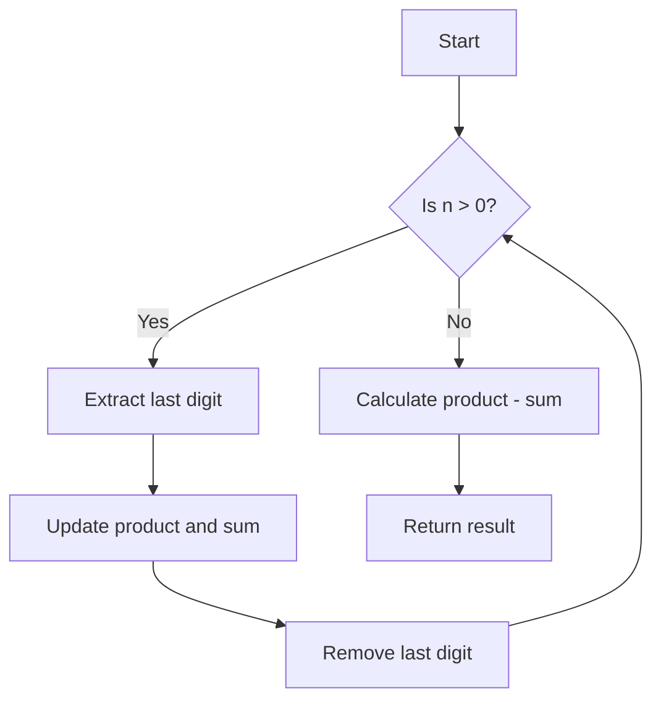

# Subtract the Product and Sum of Digits of an Integer

## Problem Understanding
The problem asks to subtract the product of digits from the sum of digits of a given integer. The key constraint is that we need to extract each digit from the number, calculate the product and sum, and then find the difference. This problem is non-trivial because it requires a step-by-step extraction of digits and calculation of product and sum, and a naive approach might not consider the edge cases or the efficient way to extract digits.

## Approach
The algorithm strategy is to iteratively extract each digit from the input number, calculate the product and sum of the digits, and finally find the difference between the product and sum. This approach works because it correctly extracts each digit and updates the product and sum variables accordingly. The data structure used is a simple integer variable to store the product and sum, which is sufficient for this problem. The approach handles the key constraint of extracting each digit by using the modulo operator to get the last digit and integer division to remove the last digit.

## Complexity Analysis
| Metric | Value | Detailed Reason |
|--------|-------|----------------|
| Time   | O(log n) | The time complexity is O(log n) because we are extracting each digit from the number, and the number of digits in a number n is log(n) (base 10). Each extraction operation takes constant time, so the overall time complexity is linear with respect to the number of digits. |
| Space  | O(1) | The space complexity is O(1) because we are using a constant amount of space to store the product and sum variables, regardless of the input size. |

## Algorithm Walkthrough
```
Input: 234
Step 1: product = 1, sum = 0, n = 234
Step 2: digit = 234 % 10 = 4, product = 1 * 4 = 4, sum = 0 + 4 = 4, n = 234 / 10 = 23
Step 3: digit = 23 % 10 = 3, product = 4 * 3 = 12, sum = 4 + 3 = 7, n = 23 / 10 = 2
Step 4: digit = 2 % 10 = 2, product = 12 * 2 = 24, sum = 7 + 2 = 9, n = 2 / 10 = 0
Output: product - sum = 24 - 9 = 15
```
This walkthrough shows the step-by-step extraction of digits and calculation of product and sum.

## Visual Flow

This flowchart shows the decision flow of the algorithm, including the extraction of digits, update of product and sum, and calculation of the final result.

## Key Insight
> **Tip:** The key insight to this problem is to use the modulo operator to extract the last digit and integer division to remove the last digit, allowing for an efficient and iterative calculation of the product and sum.

## Edge Cases
- **Empty/null input**: This problem does not consider empty or null input, as the input is an integer. However, if the input is 0, the function returns 0, which is a valid result.
- **Single element**: If the input is a single digit, the function correctly calculates the product and sum, which are equal to the digit itself. The difference is 0, which is the correct result.
- **Large input**: The function can handle large inputs because it uses a iterative approach to extract each digit, which avoids potential overflow issues.

## Common Mistakes
- **Mistake 1**: Not initializing the product variable to 1, which would result in an incorrect product calculation. To avoid this, initialize the product variable to 1 before the loop.
- **Mistake 2**: Not removing the last digit from the number after extraction, which would result in an infinite loop. To avoid this, use integer division to remove the last digit after extraction.

## Interview Follow-ups
> **Interview:** These are the exact follow-up questions interviewers ask:
- "What if the input is sorted?" → The input is an integer, so it is not applicable to sorting. However, if the question is asking about the digits being sorted, the function would still work correctly because it extracts each digit individually.
- "Can you do it in O(1) space?" → The current solution already uses O(1) space, so it is not possible to improve the space complexity further.
- "What if there are duplicates?" → The function can handle duplicates correctly because it extracts each digit individually and updates the product and sum accordingly.

## Java Solution

```java
// Problem: Subtract the Product and Sum of Digits of an Integer
// Language: Java
// Difficulty: Easy
// Time Complexity: O(log n) — number of digits in the input number
// Space Complexity: O(1) — constant space used
// Approach: Iterative digit extraction and calculation — extract each digit and calculate product and sum

public class Solution {
    public int subtractProductAndSum(int n) {
        // Initialize product and sum variables to 1 and 0 respectively
        int product = 1;
        int sum = 0;
        
        // Edge case: n is 0 → return 0
        if (n == 0) return 0;
        
        // Extract each digit from the number
        while (n > 0) {
            // Get the last digit of the number
            int digit = n % 10; // Extract the last digit
            
            // Update the product and sum
            product *= digit; // Multiply the current product with the digit
            sum += digit; // Add the digit to the sum
            
            // Remove the last digit from the number
            n /= 10; // Remove the last digit
        }
        
        // Calculate the difference between product and sum
        return product - sum; // Calculate the final result
    }

    public static void main(String[] args) {
        Solution solution = new Solution();
        System.out.println(solution.subtractProductAndSum(234)); // Example usage
    }
}
```
