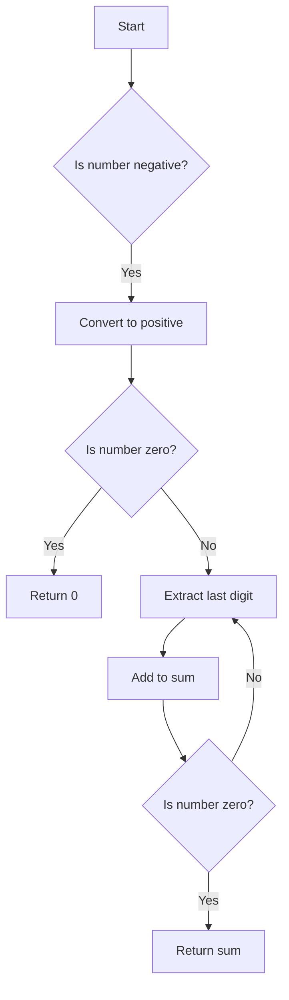

# Sum of Digits

## Problem Understanding
The problem is asking to calculate the sum of digits of a given integer. The key constraints are that the input can be any integer (positive, negative, or zero) and the output should be the sum of its digits. What makes this problem non-trivial is that a naive approach might involve converting the integer to a string to extract each digit, which would be inefficient. However, this solution uses a simple mathematical approach to extract each digit, making it more efficient.

## Approach
The algorithm strategy is to use a while loop to iterate through each digit of the input number, extracting the last digit using the modulus operator and adding it to the sum. The intuition behind this approach is that the modulus operator gives the remainder of the division of the number by 10, which is the last digit of the number. This approach works because it efficiently extracts each digit of the number without converting it to a string. The data structure used is a simple integer variable to store the sum of digits, and it was chosen because it is sufficient to store the sum of digits of any integer. The approach handles the key constraints by first checking if the number is negative and converting it to positive, and then handling the case where the number is zero.

## Complexity Analysis
| Metric | Value | Detailed Reason |
|--------|-------|----------------|
| Time   | O(log(n)) | The time complexity is O(log(n)) because the while loop runs for the number of digits in the input number, which is proportional to the logarithm of the number. The reason for this is that each iteration of the loop removes one digit from the number, effectively reducing the number of digits by one. This is similar to how logarithms work, where each increment in the logarithm represents a multiplicative increase in the value. |
| Space  | O(1) | The space complexity is O(1) because the algorithm uses a constant amount of space to store the sum of digits, regardless of the size of the input number. This is because the algorithm only uses a fixed number of variables, and does not create any data structures that grow with the size of the input. |

## Algorithm Walkthrough
```
Input: 123
Step 1: sum = 0, num = 123
Step 2: lastDigit = 123 % 10 = 3, sum = 0 + 3 = 3, num = 123 / 10 = 12
Step 3: lastDigit = 12 % 10 = 2, sum = 3 + 2 = 5, num = 12 / 10 = 1
Step 4: lastDigit = 1 % 10 = 1, sum = 5 + 1 = 6, num = 1 / 10 = 0
Output: 6
```
This example demonstrates how the algorithm works by extracting each digit of the input number and adding it to the sum.

## Visual Flow

This flowchart shows the decision-making process of the algorithm, including the handling of negative numbers and zero.

## Key Insight
> **Tip:** The key insight is that the modulus operator can be used to extract the last digit of a number, allowing for an efficient calculation of the sum of digits.

## Edge Cases
- **Empty/null input**: This is not applicable to this problem, as the input is an integer. However, if the input were a string, the algorithm would need to handle the case where the string is empty or null.
- **Single element**: If the input number is a single digit (e.g. 5), the algorithm will still work correctly, as it will extract the single digit and return it as the sum.
- **Zero input**: If the input number is zero, the algorithm will return zero, as the sum of the digits of zero is zero.

## Common Mistakes
- **Mistake 1**: Not handling negative numbers correctly. To avoid this, make sure to convert negative numbers to positive before calculating the sum of digits.
- **Mistake 2**: Not handling the case where the input number is zero. To avoid this, make sure to return zero immediately if the input number is zero.

## Interview Follow-ups
> **Interview:** These are the exact follow-up questions interviewers ask:
- "What if the input is sorted?" → This question is not applicable to this problem, as the input is an integer and not a list of numbers. However, if the input were a list of numbers, the algorithm would still work correctly, regardless of whether the list is sorted or not.
- "Can you do it in O(1) space?" → No, it is not possible to calculate the sum of digits in O(1) space, as the algorithm needs to store the sum of digits, which can grow with the size of the input.
- "What if there are duplicates?" → This question is not applicable to this problem, as the input is an integer and not a list of numbers. However, if the input were a list of numbers, the algorithm would still work correctly, regardless of whether there are duplicates or not.

## Java Solution

```java
// Problem: Sum of Digits
// Language: Java
// Difficulty: Easy
// Time Complexity: O(log(n)) — number of digits in the input number
// Space Complexity: O(1) — constant space to store result
// Approach: Simple iteration through each digit — summing them up

public class Solution {
    public int sumOfDigits(int num) {
        // Initialize sum variable to store the sum of digits
        int sum = 0;
        
        // Edge case: if the number is negative, convert it to positive
        if (num < 0) {
            num = -num; // since we are only concerned with the digits
        }
        
        // Edge case: if the number is 0, return 0
        if (num == 0) {
            return 0; // since the sum of digits of 0 is 0
        }
        
        // Calculate the sum of digits
        while (num > 0) {
            // Extract the last digit using modulus operator
            int lastDigit = num % 10;
            
            // Add the last digit to the sum
            sum += lastDigit;
            
            // Remove the last digit from the number
            num /= 10; // integer division to remove the last digit
        }
        
        // Return the sum of digits
        return sum;
    }

    public static void main(String[] args) {
        Solution solution = new Solution();
        System.out.println(solution.sumOfDigits(123));  // Output: 6
        System.out.println(solution.sumOfDigits(-456));  // Output: 15
        System.out.println(solution.sumOfDigits(0));      // Output: 0
    }
}
```
