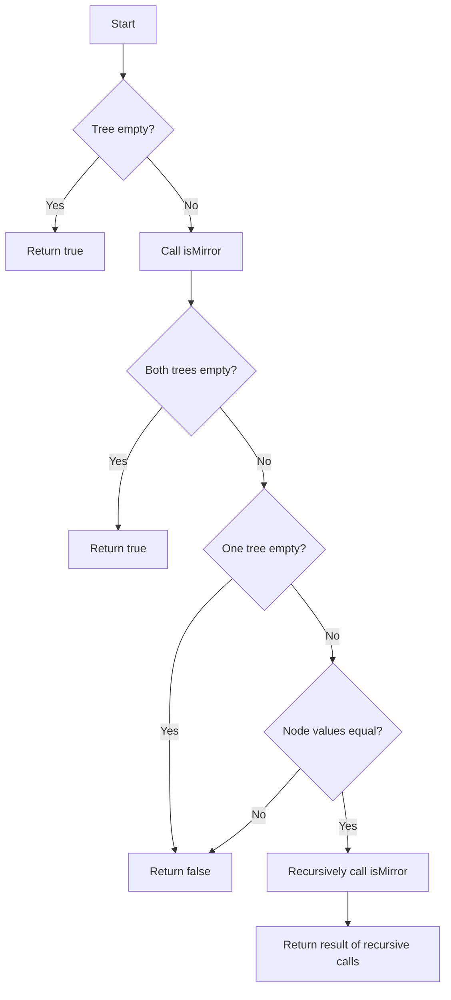

# Symmetric Tree

## Problem Understanding
The problem is asking to determine whether a given binary tree is symmetric around its center. This means that for every node on the left side of the tree, there must be a corresponding node on the right side with the same value, and the structure of the left and right subtrees must be mirror images of each other. The key constraint is that the tree must be symmetric, which implies that the left subtree of the root must be a mirror image of the right subtree. What makes this problem non-trivial is that a naive approach might involve checking all possible subtrees, which would lead to an exponential time complexity.

## Approach
The algorithm strategy is to use a recursive approach to traverse the tree and check if the left subtree is a mirror image of the right subtree. The intuition behind this approach is to compare the nodes on the left and right sides of the tree level by level, starting from the root. This approach works because it ensures that the structure of the left and right subtrees is compared correctly. The `isMirror` helper function is used to recursively check if two trees are mirror images of each other. The `TreeNode` class is used to represent the nodes of the binary tree, and the `isSymmetric` function is the main entry point of the algorithm.

## Complexity Analysis
| Metric | Value | Detailed Reason |
|--------|-------|----------------|
| Time   | O(n)  | The time complexity is O(n) because each node in the tree is visited once. The `isMirror` function recursively visits all nodes in the left and right subtrees, resulting in a total of n visits, where n is the number of nodes in the tree. |
| Space  | O(h)  | The space complexity is O(h) because the recursive call stack can grow up to a maximum depth of h, where h is the height of the tree. In the worst case, the tree is skewed, and h = n, resulting in a space complexity of O(n). However, for a balanced tree, h = log(n), resulting in a space complexity of O(log n). |

## Algorithm Walkthrough
```
Input: 
     1
   /   \
  2     2
 / \   / \
3   4 4   3

Step 1: Check if the tree is empty (it's not)
Step 2: Call the isMirror function with the left and right subtrees as arguments
Step 3: In the isMirror function, check if both trees are empty (they're not)
Step 4: Check if the current nodes have the same value (they do, both are 2)
Step 5: Recursively call the isMirror function with the left subtree of the left tree and the right subtree of the right tree
Step 6: Recursively call the isMirror function with the right subtree of the left tree and the left subtree of the right tree
Step 7: Continue this process until all nodes have been visited
Output: true (the tree is symmetric)
```

## Visual Flow


## Key Insight
> **Tip:** The key insight is to recognize that a symmetric tree can be checked by comparing the left and right subtrees level by level, starting from the root, and ensuring that the structure of the left and right subtrees is a mirror image of each other.

## Edge Cases
- **Empty tree**: If the input tree is empty, the function returns true, because an empty tree is considered symmetric.
- **Single node tree**: If the input tree has only one node, the function returns true, because a single node tree is symmetric.
- **Unbalanced tree**: If the input tree is unbalanced, the function still works correctly, because it checks the symmetry of the tree level by level, regardless of the tree's balance.

## Common Mistakes
- **Mistake 1**: Forgetting to check if the current nodes have the same value before recursively calling the `isMirror` function. To avoid this mistake, always check the node values before making recursive calls.
- **Mistake 2**: Not handling the case where one of the trees is empty. To avoid this mistake, always check if one of the trees is empty before making recursive calls.

## Interview Follow-ups
> **Interview:** These are the exact follow-up questions interviewers ask:
- "What if the input is sorted?" → The algorithm still works correctly, because it checks the symmetry of the tree level by level, regardless of the order of the node values.
- "Can you do it in O(1) space?" → No, because the recursive call stack can grow up to a maximum depth of h, where h is the height of the tree, resulting in a space complexity of O(h).
- "What if there are duplicates?" → The algorithm still works correctly, because it checks the symmetry of the tree level by level, regardless of the presence of duplicate node values.

## Java Solution

```java
// Problem: Symmetric Tree
// Language: Java
// Difficulty: Easy
// Time Complexity: O(n) — each node is visited once
// Space Complexity: O(h) — recursive call stack, h is tree height
// Approach: Recursive tree traversal — check if left subtree is mirror of right subtree

/**
 * Definition for a binary tree node.
 * public class TreeNode {
 *     int val;
 *     TreeNode left;
 *     TreeNode right;
 *     TreeNode() {}
 *     TreeNode(int val) { this.val = val; }
 *     TreeNode(int val, TreeNode left, TreeNode right) {
 *         this.val = val;
 *         this.left = left;
 *         this.right = right;
 *     }
 * }
 */

class Solution {
    public boolean isSymmetric(TreeNode root) {
        // Edge case: empty tree is symmetric
        if (root == null) return true;

        // Call helper function to check if left subtree is mirror of right subtree
        return isMirror(root.left, root.right);
    }

    /**
     * Helper function to check if two trees are mirror images of each other.
     * @param tree1 First tree
     * @param tree2 Second tree
     * @return True if trees are mirror images, false otherwise
     */
    private boolean isMirror(TreeNode tree1, TreeNode tree2) {
        // Edge case: both trees are empty
        if (tree1 == null && tree2 == null) return true;

        // Edge case: one tree is empty, the other is not
        if (tree1 == null || tree2 == null) return false;

        // Check if current nodes have same value
        if (tree1.val != tree2.val) return false;

        // Recursively check if left subtree of tree1 is mirror of right subtree of tree2
        // and right subtree of tree1 is mirror of left subtree of tree2
        return isMirror(tree1.left, tree2.right) && isMirror(tree1.right, tree2.left);
    }
}
```
