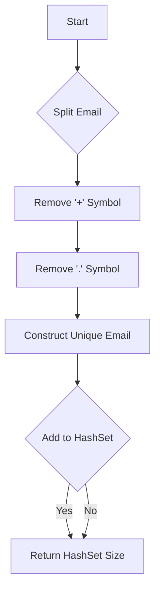

# Unique Email Addresses

## Problem Understanding
The problem asks to find the number of unique email addresses in a given array of email addresses. The key constraint is that email addresses are considered the same if they have the same local name before the '+' symbol and without the '.' symbol. This constraint implies that the email addresses need to be normalized before counting the unique ones. What makes this problem non-trivial is the need to handle the '+' and '.' symbols correctly, as a naive approach might not take into account these special cases.

## Approach
The algorithm strategy is to iterate over each email address, split it into local name and domain, remove everything after the '+' symbol in the local name, remove the '.' symbol from the local name, and construct the unique email address. This approach works because it normalizes the email addresses according to the given constraints, allowing for accurate counting of unique email addresses. A HashSet is used to store the unique email addresses, as it automatically removes duplicates and provides an efficient way to count the unique elements. The approach handles the key constraints by correctly normalizing the email addresses.

## Complexity Analysis
| Metric | Value | Detailed Reason |
|--------|-------|----------------|
| Time   | O(n)  | The algorithm iterates over each email address in the input array, performing a constant amount of work for each email address. The split and replace operations on the local name take constant time, as the size of the local name is bounded by the size of the input string. The HashSet operations (add and size) take constant time on average. |
| Space  | O(n)  | The algorithm uses a HashSet to store the unique email addresses, which in the worst case can store all email addresses in the input array. The space complexity is linear with respect to the input size. |

## Algorithm Walkthrough
```
Input: ["test.email+alex@leetcode.com","test.e.mail+bob.cathy@leetcode.com","testemail+david@lee.tcode.com"]
Step 1: 
  - Split "test.email+alex@leetcode.com" into local name and domain: "test.email+alex" and "leetcode.com"
  - Remove everything after the '+' symbol in the local name: "test.email"
  - Remove the '.' symbol from the local name: "testemail"
  - Construct the unique email address: "testemail@leetcode.com"
  - Add the unique email address to the HashSet: ["testemail@leetcode.com"]
Step 2: 
  - Split "test.e.mail+bob.cathy@leetcode.com" into local name and domain: "test.e.mail+bob.cathy" and "leetcode.com"
  - Remove everything after the '+' symbol in the local name: "test.e.mail"
  - Remove the '.' symbol from the local name: "testemail"
  - Construct the unique email address: "testemail@leetcode.com"
  - Add the unique email address to the HashSet: ["testemail@leetcode.com"] (no change, as it's a duplicate)
Step 3: 
  - Split "testemail+david@lee.tcode.com" into local name and domain: "testemail+david" and "lee.tcode.com"
  - Remove everything after the '+' symbol in the local name: "testemail"
  - Remove the '.' symbol from the local name: "testemail"
  - Construct the unique email address: "testemail@lee.tcode.com"
  - Add the unique email address to the HashSet: ["testemail@leetcode.com", "testemail@lee.tcode.com"]
Output: 2 (the size of the HashSet)
```

## Visual Flow


## Key Insight
> **Tip:** The key insight is to normalize the email addresses by removing everything after the '+' symbol and removing the '.' symbol, allowing for accurate counting of unique email addresses.

## Edge Cases
- **Empty/null input**: If the input array is empty or null, the algorithm will return 0, as there are no email addresses to process.
- **Single element**: If the input array contains a single email address, the algorithm will return 1, as there is only one unique email address.
- **Duplicate email addresses**: If the input array contains duplicate email addresses, the algorithm will correctly count them as a single unique email address.

## Common Mistakes
- **Mistake 1**: Not removing everything after the '+' symbol in the local name, which can lead to incorrect counting of unique email addresses. To avoid this, make sure to split the local name at the '+' symbol and take the first part.
- **Mistake 2**: Not removing the '.' symbol from the local name, which can also lead to incorrect counting of unique email addresses. To avoid this, make sure to replace the '.' symbol with an empty string.

## Interview Follow-ups
> **Interview:** These are the exact follow-up questions interviewers ask:
- "What if the input is sorted?" → The algorithm will still work correctly, as it doesn't rely on the input being sorted.
- "Can you do it in O(1) space?" → No, as we need to store the unique email addresses in a data structure, which requires at least O(n) space.
- "What if there are duplicates?" → The algorithm will correctly count the duplicates as a single unique email address.

## Java Solution

```java
// Problem: Unique Email Addresses
// Language: Java
// Difficulty: Easy
// Time Complexity: O(n) — iterating over each email address
// Space Complexity: O(n) — HashSet stores unique email addresses
// Approach: String manipulation and HashSet — to remove duplicates and count unique email addresses

import java.util.HashSet;
import java.util.Set;

public class Solution {
    public int numUniqueEmails(String[] emails) {
        // Initialize a HashSet to store unique email addresses
        Set<String> uniqueEmails = new HashSet<>();

        // Iterate over each email address
        for (String email : emails) {
            // Split the email address into local name and domain
            String[] parts = email.split("@"); // split at the '@' symbol
            String localName = parts[0];
            String domain = parts[1];

            // Remove everything after the '+' symbol in the local name
            // This is because email addresses are considered the same if they have the same local name before the '+' symbol
            localName = localName.split("\\+")[0]; // split at the '+' symbol

            // Remove the '.' symbol from the local name
            // This is because email addresses are considered the same if they have the same local name without the '.' symbol
            localName = localName.replace(".", ""); // replace '.' with an empty string

            // Construct the unique email address
            String uniqueEmail = localName + "@" + domain;

            // Add the unique email address to the HashSet
            uniqueEmails.add(uniqueEmail); // add to HashSet
        }

        // Return the number of unique email addresses
        return uniqueEmails.size(); // return the size of the HashSet
    }

    public static void main(String[] args) {
        Solution solution = new Solution();
        String[] emails = {"test.email+alex@leetcode.com","test.e.mail+bob.cathy@leetcode.com","testemail+david@lee.tcode.com"};
        System.out.println(solution.numUniqueEmails(emails)); // Output: 2
    }
}
```
