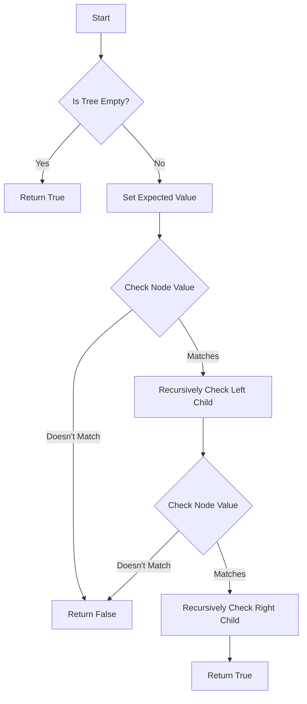

# Univalued Binary Tree

## Problem Understanding
The problem is asking to determine if a given binary tree is univalued, meaning all nodes in the tree have the same value. A key constraint is that the tree can be empty, in which case it's considered univalued. What makes this problem non-trivial is that a naive approach might involve checking every node's value against every other node's value, resulting in a time complexity of O(n^2), where n is the number of nodes in the tree. However, a more efficient approach can be achieved by leveraging the properties of a binary tree and using a recursive traversal strategy.

## Approach
The algorithm strategy is to use a recursive tree traversal approach, where each node's value is checked against the root's value. The intuition behind this approach is that if a node's value doesn't match the root's value, the tree is not univalued. The recursive helper function `isUnivalTreeHelper` is used to traverse the tree and check each node's value. This approach works because it ensures that every node in the tree is visited and its value is checked against the expected value. The data structure used is a recursive call stack, which allows for efficient traversal of the tree. The approach handles the key constraint of an empty tree by returning true, as an empty tree is considered univalued.

## Complexity Analysis
| Metric | Value | Detailed Reason |
|--------|-------|----------------|
| Time   | O(n)  | The algorithm visits each node in the tree once, where n is the number of nodes in the tree. This is because the recursive helper function is called for each node, and each node is visited once. |
| Space  | O(h)  | The algorithm uses a recursive call stack, which can grow up to the height of the tree (h). In the worst-case scenario, the tree is skewed to one side, and the height of the tree is equal to the number of nodes (n). However, in the average case, the height of a balanced binary tree is log(n). |

## Algorithm Walkthrough
```
Input: 
     1
    / \
   1   1
  / \
 1   1

Step 1: Call isUnivalTree with the root node (1)
Step 2: Set the expected value to 1
Step 3: Call isUnivalTreeHelper with the root node (1) and expected value (1)
Step 4: Check if the current node's value (1) matches the expected value (1) - true
Step 5: Recursively call isUnivalTreeHelper with the left child node (1) and expected value (1)
Step 6: Check if the current node's value (1) matches the expected value (1) - true
Step 7: Recursively call isUnivalTreeHelper with the left child node (1) and expected value (1)
Step 8: Check if the current node's value (1) matches the expected value (1) - true
Step 9: Recursively call isUnivalTreeHelper with the right child node (1) and expected value (1)
Step 10: Check if the current node's value (1) matches the expected value (1) - true
Step 11: Return true, as all nodes have the same value
Output: true
```

## Visual Flow


## Key Insight
> **Tip:** The key insight is to leverage the properties of a binary tree and use a recursive traversal strategy to check each node's value against the root's value, allowing for an efficient solution with a time complexity of O(n).

## Edge Cases
- **Empty Tree**: If the input tree is empty, the algorithm returns true, as an empty tree is considered univalued.
- **Single Node Tree**: If the input tree has only one node, the algorithm returns true, as a single node tree is considered univalued.
- **Tree with Different Values**: If the input tree has nodes with different values, the algorithm returns false, as the tree is not univalued.

## Common Mistakes
- **Mistake 1: Not Handling Empty Tree**: Failing to handle the case where the input tree is empty, which can result in a NullPointerException. To avoid this, add a base case to return true when the tree is empty.
- **Mistake 2: Not Checking Node Values Recursively**: Failing to recursively check the node values, which can result in incorrect results. To avoid this, use a recursive helper function to traverse the tree and check each node's value.

## Interview Follow-ups
> **Interview:** These are the exact follow-up questions interviewers ask:
- "What if the input is sorted?" → The algorithm's time complexity remains O(n), as it still needs to visit each node in the tree to check its value.
- "Can you do it in O(1) space?" → No, the algorithm cannot be done in O(1) space, as it uses a recursive call stack to traverse the tree, which can grow up to the height of the tree.
- "What if there are duplicates?" → The algorithm still works correctly, as it checks each node's value against the root's value, and returns false as soon as it finds a node with a different value.

## Java Solution

```java
// Problem: Univalued Binary Tree
// Language: Java
// Difficulty: Easy
// Time Complexity: O(n) — visiting each node once in the worst case
// Space Complexity: O(h) — recursion stack size, where h is the height of the tree
// Approach: Recursive tree traversal with value checking — for each node, check if its value matches the root's value

public class Solution {
    public boolean isUnivalTree(TreeNode root) {
        // Base case: if the tree is empty, it's considered univalued
        if (root == null) return true;
        
        // Define the expected value
        int expectedValue = root.val;
        
        // Recursive helper function to check each node's value
        return isUnivalTreeHelper(root, expectedValue);
    }
    
    private boolean isUnivalTreeHelper(TreeNode node, int expectedValue) {
        // Base case: if the node is null, it's considered univalued
        if (node == null) return true;
        
        // Check if the current node's value matches the expected value
        if (node.val != expectedValue) return false;
        
        // Recursively check the left and right subtrees
        return isUnivalTreeHelper(node.left, expectedValue) && isUnivalTreeHelper(node.right, expectedValue);
    }
}

// Definition for a binary tree node.
public class TreeNode {
    int val;
    TreeNode left;
    TreeNode right;
    TreeNode() {}
    TreeNode(int val) { this.val = val; }
    TreeNode(int val, TreeNode left, TreeNode right) {
        this.val = val;
        this.left = left;
        this.right = right;
    }
}
```
