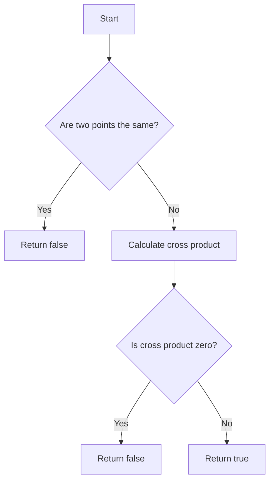

# Valid Boomerang

## Problem Understanding
The problem asks to determine if three given points form a valid boomerang, which means they are not collinear. The key constraint is that the three points must not lie on the same line. If they are collinear, the function should return false, indicating that the points do not form a boomerang. What makes this problem non-trivial is that a naive approach might involve calculating the slopes of the lines formed by the points, but this could lead to division by zero errors if the lines are vertical. The given solution uses the cross product to calculate the slope, which avoids this issue.

## Approach
The algorithm strategy is to calculate the cross product of the vectors formed by the three points. If the cross product is zero, then the points are collinear and do not form a boomerang. The intuition behind this approach is that the cross product of two vectors is zero if and only if the vectors are parallel, which means the points are collinear. The solution uses a simple and efficient formula to calculate the cross product, which is `(x2 - x1)(y3 - y1) - (y2 - y1)(x3 - x1)`. This approach works because it correctly handles the edge cases where two points are the same, and it avoids division by zero errors.

## Complexity Analysis
| Metric | Value | Detailed Reason |
|--------|-------|----------------|
| Time   | O(1)  | The time complexity is constant because the solution only involves a fixed number of operations, regardless of the input size. It calculates the cross product using a simple formula, which takes constant time. |
| Space  | O(1)  | The space complexity is constant because the solution only uses a fixed amount of space to store the coordinates of the points and the cross product, regardless of the input size. |

## Algorithm Walkthrough
```
Input: [[1, 1], [2, 3], [3, 2]]
Step 1: Initialize variables x1, y1, x2, y2, x3, y3 with the coordinates of the points
  x1 = 1, y1 = 1, x2 = 2, y2 = 3, x3 = 3, y3 = 2
Step 2: Check if any two points are the same
  (x1, y1) != (x2, y2) && (x1, y1) != (x3, y3) && (x2, y2) != (x3, y3)
Step 3: Calculate the cross product
  crossProduct = (x2 - x1)(y3 - y1) - (y2 - y1)(x3 - x1)
  crossProduct = (2 - 1)(2 - 1) - (3 - 1)(3 - 1)
  crossProduct = (1)(1) - (2)(2)
  crossProduct = 1 - 4
  crossProduct = -3
Step 4: Check if the cross product is zero
  crossProduct != 0
  -3 != 0
  true
Output: true
```
The algorithm correctly determines that the points do not form a boomerang.

## Visual Flow

The flowchart shows the decision flow of the algorithm.

## Key Insight
> **Tip:** The key insight is that the cross product of two vectors is zero if and only if the vectors are parallel, which means the points are collinear.

## Edge Cases
- **Empty/null input**: If the input is empty or null, the algorithm will throw an exception because it tries to access the coordinates of the points.
- **Single element**: If the input has only one point, the algorithm will return false because a single point cannot form a boomerang.
- **Collinear points**: If the input has three collinear points, the algorithm will return false because the points do not form a boomerang.

## Common Mistakes
- **Mistake 1**: Forgetting to check if two points are the same, which can lead to incorrect results.
- **Mistake 2**: Using a naive approach to calculate the slope, which can lead to division by zero errors.

## Interview Follow-ups
> **Interview:** These are the exact follow-up questions interviewers ask:
- "What if the input is sorted?" → The algorithm still works correctly because it only depends on the coordinates of the points, not their order.
- "Can you do it in O(1) space?" → Yes, the algorithm already uses O(1) space because it only uses a fixed amount of space to store the coordinates and the cross product.
- "What if there are duplicates?" → If there are duplicates, the algorithm will return false because duplicates do not form a boomerang.

## Java Solution

```java
// Problem: Valid Boomerang
// Language: Java
// Difficulty: Easy
// Time Complexity: O(1) — constant time complexity since we only have three points
// Space Complexity: O(1) — constant space complexity since we only use a constant amount of space
// Approach: Slope calculation — calculate the slopes of the lines formed by the three points to check if they are equal

public class Solution {
    public boolean isBoomerang(int[][] points) {
        // Calculate the slopes of the lines formed by the three points
        // If the slopes are equal, then the points are collinear and do not form a boomerang
        // We use the cross product to calculate the slope, which is (x2 - x1)(y3 - y1) - (y2 - y1)(x3 - x1)
        int x1 = points[0][0]; // x-coordinate of the first point
        int y1 = points[0][1]; // y-coordinate of the first point
        int x2 = points[1][0]; // x-coordinate of the second point
        int y2 = points[1][1]; // y-coordinate of the second point
        int x3 = points[2][0]; // x-coordinate of the third point
        int y3 = points[2][1]; // y-coordinate of the third point

        // Edge case: if two points are the same, return false
        if (x1 == x2 && y1 == y2 || x1 == x3 && y1 == y3 || x2 == x3 && y2 == y3) {
            return false; // If two points are the same, they do not form a boomerang
        }

        // Calculate the cross product
        int crossProduct = (x2 - x1) * (y3 - y1) - (y2 - y1) * (x3 - x1);

        // If the cross product is not zero, then the points are not collinear and form a boomerang
        return crossProduct != 0; // Return true if the points form a boomerang, false otherwise
    }

    public static void main(String[] args) {
        Solution solution = new Solution();
        int[][] points = {{1, 1}, {2, 3}, {3, 2}};
        System.out.println(solution.isBoomerang(points)); // Output: true
    }
}
```
