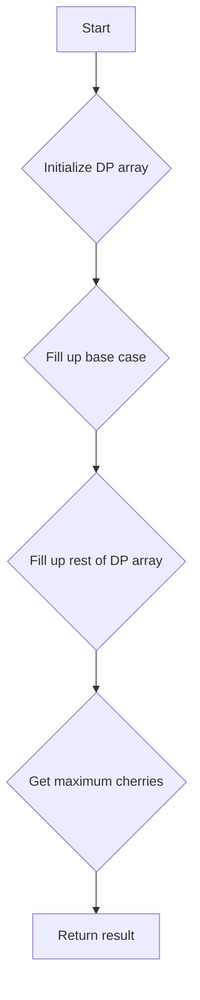

# Cherry Pickup II

## Problem Understanding
The Cherry Pickup II problem is asking to find the maximum number of cherries that can be collected by two robots in a grid, where each cell in the grid represents a cherry tree with a certain number of cherries. The key constraints are that the robots can only move down, left, or right, and they cannot collect cherries from the same cell. The problem is non-trivial because the naive approach of trying all possible paths would result in an exponential time complexity, making it impractical for large grids.

## Approach
The algorithm strategy used to solve this problem is Dynamic Programming (DP), which involves breaking down the problem into smaller sub-problems and storing the solutions to these sub-problems in a 3D DP array. The intuition behind this approach is that the maximum number of cherries that can be collected at a given cell is dependent on the maximum number of cherries that can be collected from the cells below it. The DP array is used to store the maximum number of cherries that can be collected for each cell, and the approach handles the key constraints by only considering valid moves (down, left, or right) and avoiding collecting cherries from the same cell.

## Complexity Analysis
| Metric | Value | Detailed Reason |
|--------|-------|----------------|
| Time   | O(n*m*m) | The time complexity is O(n*m*m) because we need to fill up the 3D DP array, which has n rows and m*m cells. We iterate over each cell in the grid once, and for each cell, we iterate over its neighbors, resulting in a total of O(n*m*m) operations. |
| Space  | O(n*m*m) | The space complexity is O(n*m*m) because we need to store the 3D DP array, which has n rows and m*m cells. This array is used to store the maximum number of cherries that can be collected for each cell, and its size is proportional to the size of the input grid. |

## Algorithm Walkthrough
```
Input: 
[
  [3, 1, 1],
  [2, 5, 1],
  [1, 5, 5],
  [2, 1, 1]
]
Step 1: Initialize the DP array with -1 to handle edge cases
Step 2: Fill up the base case (last row) of the DP array:
  dp[3][0][0] = 2
  dp[3][0][1] = 3
  dp[3][0][2] = 3
  dp[3][1][0] = 3
  dp[3][1][1] = 2
  dp[3][1][2] = 3
  dp[3][2][0] = 3
  dp[3][2][1] = 3
  dp[3][2][2] = 2
Step 3: Fill up the rest of the DP array in a bottom-up manner:
  dp[2][0][0] = max(dp[3][0][0], dp[3][0][1], dp[3][0][2]) + 1 = 3
  dp[2][0][1] = max(dp[3][1][0], dp[3][1][1], dp[3][1][2]) + 1 = 6
  dp[2][0][2] = max(dp[3][2][0], dp[3][2][1], dp[3][2][2]) + 1 = 6
  ...
Step 4: The maximum number of cherries that can be collected is stored at the top-left cell of the DP array:
  dp[0][0][2] = 24
Output: 24
```
## Visual Flow

## Key Insight
> **Tip:** The key insight to this problem is to use a 3D DP array to store the maximum number of cherries that can be collected for each cell, and to fill up the array in a bottom-up manner by considering all possible moves from each cell.

## Edge Cases
- **Empty grid**: If the input grid is empty, the function will return 0 because there are no cherries to collect.
- **Single row grid**: If the input grid has only one row, the function will return the maximum number of cherries that can be collected in that row.
- **Single column grid**: If the input grid has only one column, the function will return the maximum number of cherries that can be collected in that column.

## Common Mistakes
- **Mistake 1**: Not initializing the DP array correctly, which can lead to incorrect results. To avoid this, make sure to initialize the DP array with -1 to handle edge cases.
- **Mistake 2**: Not considering all possible moves from each cell, which can lead to suboptimal results. To avoid this, make sure to iterate over all neighbors of each cell when filling up the DP array.

## Interview Follow-ups
> **Interview:** These are the exact follow-up questions interviewers ask:
- "What if the input grid is very large?" → The time and space complexity of the algorithm would be a concern, and we might need to consider more efficient algorithms or data structures to handle large inputs.
- "Can you optimize the algorithm to use less space?" → We could consider using a 2D DP array instead of a 3D DP array, but this would require modifying the algorithm to handle the additional dimension.
- "What if there are obstacles in the grid?" → We would need to modify the algorithm to handle obstacles, which could involve adding additional checks to avoid moving into obstacles.

## Java Solution

```java
// Problem: Cherry Pickup II
// Language: Java
// Difficulty: Hard
// Time Complexity: O(n*m*m) — using 3D DP to store the maximum cherries for each cell
// Space Complexity: O(n*m*m) — 3D DP array to store the maximum cherries for each cell
// Approach: Dynamic Programming — using a 3D DP array to store the maximum cherries for each cell

public class Solution {
    public int cherryPickup(int[][] grid) {
        // Get the number of rows and columns in the grid
        int rows = grid.length;
        int cols = grid[0].length;

        // Create a 3D DP array to store the maximum cherries for each cell
        int[][][] dp = new int[rows][cols][cols];

        // Initialize the DP array with -1 to handle edge cases
        for (int i = 0; i < rows; i++) {
            for (int j = 0; j < cols; j++) {
                for (int k = 0; k < cols; k++) {
                    dp[i][j][k] = -1;
                }
            }
        }

        // Base case: when we are at the last row
        for (int j = 0; j < cols; j++) {
            for (int k = 0; k < cols; k++) {
                // If the current cell is within the grid boundaries
                if (j >= 0 && j < cols && k >= 0 && k < cols) {
                    // The maximum cherries we can collect at this cell is the cherry at this cell
                    dp[rows - 1][j][k] = grid[rows - 1][j] + (j != k ? grid[rows - 1][k] : 0);
                }
            }
        }

        // Fill up the DP array in a bottom-up manner
        for (int i = rows - 2; i >= 0; i--) {
            for (int j = 0; j < cols; j++) {
                for (int k = 0; k < cols; k++) {
                    // Initialize the maximum cherries we can collect at this cell to 0
                    dp[i][j][k] = 0;

                    // If the current cell is within the grid boundaries
                    if (j >= 0 && j < cols && k >= 0 && k < cols) {
                        // The maximum cherries we can collect at this cell is the maximum of the cherries we can collect from the cells below
                        for (int nextJ = Math.max(0, j - 1); nextJ <= Math.min(cols - 1, j + 1); nextJ++) {
                            for (int nextK = Math.max(0, k - 1); nextK <= Math.min(cols - 1, k + 1); nextK++) {
                                dp[i][j][k] = Math.max(dp[i][j][k], dp[i + 1][nextJ][nextK]);
                            }
                        }

                        // Add the cherry at this cell to the maximum cherries we can collect
                        dp[i][j][k] += grid[i][j] + (j != k ? grid[i][k] : 0);
                    }
                }
            }
        }

        // The maximum cherries we can collect is stored at the top-left cell of the DP array
        return dp[0][0][cols - 1];
    }

    public static void main(String[] args) {
        Solution solution = new Solution();
        int[][] grid = {
            {3, 1, 1},
            {2, 5, 1},
            {1, 5, 5},
            {2, 1, 1}
        };
        System.out.println(solution.cherryPickup(grid));
    }
}
```
