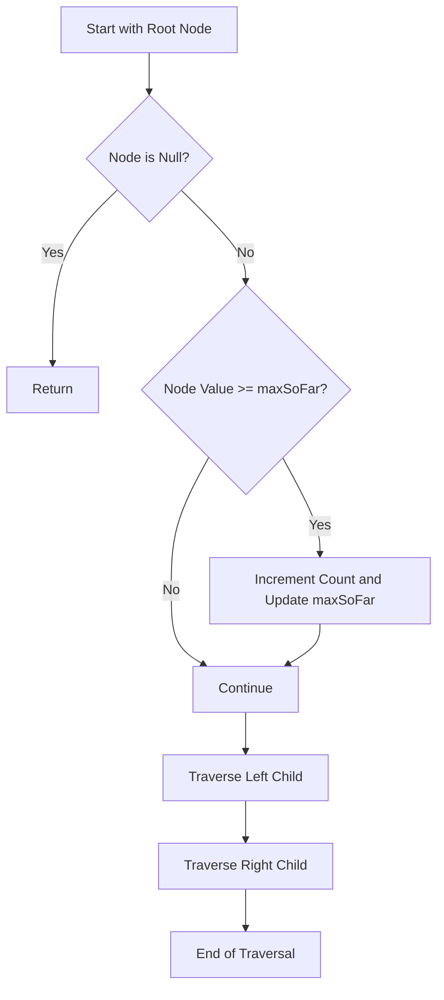

# Count Good Nodes in Binary Tree

## Problem Understanding
The problem is asking to count the number of "good" nodes in a binary tree, where a good node is defined as a node whose value is greater than or equal to the maximum value on the path from the root to that node. The key constraint is that the comparison is done along the path from the root to each node, making it non-trivial because a naive approach would require keeping track of all possible paths and their maximum values. The problem becomes even more challenging due to the recursive nature of the tree traversal.

## Approach
The algorithm strategy involves recursive traversal of the binary tree, keeping track of the maximum value seen so far along the path to each node. The intuition behind this approach is to maintain a running maximum value as we traverse down the tree, updating it whenever we encounter a node with a value greater than or equal to the current maximum. This approach works because it ensures that each node's value is compared against the maximum value seen on the path from the root to that node, which is the definition of a "good" node. An array is used to store the count of good nodes, allowing it to be modified within the recursive helper function.

## Complexity Analysis
| Metric | Value | Detailed Reason |
|--------|-------|----------------|
| Time   | O(n)  | The algorithm visits each node in the tree exactly once, where n is the number of nodes in the tree. This is because the recursive traversal ensures that every node is visited in a depth-first manner. |
| Space  | O(h)  | The space complexity is determined by the height of the recursive call stack, which in the worst case (a skewed tree) can be equal to the number of nodes in the tree. However, for a balanced binary tree, the height (h) is approximately log(n), reducing the space complexity. |

## Algorithm Walkthrough
```
Input: 
     3
    / \
   1   4
  / \
 3   4

Step 1: Start with the root node (3) and initialize maxSoFar as 3.
Step 2: Traverse to the left child (1) of the root. Since 1 < 3, it's not a good node.
Step 3: Traverse to the left child (3) of node 1. Since 3 >= 3, it's a good node. Increment count and update maxSoFar to 3.
Step 4: Traverse to the right child (4) of node 1. Since 4 >= 3, it's a good node. Increment count and update maxSoFar to 4.
Step 5: Traverse to the right child (4) of the root. Since 4 >= 3, it's a good node. Increment count and update maxSoFar to 4.
Output: The total count of good nodes is 4.
```

## Visual Flow


## Key Insight
> **Tip:** The key to solving this problem is to maintain a running maximum value (`maxSoFar`) as you traverse down the tree, and update it whenever you encounter a node that is a "good" node, ensuring that each subsequent node's value is compared against the most up-to-date maximum value seen along the path.

## Edge Cases
- **Empty Tree**: If the input tree is empty (i.e., `root` is `null`), the function correctly returns 0, as there are no nodes to consider.
- **Single Element Tree**: For a tree consisting of a single node, the function returns 1, because the single node is considered a "good" node since its value is greater than or equal to the maximum value seen on the path to itself (which is the node's value itself).
- **All Nodes Have the Same Value**: In a tree where all nodes have the same value, every node is considered "good" because each node's value is greater than or equal to the maximum value seen on the path from the root to that node. The function correctly counts all nodes in this scenario.

## Common Mistakes
- **Mistake 1: Not Updating maxSoFar Correctly**: Failing to update `maxSoFar` when a node with a value greater than or equal to the current `maxSoFar` is encountered. This can be avoided by ensuring that the update logic is correctly implemented within the recursive function.
- **Mistake 2: Incorrect Counting of Good Nodes**: Incorrectly incrementing the count of good nodes. This can be avoided by ensuring that the increment operation is only performed when a node's value is indeed greater than or equal to the current `maxSoFar`.

## Interview Follow-ups
> **Interview:** These are the exact follow-up questions interviewers ask:
- "What if the input is sorted?" → The algorithm still works correctly, as it compares each node's value against the maximum value seen along the path to that node, regardless of the overall sorting of the tree.
- "Can you do it in O(1) space?" → No, because the recursive call stack will always use at least O(h) space, where h is the height of the tree. However, for an iterative approach using a stack, the space complexity would still be O(n) in the worst case.
- "What if there are duplicates?" → The algorithm handles duplicates correctly by comparing each node's value against the maximum value seen so far. If a node's value is equal to the current maximum, it is still considered a "good" node.

## Java Solution

```java
// Problem: Count Good Nodes in Binary Tree
// Language: Java
// Difficulty: Hard
// Time Complexity: O(n) — recursive traversal of all nodes in the tree
// Space Complexity: O(h) — recursive call stack can go up to the height of the tree
// Approach: Recursive traversal with max value tracking — for each node, check if its value is greater than or equal to the max value seen so far

/**
 * Definition for a binary tree node.
 * public class TreeNode {
 *     int val;
 *     TreeNode left;
 *     TreeNode right;
 *     TreeNode() {}
 *     TreeNode(int val) { this.val = val; }
 *     TreeNode(int val, TreeNode left, TreeNode right) {
 *         this.val = val;
 *         this.left = left;
 *         this.right = right;
 *     }
 * }
 */
class Solution {
    public int goodNodes(TreeNode root) {
        // Edge case: empty tree → return 0
        if (root == null) return 0;
        
        // Initialize count of good nodes
        int[] count = new int[1];
        
        // Recursive helper function to traverse the tree and count good nodes
        traverse(root, root.val, count);
        
        // Return the count of good nodes
        return count[0];
    }
    
    // Recursive helper function to traverse the tree and count good nodes
    private void traverse(TreeNode node, int maxSoFar, int[] count) {
        // If the current node is null, return immediately
        if (node == null) return;
        
        // If the current node's value is greater than or equal to the max value seen so far, increment the count
        if (node.val >= maxSoFar) {
            count[0]++; // Increment the count of good nodes
            maxSoFar = node.val; // Update the max value seen so far
        }
        
        // Recursively traverse the left and right subtrees
        traverse(node.left, maxSoFar, count); // Traverse the left subtree
        traverse(node.right, maxSoFar, count); // Traverse the right subtree
    }
}
```
