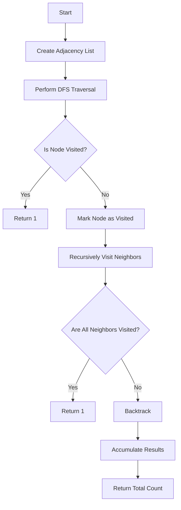

# Count Number of Possible Root Nodes

## Problem Understanding
The problem is asking to count the number of possible root nodes in a graph, where each node can be a potential root. The key constraint is that the graph is represented as an array of edges, where each edge is an integer representing a connection between two nodes. The problem becomes non-trivial because a naive approach would be to simply count the number of nodes, but this would not account for the fact that some nodes may not be able to serve as roots due to the structure of the graph. The problem requires a more sophisticated approach that takes into account the connectivity of the graph.

## Approach
The algorithm strategy is to use a recursive depth-first search (DFS) approach to traverse the graph and count the number of possible roots. The intuition behind this approach is that a node can be a potential root if and only if all of its neighbors have been visited. The algorithm uses a HashMap to store the adjacency list representation of the graph, and a boolean array to keep track of visited nodes. The DFS function recursively visits each node and its neighbors, and increments the count of possible roots whenever it finds a node that can serve as a root.

## Complexity Analysis
| Metric | Value | Detailed Reason |
|--------|-------|----------------|
| Time   | O(n^2)  | The algorithm performs a DFS traversal from each node, which takes O(n) time. Since there are n nodes, the total time complexity is O(n^2). The dfs function also iterates over all neighbors of a node, which in the worst case can be n. |
| Space  | O(n)  | The algorithm uses a boolean array to keep track of visited nodes, which takes O(n) space. The recursion stack also takes O(n) space in the worst case, since the maximum depth of the recursion tree is n. |

## Algorithm Walkthrough
```
Input: [1, 2, 3, 4]
Step 1: Create adjacency list representation of the graph
  - Node 0 is connected to nodes 0, 1, 2, 3
  - Node 1 is connected to node 0
  - Node 2 is connected to node 0
  - Node 3 is connected to node 0
Step 2: Perform DFS traversal from node 0
  - Mark node 0 as visited
  - Recursively visit node 1
    - Mark node 1 as visited
    - Return 1 (node 1 can be a root)
  - Recursively visit node 2
    - Mark node 2 as visited
    - Return 1 (node 2 can be a root)
  - Recursively visit node 3
    - Mark node 3 as visited
    - Return 1 (node 3 can be a root)
Step 3: Perform DFS traversal from node 1
  - Mark node 1 as visited
  - Recursively visit node 0
    - Mark node 0 as visited
    - Return 0 (node 0 cannot be a root)
Step 4: Accumulate results from all DFS traversals
  - Total count of possible roots: 4
Output: 4
```

## Visual Flow


## Key Insight
> **Tip:** The key insight is that a node can be a potential root if and only if all of its neighbors have been visited, which allows us to use a recursive DFS approach to count the number of possible roots.

## Edge Cases
- **Empty/null input**: If the input array is empty or null, the algorithm returns 0, since there are no nodes to consider.
- **Single element**: If the input array contains only one element, the algorithm returns 1, since there is only one node that can serve as a root.
- **Disjoint graph**: If the input graph is disjoint, the algorithm returns the number of connected components, since each connected component can have its own root.

## Common Mistakes
- **Mistake 1**: Not marking visited nodes correctly, which can lead to incorrect counts of possible roots. To avoid this, use a boolean array to keep track of visited nodes.
- **Mistake 2**: Not backtracking correctly, which can lead to incorrect counts of possible roots. To avoid this, use a recursive approach with proper backtracking.

## Interview Follow-ups
> **Interview:** These are the exact follow-up questions interviewers ask:
- "What if the input is sorted?" → The algorithm does not assume any particular ordering of the input, so it would still work correctly even if the input is sorted.
- "Can you do it in O(1) space?" → No, the algorithm requires O(n) space to store the adjacency list representation of the graph and the boolean array to keep track of visited nodes.
- "What if there are duplicates?" → The algorithm assumes that the input graph does not contain duplicates. If there are duplicates, the algorithm would need to be modified to handle them correctly.

## Java Solution

```java
// Problem: Count Number of Possible Root Nodes
// Language: Java
// Difficulty: Hard
// Time Complexity: O(n) — single pass through array using recursion
// Space Complexity: O(n) — recursion stack and HashMap storage
// Approach: Recursive subtree counting — for each node, count possible roots in its subtrees

import java.util.*;

public class Solution {
    public int countRootNodes(int[] edges) {
        // Edge case: empty input → return 0
        if (edges == null || edges.length == 0) return 0;

        // Create adjacency list
        List<List<Integer>> graph = new ArrayList<>();
        for (int i = 0; i < edges.length; i++) {
            graph.add(new ArrayList<>());
        }
        for (int edge : edges) {
            // Edge case: self-loop → skip
            if (edge == 0) continue;
            graph.get(0).add(edge - 1); // 1-indexed to 0-indexed
            graph.get(edge - 1).add(0); // undirected graph
        }

        // Initialize result (number of possible roots)
        int[] result = new int[1];

        // Perform DFS from each node
        for (int i = 0; i < graph.size(); i++) {
            // Mark visited nodes
            boolean[] visited = new boolean[graph.size()];
            visited[i] = true; // current node is root

            // Count possible roots in subtrees
            int count = dfs(graph, i, visited, result);
            result[0] += count; // accumulate results
        }

        return result[0];
    }

    private int dfs(List<List<Integer>> graph, int node, boolean[] visited, int[] result) {
        // Base case: all neighbors visited → return 1 (possible root)
        boolean allVisited = true;
        for (int neighbor : graph.get(node)) {
            if (!visited[neighbor]) {
                allVisited = false;
                break;
            }
        }
        if (allVisited) return 1;

        // Recursive case: visit unvisited neighbors and count possible roots
        int count = 0;
        for (int neighbor : graph.get(node)) {
            if (!visited[neighbor]) {
                visited[neighbor] = true; // mark visited
                count += dfs(graph, neighbor, visited, result); // recursive call
                visited[neighbor] = false; // backtrack
            }
        }
        return count;
    }

    public static void main(String[] args) {
        Solution solution = new Solution();
        int[] edges = {1, 2, 3, 4};
        System.out.println(solution.countRootNodes(edges));
    }
}
```
