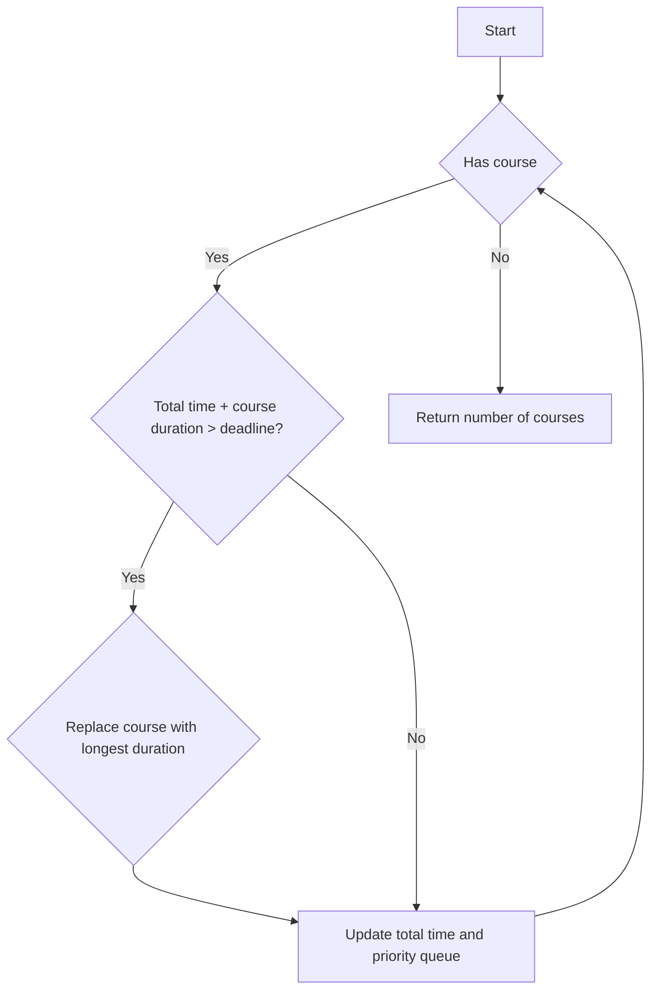

# Course Schedule III

## Problem Understanding
The problem Course Schedule III is asking to find the maximum number of courses that can be taken given their durations and deadlines. The key constraint is that the total time spent on courses cannot exceed the deadline of the course. This problem is non-trivial because a naive approach of simply taking all courses or taking courses in the order they are given would not work, as it may lead to exceeding the deadline. The problem requires a more sophisticated approach that takes into account the deadlines and durations of the courses.

## Approach
The algorithm strategy used to solve this problem is a greedy algorithm with a priority queue. The intuition behind this approach is to choose courses with the earliest deadline and, in case of a conflict, replace the course with the longest duration with the current course. This approach works because it ensures that we always have a valid schedule by not exceeding the deadline. The priority queue is used to store courses with their deadlines as the key, allowing us to efficiently find and remove the course with the longest duration. The algorithm handles the key constraints by checking if the total time spent on courses exceeds the deadline and taking corrective action by removing the course with the longest duration.

## Complexity Analysis
| Metric | Value | Detailed Reason |
|--------|-------|----------------|
| Time   | O(n log n) | The time complexity is O(n log n) due to the sorting and priority queue operations. The sorting operation takes O(n log n) time, and the priority queue operations (insertion and deletion) take O(log n) time. Since these operations are performed n times, the overall time complexity is O(n log n). |
| Space  | O(n) | The space complexity is O(n) because we are storing courses in the priority queue. In the worst case, all courses are stored in the priority queue, resulting in a space complexity of O(n). |

## Algorithm Walkthrough
```
Input: [[100, 200], [200, 1300], [1000, 1250], [2000, 3200]]
Step 1: Initialize priority queue and total time (0)
Step 2: Add course [100, 200] to priority queue, total time = 100
Step 3: Add course [200, 1300] to priority queue, total time = 300
Step 4: Add course [1000, 1250] to priority queue, total time = 1300
Step 5: Since total time (1300) + course duration (2000) > course deadline (3200), replace course [1000, 1250] with [2000, 3200], total time = 3200
Output: 3 (number of courses in schedule)
```
## Visual Flow

## Key Insight
> **Tip:** The key insight to solving this problem is to use a greedy approach with a priority queue to efficiently manage courses with conflicting deadlines and durations.

## Edge Cases
- **Empty/null input**: If the input is empty or null, the algorithm will return 0, as there are no courses to schedule.
- **Single element**: If there is only one course, the algorithm will return 1, as it can always schedule a single course.
- **Courses with same deadline**: If multiple courses have the same deadline, the algorithm will choose the course with the shortest duration to minimize the total time spent.

## Common Mistakes
- **Mistake 1**: Not checking for conflicts between course deadlines and total time spent. → To avoid this, always check if the total time spent on courses exceeds the deadline of the current course.
- **Mistake 2**: Not using a priority queue to efficiently manage courses with conflicting deadlines and durations. → To avoid this, use a priority queue to store courses and efficiently find and remove the course with the longest duration.

## Interview Follow-ups
> **Interview:** These are the exact follow-up questions interviewers ask:
- "What if the input is sorted?" → The algorithm will still work correctly, but the time complexity will be O(n) due to the removal of the sorting operation.
- "Can you do it in O(1) space?" → No, it is not possible to solve this problem in O(1) space, as we need to store courses in a data structure to efficiently manage them.
- "What if there are duplicates?" → The algorithm will treat duplicate courses as separate courses and schedule them accordingly. However, this may lead to inefficient scheduling, and additional logic may be needed to handle duplicates.

## Java Solution

```java
// Problem: Course Schedule III
// Language: Java
// Difficulty: Hard
// Time Complexity: O(n log n) — sorting and priority queue operations
// Space Complexity: O(n) — storing courses in priority queue
// Approach: Greedy algorithm with priority queue — choose courses with earliest deadline

import java.util.PriorityQueue;

public class Solution {
    public int scheduleCourse(int[][] courses) {
        // Sort courses by deadline // this is necessary for choosing courses with earliest deadline
        PriorityQueue<int[]> pq = new PriorityQueue<>((a, b) -> a[1] - b[1]); // min heap based on deadline
        int totalTime = 0; // total time spent on courses

        for (int[] course : courses) {
            // Edge case: if total time exceeds deadline, remove course with longest duration // this ensures we always have a valid schedule
            if (totalTime + course[0] > course[1]) {
                if (!pq.isEmpty() && pq.peek()[0] > course[0]) { // if current course has shorter duration than longest course, replace it
                    totalTime -= pq.poll()[0]; // remove longest course
                    totalTime += course[0]; // add current course
                    pq.offer(course);
                }
            } else { // if total time does not exceed deadline, add course
                totalTime += course[0];
                pq.offer(course);
            }
        }

        return pq.size(); // return number of courses in schedule
    }

    public static void main(String[] args) {
        Solution solution = new Solution();
        int[][] courses = {{100, 200}, {200, 1300}, {1000, 1250}, {2000, 3200}};
        System.out.println(solution.scheduleCourse(courses)); // Output: 3
    }
}
```
