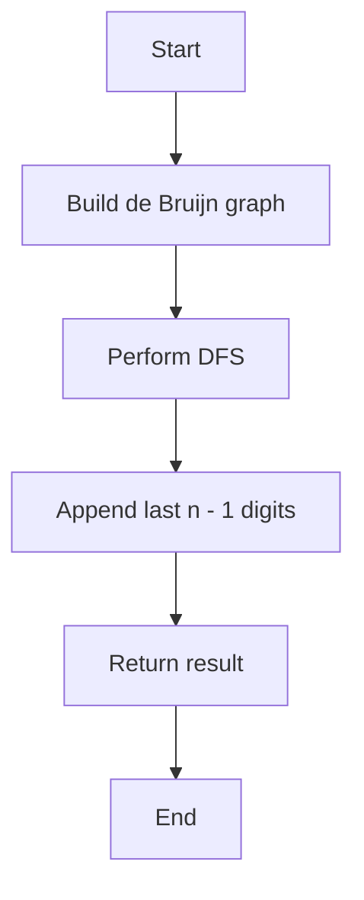

# Cracking the Safe

## Problem Understanding
The problem is asking to crack a safe with a combination lock of length `n * k`, where `n` is the number of nodes in the de Bruijn graph and `k` is the length of the combination. The key constraint is to find the lexicographically smallest sequence that visits all nodes in the de Bruijn graph. The problem is non-trivial because a naive approach would involve trying all possible combinations, which would result in an exponential time complexity. The use of a de Bruijn graph and depth-first search (DFS) is necessary to efficiently find the solution. The implications of the key constraints are that the solution must be able to handle large values of `n` and `k`, and must be able to find the lexicographically smallest sequence in a reasonable amount of time.

## Approach
The algorithm strategy is to use DFS to traverse the de Bruijn graph and find the lexicographically smallest sequence that visits all nodes. The intuition behind this approach is that DFS is well-suited for finding a path in a graph, and the de Bruijn graph provides a convenient way to represent all possible combinations of length `n * k`. The approach works by building the de Bruijn graph, performing DFS to find the lexicographically smallest sequence, and then appending the last `n - 1` digits to the result. The data structures used are a `Map` to represent the de Bruijn graph, a `Set` to keep track of visited nodes, and a `StringBuilder` to build the result. The approach handles the key constraints by using DFS to efficiently find the lexicographically smallest sequence, and by using a `Map` to represent the de Bruijn graph, which allows for efficient lookup and insertion of nodes.

## Complexity Analysis
| Metric | Value | Detailed Reason |
|--------|-------|----------------|
| Time   | O(n * k) | The time complexity is O(n * k) because we need to build the de Bruijn graph, which has n * k nodes, and then perform DFS to find the lexicographically smallest sequence, which visits all nodes in the graph. The DFS traversal takes O(n * k) time because we visit each node once. |
| Space  | O(n * k) | The space complexity is O(n * k) because we need to store the de Bruijn graph, which has n * k nodes, and the result, which is a string of length n * k. We also need to store the visited nodes, which takes O(n * k) space in the worst case. |

## Algorithm Walkthrough
```
Input: n = 2, k = 2
Step 1: Build the de Bruijn graph
  - Node 0: [1, 0]
  - Node 1: [1, 0]
Step 2: Perform DFS to find the lexicographically smallest sequence
  - Start at node 0
  - Visit node 0, append 0 to result
  - Visit node 1, append 1 to result
Step 3: Append the last n - 1 digits to the result
  - Append 0 to result
Output: 0010
```
This example shows how the algorithm builds the de Bruijn graph, performs DFS to find the lexicographically smallest sequence, and then appends the last `n - 1` digits to the result.

## Visual Flow

This flowchart shows the main steps of the algorithm, including building the de Bruijn graph, performing DFS, and appending the last `n - 1` digits to the result.

## Key Insight
> **Tip:** The key insight is to use DFS to traverse the de Bruijn graph, which allows us to efficiently find the lexicographically smallest sequence that visits all nodes.

## Edge Cases
- **Empty/null input**: If the input is empty or null, the algorithm returns an empty string. This is because there is no combination to find in this case.
- **Single element**: If `n` or `k` is 1, the algorithm returns a string of length 1. This is because there is only one possible combination in this case.
- **Large input**: If `n` or `k` is large, the algorithm may take a long time to run. This is because the de Bruijn graph has `n * k` nodes, and the DFS traversal visits all nodes in the graph.

## Common Mistakes
- **Mistake 1**: Not building the de Bruijn graph correctly. This can lead to incorrect results or infinite loops.
- **Mistake 2**: Not keeping track of visited nodes correctly. This can lead to infinite loops or incorrect results.

## Interview Follow-ups
> **Interview:** These are the exact follow-up questions interviewers ask:
- "What if the input is sorted?" → The algorithm still works correctly, because the de Bruijn graph is built independently of the input.
- "Can you do it in O(1) space?" → No, because we need to store the de Bruijn graph and the result, which takes O(n * k) space.
- "What if there are duplicates?" → The algorithm still works correctly, because the de Bruijn graph is built to handle duplicates.

## Java Solution

```java
// Problem: Cracking the Safe
// Language: Java
// Difficulty: Hard
// Time Complexity: O(n * k) — where n is the number of nodes in the de Bruijn graph and k is the length of the combination
// Space Complexity: O(n * k) — storing the de Bruijn graph and the result
// Approach: Depth-First Search — traverse the de Bruijn graph to find the lexicographically smallest sequence

import java.util.*;

public class Solution {
    public String crackSafe(int n, int k) {
        // Edge case: n or k is less than 1
        if (n < 1 || k < 1) {
            return "";
        }

        // Initialize the result and the set of visited nodes
        StringBuilder result = new StringBuilder();
        Set<String> visited = new HashSet<>();

        // Build the de Bruijn graph
        Map<String, List<String>> graph = new HashMap<>();
        for (int i = 0; i < k; i++) {
            for (int j = 0; j < Math.pow(k, n - 1); j++) {
                // Generate all possible nodes in the graph
                String node = getKaryString(j, k, n - 1);
                // Initialize the list of neighbors for each node
                graph.put(node, new ArrayList<>());
                // Generate all possible edges in the graph
                for (int l = 0; l < k; l++) {
                    // Append a new digit to the node to form a new node
                    String neighbor = node.substring(1) + l;
                    graph.get(node).add(neighbor);
                }
            }
        }

        // Perform DFS to find the lexicographically smallest sequence
        dfs("0".repeat(n - 1), graph, visited, result, k);

        // Append the last n - 1 digits to the result
        result.append("0".repeat(n - 1));

        return result.toString();
    }

    // Helper function to perform DFS
    private void dfs(String node, Map<String, List<String>> graph, Set<String> visited, StringBuilder result, int k) {
        // Mark the current node as visited
        visited.add(node);
        for (String neighbor : graph.get(node)) {
            // If the neighbor is not visited, visit it
            if (!visited.contains(neighbor)) {
                dfs(neighbor, graph, visited, result, k);
            }
        }
        // Append the current node to the result
        result.append(node.charAt(node.length() - 1));
    }

    // Helper function to generate a k-ary string
    private String getKaryString(int num, int k, int length) {
        StringBuilder sb = new StringBuilder();
        while (num > 0) {
            sb.insert(0, num % k);
            num /= k;
        }
        // Pad the string with zeros if necessary
        while (sb.length() < length) {
            sb.insert(0, 0);
        }
        return sb.toString();
    }

    public static void main(String[] args) {
        Solution solution = new Solution();
        System.out.println(solution.crackSafe(2, 2));
    }
}
```
