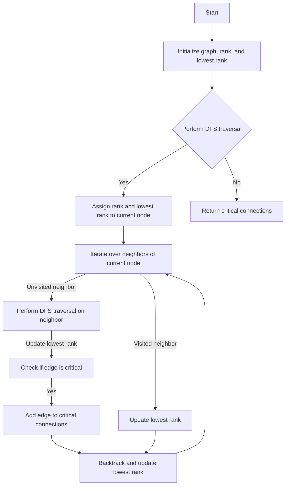

# Critical Connections in Network

## Problem Understanding
The problem asks us to find all critical connections in a given network, where a critical connection is an edge that, when removed, increases the number of connected components in the network. The key constraint is that the network is represented as an undirected graph, and we need to identify the edges that are critical to the connectivity of the graph. This problem is non-trivial because a naive approach would involve removing each edge and checking if the graph becomes disconnected, which would result in a time complexity of O(n*m), where n is the number of nodes and m is the number of edges.

## Approach
The algorithm strategy used here is a Depth-First Search (DFS) traversal of the graph with rank assignment, where each node is assigned a rank based on its discovery time. The intuition behind this approach is that if a node has a lower rank than its neighbor, then the edge between them is not critical, because there is a path from the neighbor to the node that does not use the edge. The algorithm uses a recursive DFS traversal to assign ranks to nodes and identify critical connections. The data structures used are an adjacency list representation of the graph, an array to store the ranks of nodes, and a set to store the critical connections.

## Complexity Analysis
| Metric | Value | Detailed Reason |
|--------|-------|----------------|
| Time   | O(n + m) | The algorithm performs a single DFS traversal of the graph, visiting each node and edge once. The time complexity is proportional to the number of nodes (n) and edges (m) in the graph. |
| Space  | O(n + m) | The algorithm uses an adjacency list representation of the graph, which requires O(n + m) space. Additionally, the recursion stack and the set of critical connections also require O(n) and O(m) space, respectively. |

## Algorithm Walkthrough
```
Input: n = 4, connections = [[0, 1], [1, 2], [2, 0], [1, 3]]
Step 1: Initialize the graph, rank, and lowest rank arrays
  - graph = {0: [1, 2], 1: [0, 2, 3], 2: [0, 1], 3: [1]}
  - rank = [0, 0, 0, 0]
  - lowestRank = [0, 0, 0, 0]
Step 2: Perform DFS traversal starting from node 0
  - dfs(0, 0, -1)
    - rank[0] = 0, lowestRank[0] = 0
    - Iterate over neighbors of node 0: [1, 2]
      - dfs(1, 1, 0)
        - rank[1] = 1, lowestRank[1] = 1
        - Iterate over neighbors of node 1: [0, 2, 3]
          - Skip node 0 (parent)
          - dfs(2, 2, 1)
            - rank[2] = 2, lowestRank[2] = 2
            - Iterate over neighbors of node 2: [0, 1]
              - Skip node 1 (parent)
              - Update lowestRank[2] = 0 (because of edge [2, 0])
          - dfs(3, 2, 1)
            - rank[3] = 2, lowestRank[3] = 2
            - Iterate over neighbors of node 3: [1]
              - Update lowestRank[1] = 2
      - Update lowestRank[0] = 0
Step 3: Identify critical connections
  - Critical connections: [[1, 3]]
Output: [[1, 3]]
```

## Visual Flow


## Key Insight
> **Tip:** The key insight is to use the lowest rank of each node to determine if an edge is critical. If the lowest rank of a node is greater than the rank of its neighbor, then the edge between them is critical.

## Edge Cases
- **Empty/null input**: If the input graph is empty or null, the algorithm returns an empty list of critical connections.
- **Single element**: If the input graph has only one node, the algorithm returns an empty list of critical connections.
- **Disjoint graph**: If the input graph is disjoint (i.e., has multiple connected components), the algorithm returns an empty list of critical connections for each component.

## Common Mistakes
- **Mistake 1**: Not handling the case where a node has no neighbors. To avoid this, we need to check if a node has any neighbors before iterating over them.
- **Mistake 2**: Not updating the lowest rank of a node correctly. To avoid this, we need to update the lowest rank of a node based on the ranks of its neighbors.

## Interview Follow-ups
> **Interview:** These are the exact follow-up questions interviewers ask:
- "What if the input is sorted?" → The algorithm does not assume any specific order of the input edges, so it works correctly even if the input is sorted.
- "Can you do it in O(1) space?" → No, the algorithm requires O(n + m) space to store the graph, rank, and lowest rank arrays, as well as the recursion stack.
- "What if there are duplicates?" → The algorithm handles duplicates correctly by using a set to store the critical connections, which automatically eliminates duplicates.

## Java Solution

```java
// Problem: Critical Connections in Network
// Language: Java
// Difficulty: Hard
// Time Complexity: O(n + m) — DFS traversal of the graph, where n is the number of nodes and m is the number of edges
// Space Complexity: O(n + m) — recursion stack and adjacency list representation
// Approach: Depth-First Search (DFS) with rank assignment — to identify critical connections by finding edges that increase the rank of the lower-ranked node

import java.util.*;

class Solution {
    // Initialize variables to store the graph, rank, and lowest rank
    private Map<Integer, List<Integer>> graph;
    private int[] rank;
    private int[] lowestRank;
    private Set<String> criticalConnections;

    public List<List<Integer>> criticalConnections(int n, int[][] connections) {
        // Edge case: empty input → return empty list
        if (n == 0 || connections.length == 0) return new ArrayList<>();

        // Initialize the graph, rank, and lowest rank
        graph = new HashMap<>();
        rank = new int[n];
        lowestRank = new int[n];
        criticalConnections = new HashSet<>();

        // Build the graph
        for (int[] connection : connections) {
            int node1 = connection[0];
            int node2 = connection[1];
            graph.computeIfAbsent(node1, k -> new ArrayList<>()).add(node2);
            graph.computeIfAbsent(node2, k -> new ArrayList<>()).add(node1);
        }

        // Perform DFS traversal
        dfs(0, 0, -1);

        // Convert critical connections to list of lists
        List<List<Integer>> result = new ArrayList<>();
        for (String connection : criticalConnections) {
            String[] nodes = connection.split(",");
            result.add(Arrays.asList(Integer.parseInt(nodes[0]), Integer.parseInt(nodes[1])));
        }

        return result;
    }

    // Perform DFS traversal with rank assignment
    private void dfs(int currentNode, int currentRank, int parent) {
        // Assign the current rank to the node
        rank[currentNode] = currentRank;
        lowestRank[currentNode] = currentRank;

        // Iterate over the neighbors of the current node
        for (int neighbor : graph.get(currentNode)) {
            // Skip the parent node to avoid false positives
            if (neighbor == parent) continue;

            // If the neighbor has not been visited, perform DFS traversal
            if (rank[neighbor] == 0) {
                dfs(neighbor, currentRank + 1, currentNode);

                // Update the lowest rank of the current node
                lowestRank[currentNode] = Math.min(lowestRank[currentNode], lowestRank[neighbor]);

                // If the lowest rank of the neighbor is greater than the current rank, it's a critical connection
                if (lowestRank[neighbor] > currentRank) {
                    criticalConnections.add(Math.min(currentNode, neighbor) + "," + Math.max(currentNode, neighbor));
                }
            } else {
                // If the neighbor has been visited and it's not the parent, update the lowest rank
                lowestRank[currentNode] = Math.min(lowestRank[currentNode], rank[neighbor]);
            }
        }
    }

    public static void main(String[] args) {
        Solution solution = new Solution();
        int n = 4;
        int[][] connections = {{0, 1}, {1, 2}, {2, 0}, {1, 3}};
        List<List<Integer>> criticalConnections = solution.criticalConnections(n, connections);
        System.out.println(criticalConnections);
    }
}
```
