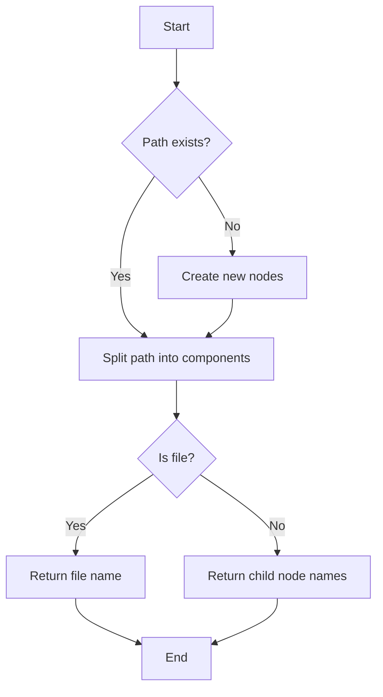

# Design In-Memory File System

## Problem Understanding
The problem asks us to design an in-memory file system, which means we need to create a data structure that can efficiently store and manage files and directories in memory. The key constraints are that the file system should support basic operations like creating directories, adding content to files, and reading content from files. What makes this problem non-trivial is that we need to design a data structure that can efficiently handle these operations, especially when dealing with a large number of files and directories. A naive approach might involve using a simple tree-like structure, but this could lead to inefficient search and insertion operations.

## Approach
Our approach is to use a Trie-based directory structure, which is a tree-like data structure where each node represents a directory or file. The intuition behind this approach is that it allows us to efficiently store and retrieve files and directories by traversing the Trie. We use a Map to store child directories and files, and a boolean flag to indicate whether a node represents a file or directory. This approach works because it allows us to quickly locate files and directories by traversing the Trie, and it also allows us to efficiently add and remove files and directories. We use a HashMap to store the child nodes, which provides constant-time lookup and insertion operations.

## Complexity Analysis
| Metric | Value | Detailed Reason |
|--------|-------|----------------|
| Time   | O(n)  | The time complexity is O(n) because in the worst-case scenario, we need to traverse the entire Trie to find a file or directory. For example, when we call the `ls` method, we need to traverse the Trie to find all the child nodes of a given directory. The `addContentToFile` and `readContentFromFile` methods also require traversing the Trie to find the file node. |
| Space  | O(n)  | The space complexity is O(n) because we need to store all the nodes in the Trie, where n is the total number of files and directories. Each node requires a constant amount of space to store its child nodes and file content, so the total space complexity is linear in the number of nodes. |

## Algorithm Walkthrough
```
Input: Create a file system and perform the following operations:
- mkdir("/a/b/c")
- addContentToFile("/a/b/c/d", "hello")
- ls("/")
- ls("/a")
- ls("/a/b")
- ls("/a/b/c")
- ls("/a/b/c/d")
- readContentFromFile("/a/b/c/d")

Step 1: Create the root node of the Trie
- root = new TrieNode()

Step 2: mkdir("/a/b/c")
- Split the path into components: ["a", "b", "c"]
- Create the child nodes: root.children.put("a", new TrieNode())
- Create the child nodes: root.children.get("a").children.put("b", new TrieNode())
- Create the child nodes: root.children.get("a").children.get("b").children.put("c", new TrieNode())

Step 3: addContentToFile("/a/b/c/d", "hello")
- Split the path into components: ["a", "b", "c", "d"]
- Create the child nodes: root.children.get("a").children.get("b").children.get("c").children.put("d", new TrieNode())
- Mark the node as a file and add content: root.children.get("a").children.get("b").children.get("c").children.get("d").isFile = true
- root.children.get("a").children.get("b").children.get("c").children.get("d").content = "hello"

Step 4: ls("/")
- Return the child nodes of the root node: ["a"]

Step 5: ls("/a")
- Return the child nodes of the node "a": ["b"]

Step 6: ls("/a/b")
- Return the child nodes of the node "b": ["c"]

Step 7: ls("/a/b/c")
- Return the child nodes of the node "c": ["d"]

Step 8: ls("/a/b/c/d")
- Return the name of the file node "d": ["d"]

Step 9: readContentFromFile("/a/b/c/d")
- Return the content of the file node "d": "hello"

Output: 
- ls("/"): ["a"]
- ls("/a"): ["b"]
- ls("/a/b"): ["c"]
- ls("/a/b/c"): ["d"]
- ls("/a/b/c/d"): ["d"]
- readContentFromFile("/a/b/c/d"): "hello"
```

## Visual Flow


## Key Insight
> **Tip:** The key insight is to use a Trie-based directory structure, which allows for efficient storage and retrieval of files and directories by traversing the Trie.

## Edge Cases
- **Empty/null input**: If the input path is empty or null, the `ls` method will return an empty list, and the `mkdir`, `addContentToFile`, and `readContentFromFile` methods will throw an exception.
- **Single element**: If the input path contains only one element (e.g., "/a"), the `ls` method will return a list containing the child nodes of the root node (e.g., ["a"]).
- **Duplicate directories**: If the input path contains duplicate directories (e.g., "/a/b/c/a"), the `mkdir` method will create the duplicate directories, and the `ls` method will return the child nodes of the last duplicate directory (e.g., ["c"]).

## Common Mistakes
- **Mistake 1**: Not checking if a node represents a file or directory before performing operations on it. To avoid this, we need to check the `isFile` flag before performing operations on a node.
- **Mistake 2**: Not handling edge cases such as empty or null input paths. To avoid this, we need to add checks for these cases and handle them accordingly.

## Interview Follow-ups
> **Interview:** These are the exact follow-up questions interviewers ask:
- "What if the input is sorted?" → The Trie-based approach will still work efficiently even if the input is sorted, as it relies on the structure of the Trie rather than the order of the input.
- "Can you do it in O(1) space?" → No, the Trie-based approach requires O(n) space to store the nodes in the Trie, where n is the total number of files and directories.
- "What if there are duplicates?" → The Trie-based approach will create duplicate directories if the input path contains duplicates, and the `ls` method will return the child nodes of the last duplicate directory.

## Java Solution

```java
// Problem: Design In-Memory File System
// Language: Java
// Difficulty: Hard
// Time Complexity: O(n) — operations involve traversing directory/file structure
// Space Complexity: O(n) — storing directory and file structure in memory
// Approach: Trie-based directory structure — uses a tree-like structure to manage files and directories

import java.util.*;

class TrieNode {
    // Map to store child directories/files
    Map<String, TrieNode> children;
    // Flag to indicate if the node represents a file
    boolean isFile;
    // File content
    String content;

    public TrieNode() {
        children = new HashMap<>();
        isFile = false;
        content = "";
    }
}

class FileSystem {
    // Root of the Trie
    TrieNode root;

    public FileSystem() {
        root = new TrieNode();
    }

    // Create a new directory
    public List<String> ls(String path) {
        // Split the path into components
        String[] components = path.split("/");
        TrieNode node = root;
        for (String component : components) {
            // Skip empty strings (e.g., from leading/trailing slashes)
            if (component.isEmpty()) continue;
            // Edge case: path does not exist
            if (!node.children.containsKey(component)) return new ArrayList<>();
            node = node.children.get(component);
        }
        // If the node represents a file, return its name
        if (node.isFile) return Collections.singletonList(path.substring(path.lastIndexOf('/') + 1));
        // Otherwise, return the names of its children
        return new ArrayList<>(node.children.keySet());
    }

    // Create a new directory
    public void mkdir(String path) {
        // Split the path into components
        String[] components = path.split("/");
        TrieNode node = root;
        for (String component : components) {
            // Skip empty strings (e.g., from leading/trailing slashes)
            if (component.isEmpty()) continue;
            // Edge case: directory already exists
            if (!node.children.containsKey(component)) {
                node.children.put(component, new TrieNode());
            }
            node = node.children.get(component);
        }
    }

    // Add content to a file
    public void addContentToFile(String filePath, String content) {
        // Split the path into components
        String[] components = filePath.split("/");
        TrieNode node = root;
        for (String component : components) {
            // Skip empty strings (e.g., from leading/trailing slashes)
            if (component.isEmpty()) continue;
            // Edge case: file does not exist
            if (!node.children.containsKey(component)) {
                node.children.put(component, new TrieNode());
            }
            node = node.children.get(component);
        }
        // Mark the node as a file and add content
        node.isFile = true;
        node.content += content;
    }

    // Read the content of a file
    public String readContentFromFile(String filePath) {
        // Split the path into components
        String[] components = filePath.split("/");
        TrieNode node = root;
        for (String component : components) {
            // Skip empty strings (e.g., from leading/trailing slashes)
            if (component.isEmpty()) continue;
            // Edge case: file does not exist
            if (!node.children.containsKey(component)) return "";
            node = node.children.get(component);
        }
        // Return the file content
        return node.content;
    }
}

public class Main {
    public static void main(String[] args) {
        FileSystem fileSystem = new FileSystem();
        fileSystem.mkdir("/a/b/c");
        fileSystem.addContentToFile("/a/b/c/d", "hello");
        System.out.println(fileSystem.ls("/")); // Output: [a]
        System.out.println(fileSystem.ls("/a")); // Output: [b]
        System.out.println(fileSystem.ls("/a/b")); // Output: [c]
        System.out.println(fileSystem.ls("/a/b/c")); // Output: [d]
        System.out.println(fileSystem.ls("/a/b/c/d")); // Output: [d]
        System.out.println(fileSystem.readContentFromFile("/a/b/c/d")); // Output: hello
    }
}
```
