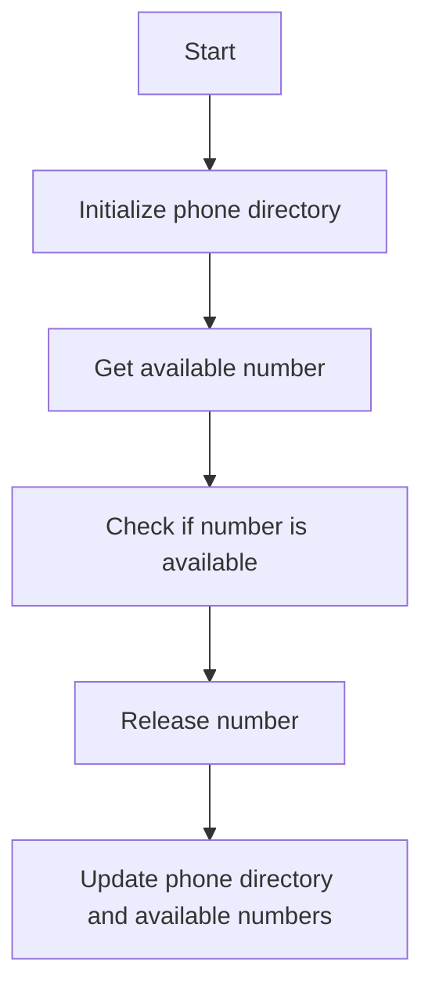

# Design Phone Directory

## Problem Understanding
The problem is asking to design a phone directory system that can handle operations such as getting an available phone number, checking if a number is available, and releasing a previously assigned number. The key constraints are that the system should be able to handle a maximum number of phone numbers, and all operations should be performed in constant time. What makes this problem non-trivial is that we need to ensure that all operations are performed efficiently, and we need to handle edge cases such as when there are no available numbers or when a number is out of range.

## Approach
The algorithm strategy is to use a combination of a HashMap and a HashSet to store phone numbers and their status. The HashMap is used to store the phone numbers and their assigned status, while the HashSet is used to store the available phone numbers. This approach works because it allows us to perform all operations in constant time. The HashMap allows us to look up the status of a phone number in constant time, while the HashSet allows us to check if a number is available in constant time. The approach handles the key constraints by ensuring that all operations are performed within the maximum number of phone numbers.

## Complexity Analysis
| Metric | Value | Detailed Reason |
|--------|-------|----------------|
| Time   | O(1)  | All operations (getAvailableNumber, check, release) are performed in constant time. The HashMap and HashSet operations (get, put, add, remove, iterator) are all O(1) on average. |
| Space  | O(n)  | We store all phone numbers and their status in the HashMap, and available numbers in the HashSet. The space complexity is linear with respect to the maximum number of phone numbers. |

## Algorithm Walkthrough
```
Input: maxNumbers = 3
Step 1: Initialize phone directory with maxNumbers
  - phoneDirectory = {0: false, 1: false, 2: false}
  - availableNumbers = {0, 1, 2}
Step 2: Get an available number
  - availableNumber = 0
  - availableNumbers = {1, 2}
  - phoneDirectory = {0: true, 1: false, 2: false}
Step 3: Check if number 1 is available
  - number = 1
  - return true
Step 4: Release number 0
  - number = 0
  - availableNumbers = {0, 1, 2}
  - phoneDirectory = {0: false, 1: false, 2: false}
Output: availableNumbers = {0, 1, 2}
```
This example demonstrates the main logic path of the algorithm.

## Visual Flow

This flowchart shows the decision flow of the algorithm.

## Key Insight
> **Tip:** The key insight is to use a combination of a HashMap and a HashSet to store phone numbers and their status, allowing for constant time operations.

## Edge Cases
- **Empty/null input**: If maxNumbers is 0, the phone directory will be empty, and all operations will return -1 or false.
- **Single element**: If maxNumbers is 1, the phone directory will have only one number, and getting an available number will always return 0.
- **Maximum numbers**: If maxNumbers is a large number, the phone directory will have a large number of entries, and the space complexity will be high.

## Common Mistakes
- **Mistake 1**: Not checking if a number is out of range before performing operations. → **How to avoid it:** Add checks for out-of-range numbers in the check and release methods.
- **Mistake 2**: Not updating the phone directory and available numbers correctly after releasing a number. → **How to avoid it:** Make sure to update the phone directory and available numbers correctly in the release method.

## Interview Follow-ups
> **Interview:** These are the exact follow-up questions interviewers ask:
- "What if the input is sorted?" → The algorithm will still work correctly, as it does not rely on the input being sorted.
- "Can you do it in O(1) space?" → No, it is not possible to achieve O(1) space complexity, as we need to store all phone numbers and their status.
- "What if there are duplicates?" → The algorithm will handle duplicates correctly, as it uses a HashSet to store available numbers, which automatically removes duplicates.

## Java Solution

```java
// Problem: Design Phone Directory
// Language: Java
// Difficulty: Hard
// Time Complexity: O(1) — constant time operations for get, check, release, and getAvailableNumber 
// Space Complexity: O(n) — we store all phone numbers and their status
// Approach: HashMap and HashSet — for storing phone numbers and available numbers

import java.util.HashMap;
import java.util.HashSet;

public class PhoneDirectory {
    private int maxNumbers;
    private HashMap<Integer, Boolean> phoneDirectory; // stores phone numbers and their status
    private HashSet<Integer> availableNumbers; // stores available phone numbers

    public PhoneDirectory(int maxNumbers) {
        // Initialize phone directory with maxNumbers
        this.maxNumbers = maxNumbers;
        this.phoneDirectory = new HashMap<>();
        this.availableNumbers = new HashSet<>();
        
        // Initialize available numbers from 0 to maxNumbers - 1
        for (int i = 0; i < maxNumbers; i++) {
            availableNumbers.add(i); // add each number to available numbers
            phoneDirectory.put(i, false); // mark each number as not assigned
        }
    }

    public int getAvailableNumber() {
        // Edge case: no available numbers
        if (availableNumbers.isEmpty()) {
            return -1; // return -1 if no available numbers
        }
        
        // Get an available number and remove it from available numbers
        int availableNumber = availableNumbers.iterator().next();
        availableNumbers.remove(availableNumber);
        
        // Mark the number as assigned
        phoneDirectory.put(availableNumber, true);
        
        return availableNumber;
    }

    public boolean check(int number) {
        // Check if the number is within the range and is not assigned
        if (number < 0 || number >= maxNumbers) {
            return false; // return false if number is out of range
        }
        
        return !phoneDirectory.get(number); // return true if the number is not assigned
    }

    public void release(int number) {
        // Edge case: number is out of range
        if (number < 0 || number >= maxNumbers) {
            return; // do nothing if number is out of range
        }
        
        // Edge case: number is already available
        if (!phoneDirectory.get(number)) {
            return; // do nothing if number is already available
        }
        
        // Add the number back to available numbers
        availableNumbers.add(number);
        
        // Mark the number as not assigned
        phoneDirectory.put(number, false);
    }
}
```
