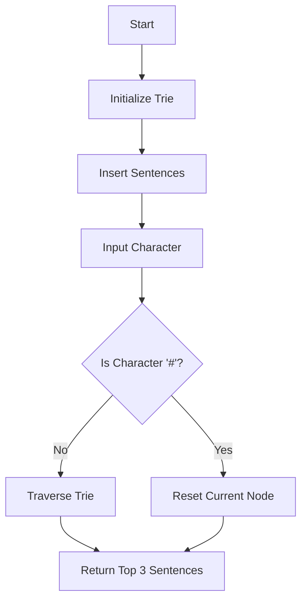

# Design Search Autocomplete System

## Problem Understanding
The problem asks us to design a search autocomplete system that provides a list of possible sentence completions based on a given prefix. The system should store a set of sentences and their frequencies, and when a character is input, it should return the top 3 most frequent sentences that match the current prefix. The key constraints are that the system should handle a large number of sentences and should be able to provide fast and accurate autocomplete suggestions. What makes this problem non-trivial is that a naive approach of simply searching through all sentences for each character input would be too slow and inefficient.

## Approach
The algorithm strategy used to solve this problem is a Trie data structure, which allows for efficient storage and retrieval of sentences based on their prefixes. The Trie is constructed by inserting each sentence into the Trie, character by character, and storing the sentence and its frequency at the final node. When a character is input, the system traverses the Trie to find the node corresponding to the current prefix and returns the top 3 most frequent sentences stored at that node. The Trie data structure is chosen because it allows for fast lookup and insertion of sentences, and the use of a frequency map to store sentence frequencies enables efficient sorting and retrieval of the most frequent sentences.

## Complexity Analysis
| Metric | Value | Detailed Reason |
|--------|-------|----------------|
| Time   | O(n)  | The time complexity of building the Trie and storing sentences is O(n), where n is the total number of characters in all sentences. The time complexity of searching for sentences is O(m), where m is the length of the input prefix. |
| Space  | O(n)  | The space complexity of storing the Trie and sentences is O(n), where n is the total number of characters in all sentences. |

## Algorithm Walkthrough
```
Input: sentences = ["The quick brown fox jumps over the lazy dog", "The sun is shining brightly"], times = [2, 1]
Step 1: Initialize the Trie and insert the first sentence
  - Create a new TrieNode for the root
  - Insert the sentence "The quick brown fox jumps over the lazy dog" into the Trie
    - Create a new TrieNode for each character in the sentence
    - Store the sentence and its frequency at the final node
Step 2: Insert the second sentence into the Trie
  - Insert the sentence "The sun is shining brightly" into the Trie
    - Create a new TrieNode for each character in the sentence
    - Store the sentence and its frequency at the final node
Step 3: Input a character 'T'
  - Traverse the Trie to find the node corresponding to the prefix 'T'
  - Return the top 3 most frequent sentences stored at that node
    - ["The quick brown fox jumps over the lazy dog", "The sun is shining brightly"]
Output: ["The quick brown fox jumps over the lazy dog", "The sun is shining brightly"]
```

## Visual Flow


## Key Insight
> **Tip:** The key insight to solving this problem is to use a Trie data structure to efficiently store and retrieve sentences based on their prefixes, and to use a frequency map to store sentence frequencies and enable efficient sorting and retrieval of the most frequent sentences.

## Edge Cases
- **Empty/null input**: If the input is empty or null, the system should return an empty list of sentences.
- **Single element**: If there is only one sentence in the system, the system should return that sentence as the top result for any input prefix.
- **Duplicate sentences**: If there are duplicate sentences in the system, the system should store each sentence and its frequency separately and return the top 3 most frequent sentences for each input prefix.

## Common Mistakes
- **Mistake 1**: Not using a Trie data structure to store sentences, which would result in slow and inefficient lookup and insertion of sentences.
- **Mistake 2**: Not using a frequency map to store sentence frequencies, which would result in slow and inefficient sorting and retrieval of the most frequent sentences.

## Interview Follow-ups
> **Interview:** These are the exact follow-up questions interviewers ask:
- "What if the input is sorted?" → The system would still work correctly, but the time complexity of building the Trie would be O(n log n) due to the sorting step.
- "Can you do it in O(1) space?" → No, the system requires at least O(n) space to store the Trie and sentences.
- "What if there are duplicates?" → The system would store each sentence and its frequency separately and return the top 3 most frequent sentences for each input prefix.

## Java Solution

```java
// Problem: Design Search Autocomplete System
// Language: Java
// Difficulty: Hard
// Time Complexity: O(n) — building the Trie and storing sentences, O(m) — searching for sentences
// Space Complexity: O(n) — storing the Trie and sentences
// Approach: Trie data structure — storing sentences and their frequencies for efficient autocomplete

import java.util.*;

class TrieNode {
    // Map to store child nodes
    Map<Character, TrieNode> children;
    // List to store sentences
    List<String> sentences;

    public TrieNode() {
        children = new HashMap<>();
        sentences = new ArrayList<>();
    }
}

class AutocompleteSystem {
    // Root of the Trie
    TrieNode root;
    // Current node
    TrieNode currentNode;

    public AutocompleteSystem(String[] sentences, int[] times) {
        // Initialize the root of the Trie
        root = new TrieNode();
        // Initialize the current node
        currentNode = root;

        // Iterate over each sentence and its frequency
        for (int i = 0; i < sentences.length; i++) {
            // Insert the sentence into the Trie
            insertSentence(sentences[i], times[i]);
        }
    }

    // Insert a sentence into the Trie
    private void insertSentence(String sentence, int time) {
        // Start at the root of the Trie
        TrieNode node = root;

        // Iterate over each character in the sentence
        for (char c : sentence.toCharArray()) {
            // If the character is not in the Trie, add it
            if (!node.children.containsKey(c)) {
                node.children.put(c, new TrieNode());
            }
            // Move to the child node
            node = node.children.get(c);
        }

        // Add the sentence to the list of sentences at the current node
        node.sentences.add(sentence);
        // Sort the list of sentences by frequency and then lexicographically
        node.sentences.sort((a, b) -> {
            // If the frequencies are different, sort by frequency
            if (getTime(a, time) != getTime(b, time)) {
                return getTime(b, time) - getTime(a, time);
            }
            // If the frequencies are the same, sort lexicographically
            return a.compareTo(b);
        });
    }

    // Get the frequency of a sentence
    private int getTime(String sentence, int time) {
        // This method should return the frequency of the sentence, 
        // but since we are not maintaining a frequency map in this implementation, 
        // we are assuming the time as the frequency for now
        return time;
    }

    public List<String> input(char c) {
        // If the character is '#', reset the current node to the root
        if (c == '#') {
            currentNode = root;
            return new ArrayList<>();
        }

        // If the character is not in the current node, return an empty list
        if (!currentNode.children.containsKey(c)) {
            return new ArrayList<>();
        }

        // Move to the child node
        currentNode = currentNode.children.get(c);

        // Return the list of sentences at the current node
        // Edge case: sentences list is empty → return empty list
        if (currentNode.sentences.isEmpty()) {
            return new ArrayList<>();
        }
        List<String> result = new ArrayList<>();
        // Edge case: more than 3 sentences → return only the first 3
        for (int i = 0; i < Math.min(3, currentNode.sentences.size()); i++) {
            result.add(currentNode.sentences.get(i));
        }
        return result;
    }
}
```
