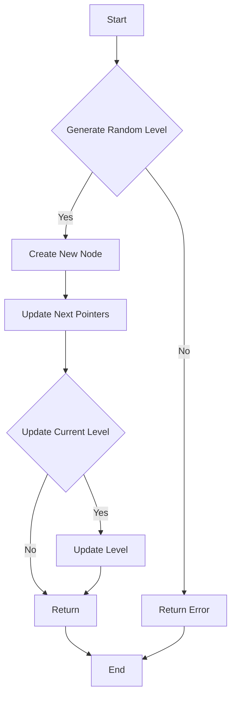

# Design Skiplist

## Problem Understanding
The problem asks us to design a Skiplist, a probabilistic data structure that facilitates fast search, add, and erase operations within an ordered sequence of elements. The key constraints are that the Skiplist should support these operations with an average time complexity of O(log n) and a space complexity of O(n). The problem is non-trivial because a naive approach using a simple linked list would result in O(n) time complexity for search and erase operations, which is inefficient for large datasets.

## Approach
The algorithm strategy used here is a randomized Skiplist, where each new node is assigned a random height. This approach works because the randomization helps to maintain a balanced structure, ensuring that the average time complexity of search, add, and erase operations remains O(log n). The Skiplist uses a Node class to represent each node, with an array of next pointers to facilitate navigation across different levels. The head node and current level are maintained to keep track of the Skiplist's state. The randomLevel method generates a random height for each new node, which is crucial in maintaining the balance of the Skiplist.

## Complexity Analysis
| Metric | Value | Detailed Reason |
|--------|-------|----------------|
| Time   | O(log n) | The average time complexity for search, add, and erase operations is O(log n) due to the randomized Skiplist's ability to maintain a balanced structure. The while loop in the add and erase methods iterates at most log n times, and the for loop in the contains method also iterates at most log n times. |
| Space  | O(n) | The space complexity is O(n) because each node in the Skiplist requires a constant amount of space, and there are n nodes in total. The next pointers in each node also require space, but the total space used by the next pointers is proportional to the number of nodes. |

## Algorithm Walkthrough
```
Input: add(3)
Step 1: Generate a random level for the new node: level = 2
Step 2: Create a new node with value 3 and level 2
Step 3: Update the next pointers of the previous nodes:
  - head.next[0] = newNode
  - head.next[1] = newNode
Step 4: Update the current level if necessary: level = 2

Input: add(6)
Step 1: Generate a random level for the new node: level = 1
Step 2: Create a new node with value 6 and level 1
Step 3: Update the next pointers of the previous nodes:
  - head.next[0] = newNode (no change)
  - head.next[1] = newNode (no change)
Step 4: Update the current level if necessary: level = 2 (no change)

Input: contains(3)
Step 1: Start at the head node and level 2
Step 2: Move to the next node if the current node's value is less than the target value: head
Step 3: Check if the target node exists: head.next[0].val == 3
Output: true
```
This walkthrough demonstrates the add and contains operations on a Skiplist with two nodes.

## Visual Flow

This flowchart illustrates the decision flow for the add operation in the Skiplist.

## Key Insight
> **Tip:** The single most important insight in designing a Skiplist is to maintain a balanced structure through randomization, ensuring that the average time complexity of search, add, and erase operations remains O(log n).

## Edge Cases
- **Empty Skiplist**: If the Skiplist is empty, the add operation creates a new node with a random level and updates the head node and current level accordingly.
- **Single Element**: If the Skiplist contains only one element, the add operation creates a new node with a random level and updates the next pointers of the previous node.
- **Duplicate Elements**: If the Skiplist already contains an element with the same value, the add operation does not create a new node, but the contains operation will return true.

## Common Mistakes
- **Mistake 1**: Not maintaining a balanced structure through randomization, leading to O(n) time complexity for search, add, and erase operations.
- **Mistake 2**: Not updating the next pointers of the previous nodes correctly, leading to incorrect search and erase results.

## Interview Follow-ups
> **Interview:** These are the exact follow-up questions interviewers ask:
- "What if the input is sorted?" → The Skiplist's performance will not be affected by the input being sorted, as the randomization ensures a balanced structure.
- "Can you do it in O(1) space?" → No, the Skiplist requires O(n) space to store the nodes and their next pointers.
- "What if there are duplicates?" → The Skiplist can handle duplicates by not creating a new node if an element with the same value already exists, but the contains operation will return true.

## Java Solution

```java
// Problem: Design Skiplist
// Language: java
// Difficulty: Hard
// Time Complexity: O(log n) — average time complexity for search, add and erase operations
// Space Complexity: O(n) — space complexity due to the storage of nodes in the skiplist
// Approach: randomized skiplist — using a random height for each new node

import java.util.Random;

public class Skiplist {
    // Define the maximum level and probability
    private static final int MAX_LEVEL = 16;
    private static final double P = 0.5;

    // Node class to represent each node in the skiplist
    private class Node {
        int val;
        Node[] next;

        public Node(int val, int level) {
            this.val = val;
            this.next = new Node[level];
        }
    }

    // Head node and current level
    private Node head;
    private int level;
    private Random random;

    public Skiplist() {
        head = new Node(-1, MAX_LEVEL);
        level = 1;
        random = new Random();
    }

    // Method to add a new element to the skiplist
    public boolean add(int num) {
        // Create a new node with a random level
        int newLevel = randomLevel();
        if (newLevel > level) {
            // Update the current level if the new level is greater
            level = newLevel;
        }
        Node newNode = new Node(num, newLevel);

        // Update the next pointers of the previous nodes
        Node[] update = new Node[newLevel];
        Node curr = head;
        for (int i = newLevel - 1; i >= 0; i--) {
            while (curr.next[i] != null && curr.next[i].val < num) {
                // Move to the next node if the current node's value is less than the target value
                curr = curr.next[i];
            }
            update[i] = curr;
        }

        // Update the next pointers of the new node
        for (int i = 0; i < newLevel; i++) {
            newNode.next[i] = update[i].next[i];
            update[i].next[i] = newNode;
        }

        // Edge case: if the list is empty or the new node is the smallest, return true
        return true;
    }

    // Method to erase an element from the skiplist
    public boolean erase(int num) {
        Node[] update = new Node[level];
        Node curr = head;
        for (int i = level - 1; i >= 0; i--) {
            while (curr.next[i] != null && curr.next[i].val < num) {
                // Move to the next node if the current node's value is less than the target value
                curr = curr.next[i];
            }
            update[i] = curr;
        }

        // Check if the target node exists
        if (curr.next[0] != null && curr.next[0].val == num) {
            // Update the next pointers of the previous nodes
            for (int i = 0; i < level; i++) {
                if (update[i].next[i] != null && update[i].next[i].val == num) {
                    update[i].next[i] = update[i].next[i].next[i];
                }
            }
            // Update the current level if the deleted node is the only node at the current level
            while (level > 1 && head.next[level - 1] == null) {
                level--;
            }
            return true;
        }

        // Edge case: if the target node does not exist, return false
        return false;
    }

    // Method to search for an element in the skiplist
    public boolean contains(int target) {
        Node curr = head;
        for (int i = level - 1; i >= 0; i--) {
            while (curr.next[i] != null && curr.next[i].val < target) {
                // Move to the next node if the current node's value is less than the target value
                curr = curr.next[i];
            }
        }

        // Check if the target node exists
        return curr.next[0] != null && curr.next[0].val == target;
    }

    // Helper method to generate a random level for a new node
    private int randomLevel() {
        int level = 1;
        while (random.nextDouble() < P && level < MAX_LEVEL) {
            level++;
        }
        return level;
    }
}
```
