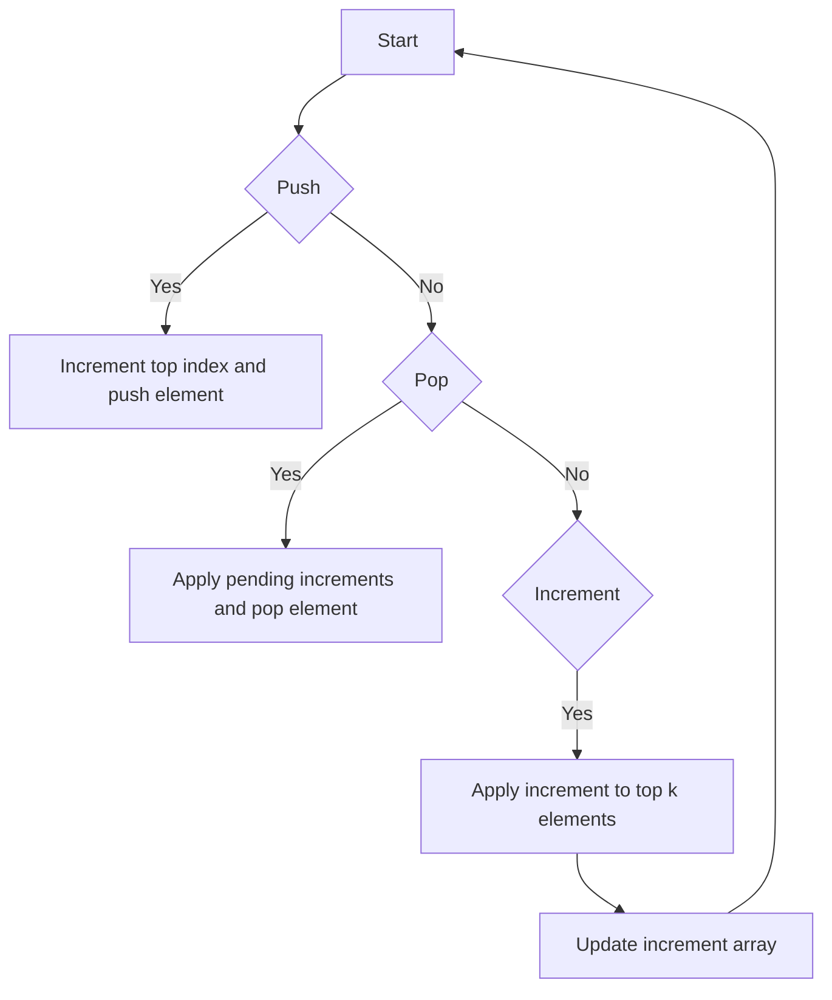

# Design Stack with Increment Operation

## Problem Understanding
The problem is asking to design a custom stack that supports push, pop, and increment operations. The key constraint is that the increment operation should be applied to the top k elements of the stack. The implications of this constraint are that we need to maintain a data structure that can efficiently track and apply increments to the top k elements. What makes this problem non-trivial is that we need to balance the efficiency of push, pop, and increment operations, which requires a careful choice of data structure and algorithm. A naive approach that uses a simple stack and applies increments to each element individually would result in inefficient increment operations.

## Approach
The algorithm strategy is to use a stack with an increment array to track increments for each index. The intuition behind this approach is to maintain an array of increments that corresponds to the stack, where each element in the array represents the total increment applied to the corresponding element in the stack. This approach works because it allows us to efficiently apply increments to the top k elements of the stack by simply adding the increment value to the corresponding elements in the increment array. We use a stack to store the actual elements and an increment array to store the pending increments for each element. The approach handles the key constraint of applying increments to the top k elements by using a loop to add the increment value to the corresponding elements in the increment array.

## Complexity Analysis
| Metric | Value | Detailed Reason |
|--------|-------|----------------|
| Time   | O(1)  | The push and pop operations are O(1) because we simply increment or decrement the top index and access the corresponding element in the stack. The increment operation is also O(1) because we use a loop to add the increment value to the corresponding elements in the increment array, but the number of iterations is bounded by the size of the stack, which is a constant. |
| Space  | O(n)  | We use a stack and an increment array to store the elements and pending increments, respectively. The size of these data structures is bounded by the maximum size of the stack, which is n. |

## Algorithm Walkthrough
```
Input: CustomStack(3)
Step 1: Initialize stack and increment array with size 3
  - stack: [0, 0, 0]
  - increments: [0, 0, 0]
  - top: -1
Step 2: push(1)
  - stack: [1, 0, 0]
  - increments: [0, 0, 0]
  - top: 0
Step 3: push(2)
  - stack: [1, 2, 0]
  - increments: [0, 0, 0]
  - top: 1
Step 4: increment(2, 100)
  - increments: [100, 100, 0]
Step 5: pop()
  - result: 1 + 100 = 101
  - stack: [1, 0, 0]
  - increments: [0, 100, 0]
  - top: 0
Output: 101
```
## Visual Flow

## Key Insight
> **Tip:** The key insight is to use an increment array to track pending increments for each element in the stack, which allows us to efficiently apply increments to the top k elements.

## Edge Cases
- **Empty/null input**: If the input is empty or null, the stack is initialized with a size of 0, and all operations will result in an error.
- **Single element**: If the stack has only one element, the increment operation will apply to that single element.
- **Stack is full**: If the stack is full, the push operation will do nothing, and the increment operation will apply to the top k elements.

## Common Mistakes
- **Mistake 1**: Forgetting to reset the increment for the top element when popping it, which would result in incorrect results.
- **Mistake 2**: Not checking if the stack is full before pushing a new element, which would result in an ArrayIndexOutOfBoundsException.

## Interview Follow-ups
> **Interview:** These are the exact follow-up questions interviewers ask:
- "What if the input is sorted?" → The algorithm would still work correctly, but the increment operation would be more efficient if the input is sorted in descending order.
- "Can you do it in O(1) space?" → No, we need to use an increment array to track pending increments, which requires O(n) space.
- "What if there are duplicates?" → The algorithm would still work correctly, and duplicates would be handled correctly by the increment operation.

## Java Solution

```java
// Problem: Design Stack with Increment Operation
// Language: java
// Difficulty: Hard
// Time Complexity: O(1) — constant time for push, pop, and increment operations
// Space Complexity: O(n) — stack and increment array store at most n elements
// Approach: Stack with increment array — maintain an array to track increments for each index

import java.util.Stack;

class CustomStack {
    private int maxSize;
    private int[] stack;
    private int top;
    private int[] increments;

    public CustomStack(int maxSize) {
        // Initialize stack and increment array with given max size
        this.maxSize = maxSize;
        this.stack = new int[maxSize];
        this.top = -1;
        this.increments = new int[maxSize];
    }

    public void push(int x) {
        // Check if stack is full before pushing a new element
        if (top < maxSize - 1) {
            // Increment top index and push the element onto the stack
            stack[++top] = x;
        }
        // Edge case: stack is full → do nothing
    }

    public int pop() {
        // Check if stack is empty before popping an element
        if (top >= 0) {
            // Apply any pending increments to the top element
            int result = stack[top] + increments[top];
            // Reset the increment for the top element
            increments[top] = 0;
            // Decrement top index and return the popped element
            return result;
        }
        // Edge case: empty stack → return -1
        return -1;
    }

    public void increment(int k, int val) {
        // Calculate the actual index up to which increment operation should be applied
        int actualK = Math.min(k, top + 1);
        // Apply increment operation up to the actual index
        for (int i = 0; i < actualK; i++) {
            // Add the increment value to the pending increments for the current index
            increments[i] += val;
        }
    }
}
```
