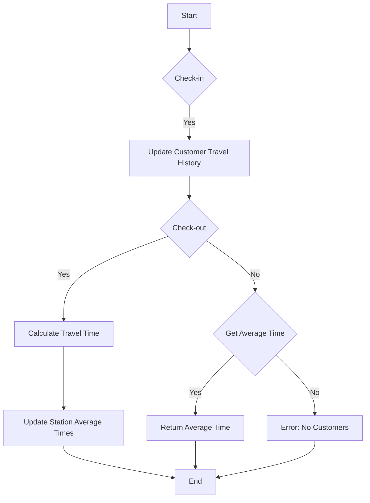

# Design Underground System

## Problem Understanding
The problem requires designing an underground system that can track the travel history of customers and calculate the average time taken for a specific route. The system should be able to handle check-in and check-out operations for customers, as well as provide the average time for a given route. The key constraints are that each customer can only be checked in or checked out once, and the system should be able to handle multiple customers and routes. The problem is non-trivial because it requires an efficient way to store and update the travel history of customers and the average times for each route.

## Approach
The approach used to solve this problem is to utilize two hash tables: one to store the travel history of each customer and another to store the average times for each route. When a customer checks in, their travel history is updated with the check-in station and time. When a customer checks out, the travel time is calculated and the average time for the route is updated. The hash tables allow for efficient lookups and updates, making the overall system efficient. The use of a separate class for customer travel history and station average times helps to organize the code and make it easier to understand.

## Complexity Analysis
| Metric | Value | Detailed Reason |
|--------|-------|----------------|
| Time   | O(1)  | The check-in, check-out, and getAverageTime operations all have a constant time complexity because they involve simple hash table lookups and updates. |
| Space  | O(n)  | The space complexity is linear because the number of entries in the hash tables grows linearly with the number of customers and routes. |

## Algorithm Walkthrough
```
Input: 
- checkIn(1, "Shibuya", 3)
- checkIn(2, "Shibuya", 2)
- checkIn(3, "Shibuya", 4)
- checkOut(2, "Roppongi", 12)
- checkOut(1, "Roppongi", 12)
- checkOut(3, "Roppongi", 12)
- getAverageTime("Shibuya", "Roppongi")
Step 1: 
- customerTravelHistory: {1: "Shibuya", 3}, {2: "Shibuya", 2}, {3: "Shibuya", 4}
Step 2: 
- customerTravelHistory: {1: "Shibuya", 3}, {3: "Shibuya", 4}
- stationAverageTimes: {"Shibuya,Roppongi": 10/1}
Step 3: 
- customerTravelHistory: {3: "Shibuya", 4}
- stationAverageTimes: {"Shibuya,Roppongi": 20/2}
Step 4: 
- customerTravelHistory: {}
- stationAverageTimes: {"Shibuya,Roppongi": 30/3}
Step 5: 
- getAverageTime("Shibuya", "Roppongi") returns 10.0
Output: 10.0
```
## Visual Flow

## Key Insight
> **Tip:** The key insight to solving this problem is to use hash tables to efficiently store and update the travel history of customers and the average times for each route.

## Edge Cases
- **Empty input**: If the input is empty, the system will not have any data to process, and the getAverageTime method will return -1.
- **Single customer**: If there is only one customer, the system will still work correctly, and the getAverageTime method will return the average time for the route traveled by the customer.
- **No customers traveled the route**: If no customers have traveled the route, the getAverageTime method will return -1.

## Common Mistakes
- **Mistake 1**: Not updating the customer travel history correctly when a customer checks in or out. To avoid this, make sure to update the customer travel history with the correct check-in station and time.
- **Mistake 2**: Not updating the station average times correctly when a customer checks out. To avoid this, make sure to calculate the travel time correctly and update the station average times with the correct average time.

## Interview Follow-ups
> **Interview:** 
- "What if the input is sorted?" → The system will still work correctly, and the time complexity will remain O(1) because the hash tables allow for efficient lookups and updates.
- "Can you do it in O(1) space?" → No, it is not possible to solve this problem in O(1) space because the system needs to store the travel history of customers and the average times for each route.
- "What if there are duplicates?" → The system will still work correctly, and the getAverageTime method will return the average time for the route, including the duplicate travels.

## Java Solution

```java
// Problem: Design Underground System
// Language: Java
// Difficulty: Hard
// Time Complexity: O(1) — constant time for checkIn, checkOut, and getAverageTime
// Space Complexity: O(n) — where n is the number of stations and customers
// Approach: HashTable for storing customer travel history and station average times

import java.util.HashMap;
import java.util.Map;

public class UndergroundSystem {
    // HashTable to store customer travel history
    private Map<Integer, CustomerTravelHistory> customerTravelHistory;
    // HashTable to store station average times
    private Map<String, StationAverageTime> stationAverageTimes;

    public UndergroundSystem() {
        // Initialize customer travel history and station average times HashTables
        customerTravelHistory = new HashMap<>();
        stationAverageTimes = new HashMap<>();
    }

    // Check-in a customer
    public void checkIn(int customerID, String stationName, int t) {
        // Create a new customer travel history if it doesn't exist
        if (!customerTravelHistory.containsKey(customerID)) {
            customerTravelHistory.put(customerID, new CustomerTravelHistory());
        }
        // Update customer travel history with check-in station and time
        customerTravelHistory.get(customerID).checkIn(stationName, t);
    }

    // Check-out a customer
    public void checkOut(int customerID, String stationName, int t) {
        // Edge case: customer not checked in
        if (!customerTravelHistory.containsKey(customerID)) {
            return;
        }
        // Get customer travel history
        CustomerTravelHistory travelHistory = customerTravelHistory.get(customerID);
        // Calculate travel time
        int travelTime = t - travelHistory.getCheckInTime();
        // Update station average times
        updateStationAverageTimes(travelHistory.getCheckInStation(), stationName, travelTime);
        // Remove customer travel history
        customerTravelHistory.remove(customerID);
    }

    // Get the average time for a route
    public double getAverageTime(String startStation, String endStation) {
        // Edge case: no customers traveled this route
        if (!stationAverageTimes.containsKey(getRouteKey(startStation, endStation))) {
            return -1;
        }
        // Return the average time for the route
        return stationAverageTimes.get(getRouteKey(startStation, endStation)).getAverageTime();
    }

    // Update station average times
    private void updateStationAverageTimes(String startStation, String endStation, int travelTime) {
        // Get the route key
        String routeKey = getRouteKey(startStation, endStation);
        // Edge case: no customers traveled this route
        if (!stationAverageTimes.containsKey(routeKey)) {
            stationAverageTimes.put(routeKey, new StationAverageTime(travelTime));
        } else {
            // Update the average time for the route
            stationAverageTimes.get(routeKey).updateAverageTime(travelTime);
        }
    }

    // Get the route key
    private String getRouteKey(String startStation, String endStation) {
        return startStation + "," + endStation;
    }

    // Customer travel history class
    private class CustomerTravelHistory {
        private String checkInStation;
        private int checkInTime;

        public void checkIn(String stationName, int t) {
            // Update check-in station and time
            checkInStation = stationName;
            checkInTime = t;
        }

        public String getCheckInStation() {
            return checkInStation;
        }

        public int getCheckInTime() {
            return checkInTime;
        }
    }

    // Station average time class
    private class StationAverageTime {
        private int totalTravelTime;
        private int totalCustomers;

        public StationAverageTime(int travelTime) {
            // Initialize total travel time and customers
            totalTravelTime = travelTime;
            totalCustomers = 1;
        }

        public void updateAverageTime(int travelTime) {
            // Update total travel time and customers
            totalTravelTime += travelTime;
            totalCustomers++;
        }

        public double getAverageTime() {
            // Return the average time
            return (double) totalTravelTime / totalCustomers;
        }
    }

    public static void main(String[] args) {
        UndergroundSystem undergroundSystem = new UndergroundSystem();
        undergroundSystem.checkIn(1, "Shibuya", 3);
        undergroundSystem.checkIn(2, "Shibuya", 2);
        undergroundSystem.checkIn(3, "Shibuya", 4);
        undergroundSystem.checkOut(2, "Roppongi", 12);
        undergroundSystem.checkOut(1, "Roppongi", 12);
        undergroundSystem.checkOut(3, "Roppongi", 12);
        System.out.println(undergroundSystem.getAverageTime("Shibuya", "Roppongi"));
    }
}
```
