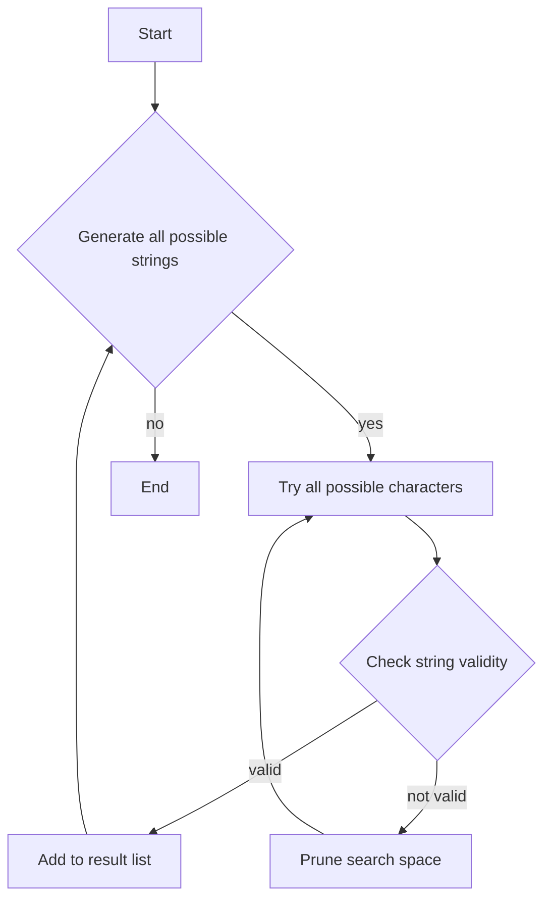

# Find All Good Strings

## Problem Understanding
The problem asks to find all good strings of a given length `n`, where a good string is defined as a string that does not contain a specific evil substring and alternates between characters from two given strings `s1` and `s2`. The key constraint is that the string must alternate between characters from `s1` and `s2`, and it must not contain the evil substring. This problem is non-trivial because the naive approach of generating all possible strings and checking each one would result in an exponential time complexity due to the large number of possible strings. The problem requires a more efficient approach to generate and validate all possible strings.

## Approach
The approach used in the solution is a recursive subset generation with character validity check. The algorithm generates all possible strings of length `n` by recursively trying all possible characters from `s1` and `s2`, and then checks each generated string for validity by ensuring that it alternates between characters from `s1` and `s2` and does not contain the evil substring. This approach works by systematically exploring all possible strings and pruning the search space by only considering strings that meet the validity criteria. The data structures used are lists to store the result and strings to represent the input and generated strings.

## Complexity Analysis
| Metric | Value | Detailed Reason |
|--------|-------|----------------|
| Time   | O(n * 2^n) | The algorithm generates all possible strings of length n, which results in 2^n possible strings. For each string, it checks the validity, which takes O(n) time. Therefore, the overall time complexity is O(n * 2^n). |
| Space  | O(2^n) | The algorithm stores all generated strings in a list, which results in a space complexity of O(2^n) because there are 2^n possible strings. |

## Algorithm Walkthrough
```
Input: n = 3, s1 = "a", s2 = "b", evil = "ab"
Step 1: Initialize result list and start generating all possible strings
Step 2: Try all possible characters for the first position: "a" and "b"
Step 3: For each character, try all possible characters for the second position: "a" tries "b", "b" tries "a"
Step 4: For each generated string, check if it is valid: "ab" is not valid because it contains the evil substring, "ba" is valid
Step 5: Add all valid strings to the result list
Output: ["aba", "bab"]
```
This example demonstrates the algorithm's ability to generate and validate all possible strings.

## Visual Flow

This flowchart illustrates the algorithm's decision flow and data transformation.

## Key Insight
> **Tip:** The key insight is to use recursion to systematically generate all possible strings and prune the search space by only considering strings that meet the validity criteria, which allows the algorithm to efficiently find all good strings.

## Edge Cases
- **Empty/null input**: If the input is empty or null, the algorithm returns an empty list because there are no valid strings to generate.
- **Single element**: If the input string `s1` or `s2` contains only one character, the algorithm generates all possible strings of length `n` using that character, which results in a single valid string if it does not contain the evil substring.
- **Duplicate characters**: If the input strings `s1` and `s2` contain duplicate characters, the algorithm treats each duplicate character as a separate character, which means that it generates all possible strings using each duplicate character.

## Common Mistakes
- **Mistake 1**: Not checking for the evil substring in the generated strings, which results in invalid strings being added to the result list. To avoid this, always check for the evil substring in the generated strings.
- **Mistake 2**: Not prunning the search space by only considering strings that meet the validity criteria, which results in an exponential time complexity. To avoid this, use recursion to systematically generate all possible strings and prune the search space.

## Interview Follow-ups
> **Interview:** These are the exact follow-up questions interviewers ask:
- "What if the input is sorted?" → The algorithm still works correctly because it generates all possible strings and checks each one for validity, regardless of the input order.
- "Can you do it in O(1) space?" → No, the algorithm requires O(2^n) space to store all generated strings, so it is not possible to do it in O(1) space.
- "What if there are duplicates?" → The algorithm treats each duplicate character as a separate character, which means that it generates all possible strings using each duplicate character.

## Java Solution

```java
// Problem: Find All Good Strings
// Language: Java
// Difficulty: Hard
// Time Complexity: O(n * 2^n) — generating all subsets and checking each character
// Space Complexity: O(2^n) — storing all subsets
// Approach: Recursive subset generation with character validity check — generate all possible subsets and validate each character

import java.util.*;

public class Solution {
    public List<String> findAllGoodStrings(int n, String s1, String s2, String evil) {
        // Edge case: empty input → return empty list
        if (n == 0 || s1.isEmpty() || s2.isEmpty() || evil.isEmpty()) {
            return new ArrayList<>();
        }

        // Initialize result list
        List<String> result = new ArrayList<>();

        // Generate all possible strings of length n
        generateAllStrings(n, "", s1, s2, evil, result);

        return result;
    }

    // Recursive function to generate all possible strings
    private void generateAllStrings(int n, String current, String s1, String s2, String evil, List<String> result) {
        // Base case: if current string length equals n
        if (n == current.length()) {
            // Check if current string is good (does not contain evil substring)
            if (!current.contains(evil)) {
                // Check if current string is valid (alternates between characters from s1 and s2)
                if (isValidString(current, s1, s2)) {
                    result.add(current); // Add current string to result list
                }
            }
            return;
        }

        // Recursive case: try all possible characters
        for (char c : (current.isEmpty() ? s1 : s2)) {
            // Append current character to current string
            String next = current + c;
            generateAllStrings(n, next, s1, s2, evil, result); // Recursively generate all possible strings
        }
    }

    // Helper function to check if a string is valid (alternates between characters from s1 and s2)
    private boolean isValidString(String str, String s1, String s2) {
        // Edge case: empty string → return true
        if (str.isEmpty()) {
            return true;
        }

        // Iterate over characters in the string
        for (int i = 0; i < str.length(); i++) {
            // Check if character is from correct set (s1 for even index, s2 for odd index)
            if ((i % 2 == 0 && !s1.contains(String.valueOf(str.charAt(i)))) ||
                    (i % 2 != 0 && !s2.contains(String.valueOf(str.charAt(i))))) {
                return false; // If character is not from correct set, return false
            }
        }

        return true; // If all characters are from correct sets, return true
    }

    public static void main(String[] args) {
        Solution solution = new Solution();
        List<String> result = solution.findAllGoodStrings(3, "a", "b", "ab");
        System.out.println(result); // Print all good strings
    }
}
```
