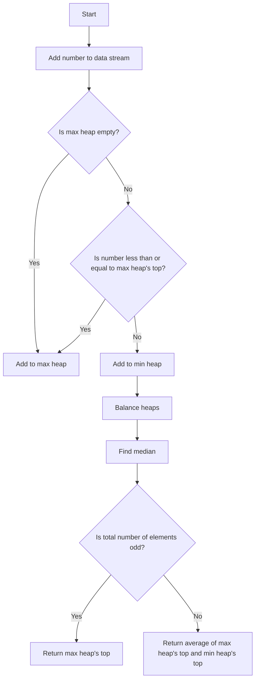

# Find Median from Data Stream

## Problem Understanding
The problem is asking to find the median of a stream of numbers, which means we need to maintain a data structure that can efficiently calculate the median after each new number is added to the stream. The key constraint is that we need to handle the data stream in real-time, meaning we cannot store all the numbers and then calculate the median. This makes the problem non-trivial because a naive approach, such as sorting all the numbers after each insertion, would be inefficient and not scalable for large data streams.

## Approach
The algorithm strategy is to use two heaps, a max heap to store the lower half of the numbers and a min heap to store the upper half of the numbers. This approach works because the max heap will always contain the smaller half of the numbers, and the min heap will always contain the larger half. The heaps are balanced to ensure the size difference between them is at most 1, which allows us to efficiently calculate the median. The data structures used are PriorityQueues, which are chosen because they provide an efficient way to maintain the max and min heaps. The approach handles the key constraints by ensuring that the heaps are balanced after each insertion, which allows us to calculate the median in O(log n) time.

## Complexity Analysis
| Metric | Value | Detailed Reason |
|--------|-------|----------------|
| Time   | O(log n) | The time complexity is O(log n) for each insertion because we need to maintain the balance of the heaps, which involves adding or removing elements from the heaps. The findMedian operation also takes O(log n) time because we need to peek at the top of the heaps. |
| Space  | O(n) | The space complexity is O(n) because we need to store all the elements in the data stream in the heaps. |

## Algorithm Walkthrough
```
Input: [1, 2, 3]
Step 1: Add 1 to the max heap
  - maxHeap: [1]
  - minHeap: []
Step 2: Add 2 to the data stream
  - Since 2 is greater than the max heap's top (1), add it to the min heap
  - maxHeap: [1]
  - minHeap: [2]
Step 3: Balance the heaps
  - Since the max heap size is not greater than the min heap size by 2, no balancing is needed
  - maxHeap: [1]
  - minHeap: [2]
Step 4: Find the median
  - Since the total number of elements is even, return the average of the max heap's top and the min heap's top
  - Median: (1 + 2) / 2.0 = 1.5
Step 5: Add 3 to the data stream
  - Since 3 is greater than the max heap's top (1), add it to the min heap
  - maxHeap: [1]
  - minHeap: [2, 3]
Step 6: Balance the heaps
  - Since the min heap size is greater than the max heap size, remove the top from the min heap and add it to the max heap
  - maxHeap: [2]
  - minHeap: [3]
Step 7: Find the median
  - Since the total number of elements is odd, return the max heap's top
  - Median: 2.0
Output: [1.5, 2.0]
```

## Visual Flow


## Key Insight
> **Tip:** The key insight is to use two heaps to maintain the lower and upper halves of the numbers, and balance them to ensure the size difference is at most 1, allowing for efficient calculation of the median.

## Edge Cases
- **Empty/null input**: If the input is empty or null, the median is undefined. In this implementation, we return 0.0 as a default value.
- **Single element**: If there is only one element in the data stream, the median is that element. In this implementation, we return the max heap's top as the median.
- **Duplicate elements**: If there are duplicate elements in the data stream, they are handled correctly by the heaps. The max heap will contain the smaller half of the numbers, and the min heap will contain the larger half.

## Common Mistakes
- **Mistake 1**: Not balancing the heaps after each insertion, leading to incorrect median calculation. To avoid this, make sure to call the balanceHeaps method after each insertion.
- **Mistake 2**: Not handling the edge case of an empty or null input. To avoid this, add a check at the beginning of the findMedian method to return a default value if the input is empty or null.

## Interview Follow-ups
> **Interview:** 
- "What if the input is sorted?" → The algorithm will still work correctly, but the time complexity will be O(n) because we need to add all the elements to the heaps. However, the space complexity will still be O(n) because we need to store all the elements in the heaps.
- "Can you do it in O(1) space?" → No, it is not possible to find the median of a data stream in O(1) space because we need to store all the elements in the data stream to calculate the median.
- "What if there are duplicates?" → The algorithm will handle duplicates correctly because the heaps will maintain the correct order of the elements. The max heap will contain the smaller half of the numbers, and the min heap will contain the larger half.

## Java Solution

```java
// Problem: Find Median from Data Stream
// Language: Java
// Difficulty: Hard
// Time Complexity: O(log n) — for each insertion, maintaining balance and finding median takes log n time
// Space Complexity: O(n) — storing all elements in the data structure
// Approach: Two heaps (max and min heap) balance — to maintain a max heap for the lower half and a min heap for the upper half

import java.util.PriorityQueue;

public class MedianFinder {
    // max heap to store the lower half of the numbers
    private PriorityQueue<Integer> maxHeap;
    // min heap to store the upper half of the numbers
    private PriorityQueue<Integer> minHeap;

    public MedianFinder() {
        // Initialize max heap with a custom comparator to make it a max heap
        maxHeap = new PriorityQueue<>((a, b) -> b - a);
        // Initialize min heap
        minHeap = new PriorityQueue<>();
    }

    // Add a new number to the data stream
    public void addNum(int num) {
        // Edge case: empty data stream → add to max heap
        if (maxHeap.isEmpty()) {
            maxHeap.add(num);
        } else {
            // If the number is less than or equal to the max heap's top, add it to the max heap
            if (num <= maxHeap.peek()) {
                maxHeap.add(num);
            } else {
                minHeap.add(num);
            }
            // Balance the heaps to ensure the size difference is at most 1
            balanceHeaps();
        }
    }

    // Balance the heaps to maintain the size difference at most 1
    private void balanceHeaps() {
        // If the max heap size is more than the min heap size by 2, remove the top from max heap and add it to min heap
        if (maxHeap.size() > minHeap.size() + 1) {
            minHeap.add(maxHeap.poll());
        }
        // If the min heap size is more than the max heap size, remove the top from min heap and add it to max heap
        else if (minHeap.size() > maxHeap.size()) {
            maxHeap.add(minHeap.poll());
        }
    }

    // Find the median from the data stream
    public double findMedian() {
        // Edge case: empty data stream → return 0.0
        if (maxHeap.isEmpty() && minHeap.isEmpty()) {
            return 0.0;
        }
        // If the total number of elements is odd, return the max heap's top
        if (maxHeap.size() > minHeap.size()) {
            return (double) maxHeap.peek();
        }
        // If the total number of elements is even, return the average of the max heap's top and the min heap's top
        return (maxHeap.peek() + minHeap.peek()) / 2.0;
    }

    public static void main(String[] args) {
        MedianFinder medianFinder = new MedianFinder();
        medianFinder.addNum(1);
        medianFinder.addNum(2);
        System.out.println(medianFinder.findMedian()); // Output: 1.5
        medianFinder.addNum(3);
        System.out.println(medianFinder.findMedian()); // Output: 2.0
    }
}
```
