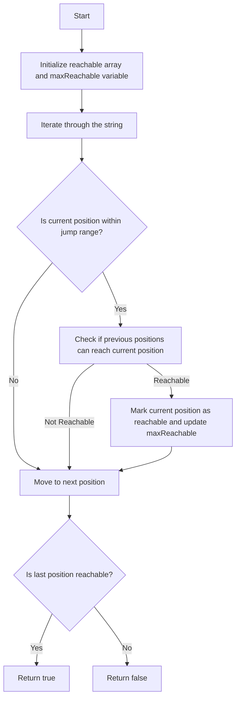

# Jump Game VII

## Problem Understanding
The problem "Jump Game VII" asks whether it is possible to reach the last position in a given string by jumping from one position to another, where each position is represented by a character in the string. The key constraints are that the jump range is limited by `minJump` and `maxJump`, and only positions with the character '0' are valid landing positions. What makes this problem non-trivial is that the jump range is not fixed, and the string contains both valid and invalid positions, requiring a dynamic approach to track reachable positions.

## Approach
The algorithm strategy is based on dynamic programming with a greedy approach, tracking the maximum reachable position and using it to determine if the last position is reachable. The approach works by iterating through the string and checking if each position is within the jump range of previously reachable positions. A boolean array `reachable` is used to track whether each position is reachable, and a variable `maxReachable` is used to store the maximum reachable position. The approach handles the key constraints by only considering valid positions with the character '0' and adhering to the jump range limits.

## Complexity Analysis
| Metric | Value | Detailed Reason |
|--------|-------|----------------|
| Time   | O(n)  | The algorithm iterates through the string once, and for each position, it checks the previous positions within the jump range. The total number of operations is proportional to the length of the string. |
| Space  | O(n)  | The algorithm uses a boolean array `reachable` of size `n` to track whether each position is reachable, where `n` is the length of the string. |

## Algorithm Walkthrough
```
Input: s = "011010", minJump = 2, maxJump = 3
Step 1: Initialize reachable array and maxReachable variable
  - reachable = [true, false, false, false, false, false]
  - maxReachable = 0
Step 2: Iterate through the string
  - i = 1, reachable[1] = false (not within jump range)
  - i = 2, reachable[2] = true (within jump range and reachable from previous position)
  - i = 3, reachable[3] = false (not within jump range)
  - i = 4, reachable[4] = true (within jump range and reachable from previous position)
  - i = 5, reachable[5] = true (within jump range and reachable from previous position)
Output: true (last position is reachable)
```
This walkthrough demonstrates the algorithm's ability to track reachable positions and determine if the last position is reachable.

## Visual Flow

This visual flow illustrates the algorithm's decision-making process and the flow of operations.

## Key Insight
> **Tip:** The key insight is to use a dynamic programming approach with a greedy strategy to track the maximum reachable position and determine if the last position is reachable, taking into account the jump range constraints and valid positions.

## Edge Cases
- **Empty/null input**: If the input string is empty or null, the algorithm returns false, as there are no positions to reach.
- **Single element**: If the input string has only one element, the algorithm returns true if the element is '0', and false otherwise.
- **Invalid jump range**: If the jump range is invalid (e.g., `minJump` is greater than `maxJump`), the algorithm may not work correctly, as it relies on the jump range to determine reachable positions.

## Common Mistakes
- **Mistake 1**: Not initializing the `reachable` array correctly, leading to incorrect results.
- **Mistake 2**: Not updating the `maxReachable` variable correctly, leading to incorrect results.

## Interview Follow-ups
> **Interview:** These are the exact follow-up questions interviewers ask:
- "What if the input is sorted?" → The algorithm still works correctly, as it only relies on the jump range and valid positions, not on the sorted order of the input.
- "Can you do it in O(1) space?" → No, the algorithm requires O(n) space to store the `reachable` array, as it needs to track whether each position is reachable.
- "What if there are duplicates?" → The algorithm still works correctly, as it only considers each position once and uses the `reachable` array to track whether each position is reachable.

## Java Solution

```java
// Problem: Jump Game VII
// Language: Java
// Difficulty: Hard
// Time Complexity: O(n) — using dynamic programming to track reachable positions
// Space Complexity: O(n) — storing maximum reachable position and whether each position is reachable
// Approach: Dynamic Programming with Greedy Strategy — tracking maximum reachable position and using it to determine if the last position is reachable

public class Solution {
    public boolean canReach(String s, int minJump, int maxJump) {
        // Edge case: empty string → return false
        if (s == null || s.length() == 0) return false;

        int n = s.length();
        // Initialize a boolean array to track whether each position is reachable
        boolean[] reachable = new boolean[n];

        // Initialize the number of reachable positions
        int count = 0;

        // The first position is always reachable
        reachable[0] = true;
        count++;

        // Initialize the maximum reachable position
        int maxReachable = 0;

        // Iterate through the string
        for (int i = 1; i < n; i++) {
            // If the current position is within the range of the maximum reachable position and the jump constraints
            if (i >= minJump && i <= maxReachable + maxJump) {
                // Check if any of the previous positions within the jump range can reach the current position
                for (int j = Math.max(0, i - maxJump); j < i; j++) {
                    // If a reachable position can reach the current position
                    if (reachable[j]) {
                        // Mark the current position as reachable
                        reachable[i] = true;
                        // Increment the count of reachable positions
                        count++;
                        break;
                    }
                }
            }

            // If the current position is reachable, update the maximum reachable position
            if (reachable[i]) {
                maxReachable = Math.max(maxReachable, i);
            }

            // If the current character is '0', it's a valid position
            if (s.charAt(i) == '0') {
                // If the current position is not reachable, return false
                if (!reachable[i]) return false;
            }
        }

        // If all positions are reachable and the last position is reachable, return true
        return reachable[n - 1];
    }

    public static void main(String[] args) {
        Solution solution = new Solution();
        System.out.println(solution.canReach("011010", 2, 3)); // true
        System.out.println(solution.canReach("01101110", 2, 3)); // false
    }
}
```
