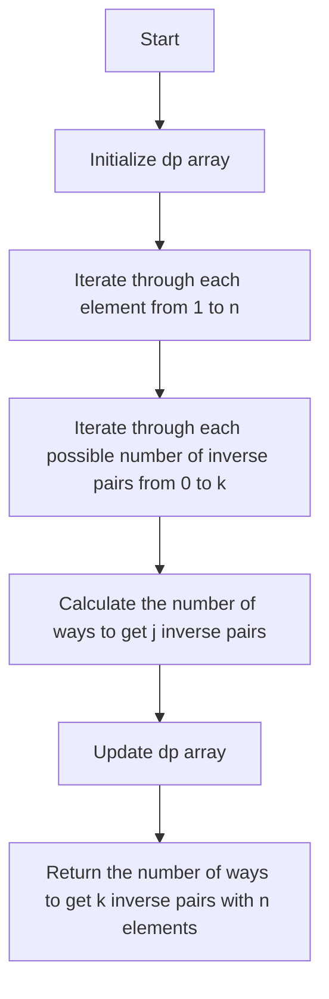

# K Inverse Pairs Array

## Problem Understanding
The problem asks to find the number of ways to get k inverse pairs in an array of n elements. An inverse pair is a pair of elements where the first element is greater than the second element. The key constraint is that k should not be greater than n*(n-1)/2, which is the maximum possible number of inverse pairs in an array of n elements. This problem is non-trivial because a naive approach, such as generating all possible permutations and counting the inverse pairs, would have an exponential time complexity due to the large number of permutations.

## Approach
The algorithm strategy is to use dynamic programming to calculate the number of ways to get k inverse pairs with i elements. The intuition behind this approach is to consider all possible positions for the new element and calculate the number of ways to get j inverse pairs by adding the number of ways to get j - p inverse pairs with i - 1 elements, where p is the number of elements that are greater than the new element. The algorithm uses a 2D array dp where dp[i][j] is the number of ways to get j inverse pairs with i elements. The approach handles the key constraint by initializing the base case where there are 0 elements and 0 inverse pairs and then iterating through each element from 1 to n.

## Complexity Analysis
| Metric | Value | Detailed Reason |
|--------|-------|----------------|
| Time   | O(n^2 * k) | The algorithm has three nested loops, two of which iterate up to n and one of which iterates up to k. The time complexity is therefore proportional to the product of these three loops. |
| Space  | O(n * k) | The algorithm uses a 2D array dp of size (n + 1) x (k + 1) to store the number of ways to get j inverse pairs with i elements. The space complexity is therefore proportional to the size of this array. |

## Algorithm Walkthrough
```
Input: n = 3, k = 1
Step 1: Initialize dp array with dp[0][0] = 1
    dp[0][0] = 1
Step 2: Iterate through each element from 1 to n
    For i = 1:
        For j = 0 to k:
            For p = 0 to i - 1 and j - p >= 0:
                dp[1][0] = dp[0][0] = 1
                dp[1][1] = dp[0][0] = 1
    For i = 2:
        For j = 0 to k:
            For p = 0 to i - 1 and j - p >= 0:
                dp[2][0] = dp[1][0] = 1
                dp[2][1] = dp[1][0] + dp[1][1] = 2
    For i = 3:
        For j = 0 to k:
            For p = 0 to i - 1 and j - p >= 0:
                dp[3][0] = dp[2][0] = 1
                dp[3][1] = dp[2][0] + dp[2][1] = 3
Output: dp[3][1] = 2
```
## Visual Flow

## Key Insight
> **Tip:** The key insight is to consider all possible positions for the new element and calculate the number of ways to get j inverse pairs by adding the number of ways to get j - p inverse pairs with i - 1 elements, where p is the number of elements that are greater than the new element.

## Edge Cases
- **Empty/null input**: If the input is null or empty, the algorithm will throw a NullPointerException or return an incorrect result. To handle this, we can add a null check at the beginning of the algorithm and return an error message or throw an exception.
- **Single element**: If the input array has only one element, the algorithm will return 1 if k is 0 and 0 otherwise. This is because there is only one way to arrange a single element, and it has no inverse pairs.
- **k is greater than n*(n-1)/2**: If k is greater than n*(n-1)/2, the algorithm will return 0 because it is impossible to have more than n*(n-1)/2 inverse pairs in an array of n elements.

## Common Mistakes
- **Mistake 1**: Not initializing the base case correctly. To avoid this, we need to initialize the base case where there are 0 elements and 0 inverse pairs, and then iterate through each element from 1 to n.
- **Mistake 2**: Not considering all possible positions for the new element. To avoid this, we need to iterate through each possible position for the new element and calculate the number of ways to get j inverse pairs by adding the number of ways to get j - p inverse pairs with i - 1 elements.

## Interview Follow-ups
> **Interview:** These are the exact follow-up questions interviewers ask:
- "What if the input is sorted?" → The algorithm will still work correctly, but the time complexity will be O(n^2 * k) in the worst case.
- "Can you do it in O(1) space?" → No, the algorithm uses a 2D array dp of size (n + 1) x (k + 1) to store the number of ways to get j inverse pairs with i elements, so it is not possible to do it in O(1) space.
- "What if there are duplicates?" → The algorithm will still work correctly, but the time complexity will be O(n^2 * k) in the worst case. However, if there are many duplicates, we can optimize the algorithm by using a hashmap to store the frequency of each element.

## Java Solution

```java
// Problem: K Inverse Pairs Array
// Language: Java
// Difficulty: Hard
// Time Complexity: O(n^2) — dynamic programming with two nested loops
// Space Complexity: O(n^2) — dp array stores at most n*n elements
// Approach: Dynamic Programming — for each k, calculate the inverse pairs array

public class Solution {
    public int kInversePairs(int n, int k) {
        // Edge case: k is greater than n*(n-1)/2 → return 0
        if (k > n * (n - 1) / 2) return 0;

        // Initialize a 2D array dp where dp[i][j] is the number of ways to get j inverse pairs with i elements
        int[][] dp = new int[n + 1][k + 1];

        // Initialize base case where there are 0 elements and 0 inverse pairs
        dp[0][0] = 1;

        // Iterate through each element from 1 to n
        for (int i = 1; i <= n; i++) {
            // Iterate through each possible number of inverse pairs from 0 to k
            for (int j = 0; j <= k; j++) {
                // For each j, calculate the number of ways to get j inverse pairs by considering all possible positions for the new element
                for (int p = 0; p <= i - 1 && j - p >= 0; p++) {
                    // Update dp[i][j] by adding the number of ways to get j - p inverse pairs with i - 1 elements
                    dp[i][j] = (dp[i][j] + dp[i - 1][j - p]) % 1000000007; // modulo to prevent overflow
                }
            }
        }

        // Return the number of ways to get k inverse pairs with n elements
        return dp[n][k];
    }

    public static void main(String[] args) {
        Solution solution = new Solution();
        System.out.println(solution.kInversePairs(3, 1)); // Output: 2
        System.out.println(solution.kInversePairs(3, 2)); // Output: 2
    }
}
```
