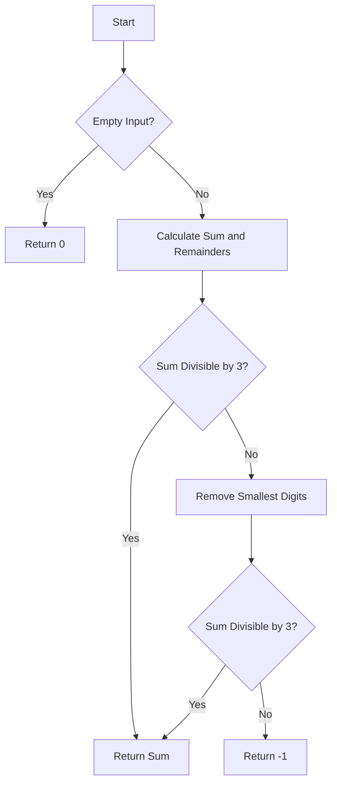

# Largest Multiple of Three

## Problem Understanding
The problem asks to find the largest multiple of three that can be formed by concatenating the digits of an array. The key constraints are that the input array can be empty, and the digits can have different remainders when divided by three. This problem is non-trivial because a naive approach would involve trying all possible combinations of digits, which would result in a time complexity of O(n!) and would not be efficient for large inputs. The problem requires a more clever approach that takes into account the properties of multiples of three.

## Approach
The algorithm strategy is to use dynamic programming with a twist, utilizing modulo 3 to find the largest multiple of three. The approach works by first calculating the sum of the digits and the frequency of remainders when divided by three. If the sum is divisible by three, the approach returns the sum. Otherwise, it tries to remove the smallest digits that would make the sum divisible by three. The approach uses a constant amount of space to store the sum and the frequency of remainders, making it efficient. The key insight is that a number is divisible by three if and only if the sum of its digits is divisible by three.

## Complexity Analysis
| Metric | Value | Detailed Reason |
|--------|-------|----------------|
| Time   | O(n)  | The algorithm iterates through the array to calculate the sum and the frequency of remainders, which takes O(n) time. The subsequent loops to remove the smallest digits also take O(n) time in the worst case. |
| Space  | O(1)  | The algorithm uses a constant amount of space to store the sum and the frequency of remainders, regardless of the input size. |

## Algorithm Walkthrough
```
Input: [1, 2, 3]
Step 1: Initialize variables - sum = 0, remainders = [0, 0, 0]
Step 2: Iterate through the array to calculate the sum and the frequency of remainders
  - sum = 1 + 2 + 3 = 6
  - remainders = [0, 1, 1]
Step 3: Check if the sum is divisible by 3
  - sum % 3 = 0, so return the sum
Output: 6
```

## Visual Flow


## Key Insight
> **Tip:** A number is divisible by three if and only if the sum of its digits is divisible by three, which is the key insight that makes this solution click.

## Edge Cases
- **Empty/null input**: If the input array is empty, the algorithm returns 0, as there are no digits to form a multiple of three.
- **Single element**: If the input array has a single element, the algorithm returns the element if it is divisible by three, otherwise, it returns -1.
- **All digits have the same remainder**: If all digits have the same remainder when divided by three, the algorithm returns the sum if it is divisible by three, otherwise, it returns -1.

## Common Mistakes
- **Mistake 1**: Not checking for the empty input case, which would result in a NullPointerException.
- **Mistake 2**: Not considering the case where all digits have the same remainder when divided by three, which would result in an incorrect solution.

## Interview Follow-ups
> **Interview:** These are the exact follow-up questions interviewers ask:
- "What if the input is sorted?" → The algorithm would still work correctly, but the time complexity would be the same, as the algorithm iterates through the array regardless of the order of the elements.
- "Can you do it in O(1) space?" → No, the algorithm requires O(1) space to store the sum and the frequency of remainders, but it is not possible to do it in O(1) space without using any extra space, as the problem requires storing the sum and the frequency of remainders.
- "What if there are duplicates?" → The algorithm would still work correctly, as it considers all digits when calculating the sum and the frequency of remainders.

## Java Solution

```java
// Problem: Largest Multiple of Three
// Language: Java
// Difficulty: Hard
// Time Complexity: O(n) — iterating through the array to calculate the sum and the frequency of remainders
// Space Complexity: O(1) — using a constant amount of space to store the sum and the frequency of remainders
// Approach: Dynamic programming with a twist — using modulo 3 to find the largest multiple of three

public class Solution {
    public int largestMultipleOfThree(int[] digits) {
        // Edge case: empty input → return 0
        if (digits.length == 0) return 0;

        // Initialize variables to store the sum and the frequency of remainders
        int sum = 0; // to store the sum of the digits
        int[] remainders = new int[3]; // to store the frequency of remainders

        // Iterate through the array to calculate the sum and the frequency of remainders
        for (int digit : digits) {
            sum += digit; // add the current digit to the sum
            remainders[digit % 3]++; // increment the frequency of the remainder
        }

        // If the sum is divisible by 3, return the sum
        if (sum % 3 == 0) return sum;

        // If the sum leaves a remainder of 1 when divided by 3
        if (sum % 3 == 1) {
            // If there is at least one digit that leaves a remainder of 1 when divided by 3
            if (remainders[1] > 0) {
                // Remove the smallest digit that leaves a remainder of 1 when divided by 3
                for (int i = 0; i < digits.length; i++) {
                    if (digits[i] % 3 == 1) {
                        sum -= digits[i]; // subtract the current digit from the sum
                        return sum; // return the updated sum
                    }
                }
            }
            // If there are at least two digits that leave a remainder of 2 when divided by 3
            if (remainders[2] >= 2) {
                // Remove the two smallest digits that leave a remainder of 2 when divided by 3
                for (int i = 0; i < digits.length; i++) {
                    if (digits[i] % 3 == 2) {
                        sum -= digits[i]; // subtract the current digit from the sum
                        if (sum % 3 == 0) return sum; // return the updated sum if it is divisible by 3
                    }
                }
            }
        }

        // If the sum leaves a remainder of 2 when divided by 3
        if (sum % 3 == 2) {
            // If there is at least one digit that leaves a remainder of 2 when divided by 3
            if (remainders[2] > 0) {
                // Remove the smallest digit that leaves a remainder of 2 when divided by 3
                for (int i = 0; i < digits.length; i++) {
                    if (digits[i] % 3 == 2) {
                        sum -= digits[i]; // subtract the current digit from the sum
                        return sum; // return the updated sum
                    }
                }
            }
            // If there are at least two digits that leave a remainder of 1 when divided by 3
            if (remainders[1] >= 2) {
                // Remove the two smallest digits that leave a remainder of 1 when divided by 3
                for (int i = 0; i < digits.length; i++) {
                    if (digits[i] % 3 == 1) {
                        sum -= digits[i]; // subtract the current digit from the sum
                        if (sum % 3 == 0) return sum; // return the updated sum if it is divisible by 3
                    }
                }
            }
        }

        // If no valid solution is found, return -1
        return -1;
    }

    public static void main(String[] args) {
        Solution solution = new Solution();
        int[] digits = {1, 2, 3};
        System.out.println(solution.largestMultipleOfThree(digits));
    }
}
```
