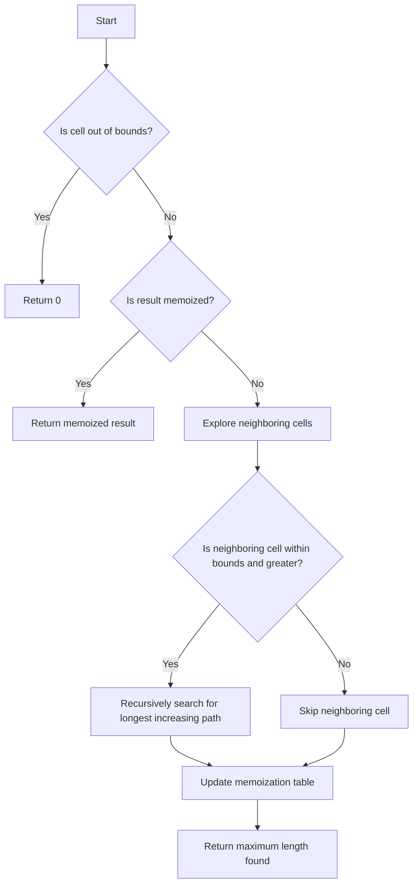

# Longest Increasing Path in Matrix

## Problem Understanding
The problem is asking us to find the longest increasing path in a given matrix, where each cell represents a value. The key constraint is that we can only move to a neighboring cell if its value is greater than the current cell's value. This problem is non-trivial because a naive approach, such as exploring all possible paths from each cell, would result in exponential time complexity due to the overlapping subproblems. The use of memoization is crucial to reduce the time complexity to O(m*n), where m and n are the dimensions of the matrix.

## Approach
The algorithm strategy used is Depth-First Search (DFS) with memoization. The intuition behind this approach is to explore all possible increasing paths from each cell and store the results in a memoization table to avoid redundant computations. The DFS function recursively searches for the longest increasing path from each neighboring cell and returns the maximum length found. The memoization table stores the longest increasing path length for each cell, allowing us to avoid recomputing the same subproblems. The approach handles the key constraints by only considering neighboring cells with greater values.

## Complexity Analysis
| Metric | Value | Detailed Reason |
|--------|-------|----------------|
| Time   | O(m*n) | The algorithm performs a DFS from each cell, and the memoization table ensures that each cell is visited at most once, resulting in a time complexity of O(m*n). The DFS function has a recursive depth of at most m+n, but the memoization table reduces the number of recursive calls. |
| Space  | O(m*n) | The memoization table stores the longest increasing path length for each cell, resulting in a space complexity of O(m*n). The recursive call stack also uses O(m+n) space, but the memoization table dominates the space complexity. |

## Algorithm Walkthrough
```
Input: matrix = [[9,9,4],[6,6,8],[2,1,1]]
Step 1: Initialize memoization table with zeros
memo = [[0,0,0],[0,0,0],[0,0,0]]
Step 2: Perform DFS from cell (0,0)
  - Explore neighboring cells: (0,1), (1,0)
  - Since matrix[0,1] = 9 is not greater than matrix[0,0] = 9, skip it
  - Since matrix[1,0] = 6 is not greater than matrix[0,0] = 9, skip it
  - memo[0,0] = 1 (minimum length is 1)
Step 3: Perform DFS from cell (0,1)
  - Explore neighboring cells: (0,2), (1,1)
  - Since matrix[0,2] = 4 is not greater than matrix[0,1] = 9, skip it
  - Since matrix[1,1] = 6 is not greater than matrix[0,1] = 9, skip it
  - memo[0,1] = 1 (minimum length is 1)
...
Output: 4 (longest increasing path: [1, 2, 6, 9])
```
## Visual Flow

## Key Insight
> **Tip:** The key insight is to use memoization to avoid redundant computations and reduce the time complexity from exponential to O(m*n), where m and n are the dimensions of the matrix.

## Edge Cases
- **Empty/null input**: If the input matrix is null or empty, the algorithm returns 0, as there are no cells to explore.
- **Single element**: If the input matrix contains only one element, the algorithm returns 1, as the single element is the longest increasing path.
- **Matrix with all equal elements**: If the input matrix contains all equal elements, the algorithm returns 1, as there are no increasing paths.

## Common Mistakes
- **Mistake 1**: Not using memoization, resulting in exponential time complexity. To avoid this, use a memoization table to store the longest increasing path length for each cell.
- **Mistake 2**: Not checking for out-of-bounds neighboring cells, resulting in incorrect results. To avoid this, always check if the neighboring cell is within bounds before exploring it.

## Interview Follow-ups
> **Interview:** These are the exact follow-up questions interviewers ask:
- "What if the input is sorted?" → The algorithm still works correctly, as it only considers neighboring cells with greater values. The time complexity remains O(m*n).
- "Can you do it in O(1) space?" → No, the algorithm requires a memoization table to store the longest increasing path length for each cell, resulting in a space complexity of O(m*n).
- "What if there are duplicates?" → The algorithm handles duplicates correctly, as it only considers neighboring cells with greater values. If there are duplicate values, the algorithm will still find the longest increasing path.

## Java Solution

```java
// Problem: Longest Increasing Path in Matrix
// Language: Java
// Difficulty: Hard
// Time Complexity: O(m*n) — where m and n are the dimensions of the matrix, using memoization
// Space Complexity: O(m*n) — memoization stores at most m*n elements
// Approach: Depth-First Search with memoization — for each cell, explore all possible increasing paths

class Solution {
    // Define the possible directions to move in the matrix
    private static final int[][] directions = {{0, 1}, {0, -1}, {1, 0}, {-1, 0}};

    public int longestIncreasingPath(int[][] matrix) {
        // Edge case: empty matrix → return 0
        if (matrix == null || matrix.length == 0) return 0;

        int m = matrix.length; // number of rows
        int n = matrix[0].length; // number of columns
        int[][] memo = new int[m][n]; // memoization table

        int maxLength = 0; // store the maximum length found so far
        for (int i = 0; i < m; i++) {
            for (int j = 0; j < n; j++) {
                // For each cell, perform a depth-first search to find the longest increasing path
                maxLength = Math.max(maxLength, dfs(matrix, i, j, memo));
            }
        }
        return maxLength;
    }

    // Perform a depth-first search from the given cell
    private int dfs(int[][] matrix, int i, int j, int[][] memo) {
        // Edge case: out of bounds → return 0
        if (i < 0 || i >= matrix.length || j < 0 || j >= matrix[0].length) return 0;

        // If the result is already memoized, return it
        if (memo[i][j] != 0) return memo[i][j];

        int maxLength = 1; // the minimum length is 1 (the cell itself)
        for (int[] direction : directions) {
            int x = i + direction[0]; // new row
            int y = j + direction[1]; // new column

            // Only consider the neighboring cell if it's within bounds and has a greater value
            if (x >= 0 && x < matrix.length && y >= 0 && y < matrix[0].length && matrix[x][y] > matrix[i][j]) {
                // Recursively search for the longest increasing path from the neighboring cell
                maxLength = Math.max(maxLength, 1 + dfs(matrix, x, y, memo));
            }
        }
        memo[i][j] = maxLength; // memoize the result
        return maxLength;
    }
}
```
