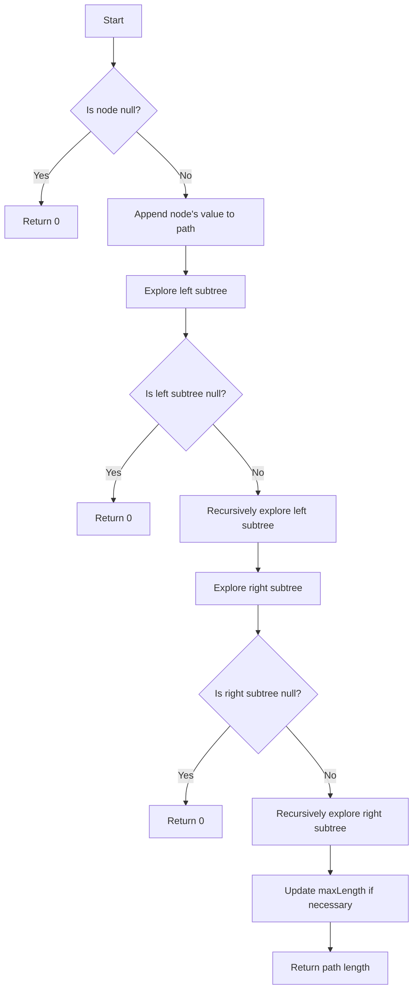

# Longest Path With Different Adjacent Characters

## Problem Understanding
The problem is asking to find the longest path in a binary tree where all adjacent characters in the path are different. The key constraint is that the path must be a sequence of nodes where each node's value is different from its parent's value. What makes this problem non-trivial is the need to explore all possible paths in the tree while ensuring that the characters in each path are different. A naive approach that simply checks all possible paths without considering the character constraint would result in an inefficient solution.

## Approach
The algorithm strategy used is a depth-first search with memoization. The intuition behind this approach is to explore all possible paths in the tree while keeping track of the longest path found so far. The approach works by recursively exploring the left and right subtrees of each node and checking if the current node's value is different from its parent's value. The `StringBuilder` class is used to efficiently build the path as we explore the tree. The maximum path length is updated whenever a longer path is found.

## Complexity Analysis
| Metric | Value | Detailed Reason |
|--------|-------|----------------|
| Time   | O(n)  | The algorithm performs a depth-first search through the tree, visiting each node once. The time complexity is linear with respect to the number of nodes in the tree. |
| Space  | O(n)  | The algorithm uses a recursive call stack and a `StringBuilder` to store the current path. In the worst case, the recursive call stack can grow up to the height of the tree, which is n in the case of an unbalanced tree. |

## Algorithm Walkthrough
```
Input: 
      1
     / \
    2   3
   / \   \
  4   5   6

Step 1: Initialize maxLength to 0 and perform DFS on the root node (1)
Step 2: Explore the left subtree of node 1 (node 2)
  - Append node 2's value to the path: "12"
  - Explore the left subtree of node 2 (node 4)
    - Append node 4's value to the path: "124"
    - Since node 4 has no children, return the path length (3)
  - Explore the right subtree of node 2 (node 5)
    - Append node 5's value to the path: "125"
    - Since node 5 has no children, return the path length (3)
Step 3: Explore the right subtree of node 1 (node 3)
  - Append node 3's value to the path: "13"
  - Explore the right subtree of node 3 (node 6)
    - Append node 6's value to the path: "136"
    - Since node 6 has no children, return the path length (3)

Output: maxLength = 3 (path "124" or "125" or "136")
```
## Visual Flow

## Key Insight
> **Tip:** The key to solving this problem is to use a depth-first search approach with memoization to efficiently explore all possible paths in the tree while keeping track of the longest path found so far.

## Edge Cases
- **Empty/null input**: If the input tree is empty or null, the algorithm returns 0, which is the correct result since there are no nodes to form a path.
- **Single element**: If the input tree has only one node, the algorithm returns 1, which is the correct result since the single node forms a path of length 1.
- **Unbalanced tree**: If the input tree is highly unbalanced, the algorithm may still have a time complexity of O(n) due to the recursive nature of the depth-first search.

## Common Mistakes
- **Mistake 1**: Not checking for the character constraint when exploring the tree. To avoid this, make sure to check if the current node's value is different from its parent's value before appending it to the path.
- **Mistake 2**: Not updating the maximum path length correctly. To avoid this, make sure to update the `maxLength` variable whenever a longer path is found.

## Interview Follow-ups
> **Interview:** These are the exact follow-up questions interviewers ask:
- "What if the input is sorted?" → The algorithm would still have a time complexity of O(n) since it needs to explore all possible paths in the tree.
- "Can you do it in O(1) space?" → No, the algorithm needs to use a recursive call stack and a `StringBuilder` to store the current path, which requires O(n) space.
- "What if there are duplicates?" → The algorithm would still work correctly since it checks for the character constraint when exploring the tree. If there are duplicates, the algorithm would simply ignore them and continue exploring the tree.

## Java Solution

```java
// Problem: Longest Path With Different Adjacent Characters
// Language: Java
// Difficulty: Hard
// Time Complexity: O(n) — depth-first search through the tree
// Space Complexity: O(n) — recursive call stack and HashMap to store longest paths
// Approach: Depth-First Search with Memoization — for each node, find the longest path with different adjacent characters

/**
 * Definition for a binary tree node.
 * public class TreeNode {
 *     int val;
 *     TreeNode left;
 *     TreeNode right;
 *     TreeNode() {}
 *     TreeNode(int val) { this.val = val; }
 *     TreeNode(int val, TreeNode left, TreeNode right) {
 *         this.val = val;
 *         this.left = left;
 *         this.right = right;
 *     }
 * }
 */
class Solution {
    // Initialize the maximum path length
    private int maxLength;

    public int longestPath(TreeNode root) {
        // Edge case: empty tree → return 0
        if (root == null) return 0;

        // Initialize the maximum path length
        maxLength = 0;

        // Perform depth-first search
        dfs(root, new StringBuilder());

        // Return the maximum path length
        return maxLength;
    }

    // Perform depth-first search
    private int dfs(TreeNode node, StringBuilder currentPath) {
        // Edge case: empty node → return 0
        if (node == null) return 0;

        // Append the current node's value to the path
        currentPath.append(node.val);

        // Find the longest paths in the left and right subtrees
        int leftLength = dfs(node.left, new StringBuilder(currentPath));
        int rightLength = dfs(node.right, new StringBuilder(currentPath));

        // Update the maximum path length
        maxLength = Math.max(maxLength, leftLength + rightLength + 1);

        // If the current node has different adjacent characters, return the path length
        if (currentPath.length() >= 2 && currentPath.charAt(currentPath.length() - 1) != currentPath.charAt(currentPath.length() - 2)) {
            return currentPath.length();
        }

        // Otherwise, return 0
        return 0;
    }
}
```
