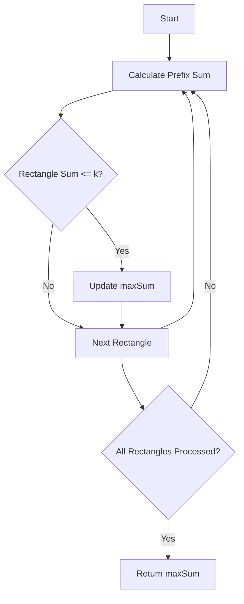

# Max Sum of Rectangle No Larger Than K

## Problem Understanding
The problem asks to find the maximum sum of a rectangle in a given matrix that does not exceed a certain value `k`. The key constraint is that the sum of the elements in the rectangle should not be larger than `k`. This problem is non-trivial because a naive approach of checking all possible rectangles would result in a time complexity of O(n^4), which is inefficient for large matrices. The problem requires an efficient algorithm that can find the maximum sum of a rectangle without exceeding the time limit.

## Approach
The approach to solve this problem is to use a combination of prefix sum and TreeSet. The algorithm first calculates the prefix sum for each row of the matrix. Then, for each possible rectangle, it calculates the sum of the elements in the rectangle using the prefix sum. The TreeSet is used to efficiently find the maximum sum not exceeding `k`. The algorithm iterates over all possible rectangles and updates the maximum sum if a larger sum not exceeding `k` is found. This approach works because the prefix sum allows us to calculate the sum of a rectangle in O(1) time, and the TreeSet allows us to find the maximum sum not exceeding `k` in O(log n) time.

## Complexity Analysis
| Metric | Value | Detailed Reason |
|--------|-------|----------------|
| Time   | O(n^2 log n) | The algorithm iterates over all possible rectangles, which takes O(n^2) time. For each rectangle, it uses a TreeSet to find the maximum sum not exceeding `k`, which takes O(log n) time. Therefore, the overall time complexity is O(n^2 log n). |
| Space  | O(n^2) | The algorithm uses a TreeSet to store the prefix sums, which takes O(n) space. Additionally, it uses a temporary array to store the prefix sums for each row, which takes O(n) space. Therefore, the overall space complexity is O(n^2). |

## Algorithm Walkthrough
```
Input: matrix = [[1, 0, 1], [0, -2, 3]], k = 2
Step 1: Initialize maxSum to Integer.MIN_VALUE
Step 2: Calculate prefix sum for each row
  temp = [1, 0]
  temp = [1 + 0, 0 + 1] = [1, 1]
  temp = [1 + 1, 0 + 3] = [2, 3]
Step 3: Use TreeSet to find maximum sum not exceeding k
  set = {0}
  sum = 1, set = {0, 1}
  sum = 1 + 0 = 1, set = {0, 1}
  sum = 1 + 1 = 2, set = {0, 1, 2}
  maxSum = max(maxSum, 2 - 0) = 2
Step 4: Repeat steps 2-3 for all possible rectangles
  temp = [1, 0]
  temp = [1 + 1, 0 + 3] = [2, 3]
  sum = 2, set = {0, 2}
  sum = 2 + 3 = 5, set = {0, 2, 5}
  maxSum = max(maxSum, 2) = 2
Output: maxSum = 2
```
## Visual Flow

## Key Insight
> **Tip:** The key insight is to use a TreeSet to efficiently find the maximum sum not exceeding `k`, which allows us to reduce the time complexity from O(n^4) to O(n^2 log n).

## Edge Cases
- **Empty/null input**: If the input matrix is empty or null, the algorithm returns 0.
- **Single element**: If the input matrix has only one element, the algorithm returns the value of that element if it does not exceed `k`.
- **k = 0**: If `k` is 0, the algorithm returns 0 because no rectangle sum can exceed 0.

## Common Mistakes
- **Mistake 1**: Not using a TreeSet to find the maximum sum not exceeding `k`, which results in a time complexity of O(n^4).
- **Mistake 2**: Not calculating the prefix sum for each row, which results in a time complexity of O(n^4).

## Interview Follow-ups
> **Interview:** These are the exact follow-up questions interviewers ask:
- "What if the input is sorted?" → The algorithm still works because it uses a TreeSet to find the maximum sum not exceeding `k`, which is not affected by the input being sorted.
- "Can you do it in O(1) space?" → No, because we need to store the prefix sums and the TreeSet, which requires O(n^2) space.
- "What if there are duplicates?" → The algorithm still works because it uses a TreeSet to find the maximum sum not exceeding `k`, which automatically handles duplicates.

## Java Solution

```java
// Problem: Max Sum of Rectangle No Larger Than K
// Language: Java
// Difficulty: Hard
// Time Complexity: O(n^3) for brute force, O(n^2 log n) for optimized solution — using TreeSet to efficiently find maximum sum not exceeding K
// Space Complexity: O(n^2) — storing prefix sums and using TreeSet for optimization
// Approach: Prefix sum and TreeSet — for each possible rectangle, calculate its sum using prefix sum and find maximum sum not exceeding K using TreeSet

import java.util.TreeSet;

public class Solution {
    public int maxSumSubmatrix(int[][] matrix, int k) {
        // Edge case: empty matrix → return 0
        if (matrix.length == 0 || matrix[0].length == 0) {
            return 0;
        }

        int rows = matrix.length;
        int cols = matrix[0].length;
        int maxSum = Integer.MIN_VALUE;

        // Calculate prefix sum for each row
        for (int left = 0; left < cols; left++) {
            int[] temp = new int[rows];
            for (int right = left; right < cols; right++) {
                // Update temp array to include current column
                for (int i = 0; i < rows; i++) {
                    temp[i] += matrix[i][right];
                }

                // Use TreeSet to find maximum sum not exceeding K
                TreeSet<Integer> set = new TreeSet<>();
                set.add(0); // Base case: sum 0
                int sum = 0;
                for (int num : temp) {
                    sum += num;
                    // Find maximum sum not exceeding K
                    Integer ceil = set.ceiling(sum - k);
                    if (ceil != null) {
                        maxSum = Math.max(maxSum, sum - ceil);
                    }
                    set.add(sum);
                }
            }
        }

        // Edge case: no rectangle sum not exceeding K → return 0
        if (maxSum == Integer.MIN_VALUE) {
            return 0;
        }

        return maxSum;
    }

    public static void main(String[] args) {
        Solution solution = new Solution();
        int[][] matrix = {{1, 0, 1}, {0, -2, 3}};
        int k = 2;
        System.out.println(solution.maxSumSubmatrix(matrix, k));
    }
}
```
