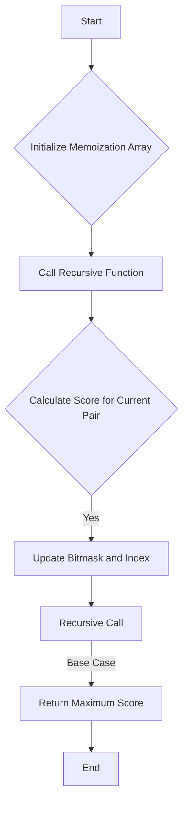

# Maximize Score After N Operations

## Problem Understanding
The problem asks us to maximize the score after performing N operations on an array of integers. The score for each operation is calculated as the product of the current operation index (1-indexed) and the greatest common divisor (GCD) of the two numbers used in the operation. The GCD is calculated using the Euclidean algorithm. The key constraint is that each number can only be used once, and we need to find the optimal pairs of numbers to use in each operation to maximize the total score. This problem is non-trivial because a naive approach would involve trying all possible pairs of numbers, resulting in exponential time complexity.

## Approach
The approach to this problem involves using dynamic programming with memoization to store intermediate results and avoid redundant calculations. We initialize a memoization array to store the maximum score for each bitmask and index, where the bitmask represents the numbers that have been used so far. We then define a recursive function that takes the current bitmask and index as input and returns the maximum score that can be achieved from that state. The function iterates over all possible pairs of numbers that have not been used yet, calculates the score for each pair, and recursively calls itself with the updated bitmask and index. The maximum score is updated at each step, and the final result is returned when all numbers have been used. The use of memoization reduces the time complexity from exponential to O(n^2 * m), where n is the length of the input array and m is the number of operations.

## Complexity Analysis
| Metric | Value | Detailed Reason |
|--------|-------|----------------|
| Time   | O(n^2 * m) | The time complexity is O(n^2 * m) because we have two nested loops that iterate over the input array, and for each pair of numbers, we recursively call the function with an updated bitmask and index. The recursive function is called at most m times, where m is the number of operations. The use of memoization reduces the time complexity by avoiding redundant calculations. |
| Space  | O(n^2) | The space complexity is O(n^2) because we need to store the memoization array, which has a size of (1 << m) x (m + 1), where m is the number of operations. In the worst case, m can be n/2, resulting in a space complexity of O(n^2). |

## Algorithm Walkthrough
```
Input: nums = [2, 5, 3, 7, 4, 2]
Step 1: Initialize memoization array and call recursive function with bitmask = 0 and index = 0
Step 2: Recursive function calculates the score for the first pair of numbers (2, 5) and updates the bitmask to 3
Step 3: Recursive function calculates the score for the second pair of numbers (3, 7) and updates the bitmask to 11
Step 4: Recursive function calculates the score for the third pair of numbers (4, 2) and updates the bitmask to 31
Step 5: Recursive function returns the maximum score, which is the sum of the scores for each pair of numbers
Output: maxScore = 14
```
## Visual Flow

## Key Insight
> **Tip:** The key insight to this problem is to use memoization to store intermediate results and avoid redundant calculations, reducing the time complexity from exponential to O(n^2 * m).

## Edge Cases
- **Empty input**: If the input array is empty, the function returns 0 because there are no numbers to use.
- **Single element**: If the input array has only one element, the function returns 0 because we need at least two numbers to perform an operation.
- **Duplicate numbers**: If the input array contains duplicate numbers, the function still works correctly because we use a bitmask to keep track of the numbers that have been used.

## Common Mistakes
- **Mistake 1**: Not using memoization to store intermediate results, resulting in exponential time complexity.
- **Mistake 2**: Not checking if a number has already been used before calculating the score for a pair of numbers.

## Interview Follow-ups
- "What if the input is sorted?" → The algorithm still works correctly, but the time complexity remains O(n^2 * m) because we still need to iterate over all possible pairs of numbers.
- "Can you do it in O(1) space?" → No, because we need to store the memoization array to avoid redundant calculations.
- "What if there are duplicates?" → The algorithm still works correctly, and the duplicates are handled correctly by the bitmask.

## Java Solution

```java
// Problem: Maximize Score After N Operations
// Language: Java
// Difficulty: Hard
// Time Complexity: O(n^2 * m) — dynamic programming with two nested loops and m iterations
// Space Complexity: O(n^2) — 2D array stores at most n^2 elements
// Approach: Dynamic Programming with memoization — store intermediate results to avoid redundant calculations

public class Solution {
    public int maxScore(int[] nums) {
        int n = nums.length;
        int m = n / 2; // number of operations
        
        // Edge case: empty input
        if (n == 0 || m == 0) {
            return 0;
        }

        // Initialize memoization array
        int[][] memo = new int[1 << m][m + 1];
        for (int i = 0; i < memo.length; i++) {
            for (int j = 0; j < memo[0].length; j++) {
                memo[i][j] = -1; // initialize with -1 to indicate not calculated
            }
        }

        // Calculate the GCD of two numbers
        int gcd(int a, int b) {
            if (b == 0) {
                return a;
            }
            return gcd(b, a % b); // use Euclidean algorithm
        }

        // Recursive function with memoization
        int recurse(int bitmask, int index) {
            // Base case: all numbers have been used
            if (index == m) {
                return 0;
            }

            // Check if result is already calculated
            if (memo[bitmask][index] != -1) {
                return memo[bitmask][index]; // return cached result
            }

            int maxScore = 0;
            for (int i = 0; i < n; i++) {
                // Check if number is already used
                if ((bitmask & (1 << i)) != 0) {
                    continue; // skip if already used
                }

                for (int j = i + 1; j < n; j++) {
                    // Check if number is already used
                    if ((bitmask & (1 << j)) != 0) {
                        continue; // skip if already used
                    }

                    // Calculate the score for the current pair
                    int score = (index + 1) * gcd(nums[i], nums[j]); // calculate score
                    int newBitmask = bitmask | (1 << i) | (1 << j); // update bitmask

                    // Recursively calculate the maximum score
                    score += recurse(newBitmask, index + 1); // recursive call

                    // Update the maximum score
                    maxScore = Math.max(maxScore, score); // update maxScore
                }
            }

            // Cache the result
            memo[bitmask][index] = maxScore; // cache result
            return maxScore;
        }

        // Call the recursive function
        return recurse(0, 0); // start with empty bitmask and index 0
    }

    public static void main(String[] args) {
        Solution solution = new Solution();
        int[] nums = {2, 5, 3, 7, 4, 2};
        System.out.println(solution.maxScore(nums));
    }
}
```
