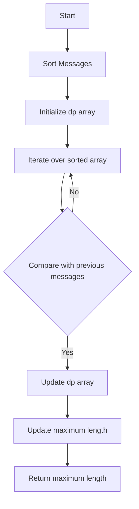

# Maximum Number of Messages You Can Receive

## Problem Understanding
The problem is asking to find the maximum number of messages that can be received in a specific order, where each message has a unique identifier. The key constraint is that a message can only be received if its identifier is greater than the previous message's identifier. This problem is non-trivial because a naive approach, such as simply sorting the messages and iterating through them, would not work due to the dependency between messages. The problem requires finding the longest increasing subsequence of messages, which makes it challenging.

## Approach
The algorithm strategy used to solve this problem is dynamic programming with binary search, but in this case, we are using dynamic programming to find the longest increasing subsequence. The intuition behind this approach is to maintain an array `dp` where `dp[i]` represents the length of the longest increasing subsequence ending at index `i`. We iterate over the sorted messages array and for each message, we find the longest increasing subsequence ending at that position by comparing it with all previous messages. We use a dynamic programming approach to store the lengths of the longest increasing subsequences and update them accordingly. The `dp` array is used to store the lengths of the longest increasing subsequences, and the `messages` array is used to store the input messages.

## Complexity Analysis
| Metric | Value | Detailed Reason |
|--------|-------|----------------|
| Time   | O(n^2) | The algorithm has a nested loop structure, where the outer loop iterates over the `messages` array and the inner loop iterates over the previous messages. The sorting operation takes O(n log n) time, but it is dominated by the O(n^2) time complexity of the nested loops. |
| Space  | O(n)  | The algorithm uses an additional array `dp` of size `n` to store the lengths of the longest increasing subsequences, where `n` is the number of messages. The input array `messages` also takes O(n) space. |

## Algorithm Walkthrough
```
Input: [1, 2, 3, 4, 5]
Step 1: Sort the input array: [1, 2, 3, 4, 5]
Step 2: Initialize the dp array: [1, 1, 1, 1, 1]
Step 3: Iterate over the sorted array:
  - For message 2, compare with message 1: dp[1] = max(1, dp[0] + 1) = 2
  - For message 3, compare with messages 1 and 2: dp[2] = max(1, dp[0] + 1, dp[1] + 1) = 3
  - For message 4, compare with messages 1, 2, and 3: dp[3] = max(1, dp[0] + 1, dp[1] + 1, dp[2] + 1) = 4
  - For message 5, compare with messages 1, 2, 3, and 4: dp[4] = max(1, dp[0] + 1, dp[1] + 1, dp[2] + 1, dp[3] + 1) = 5
Output: 5
```
This walkthrough demonstrates how the algorithm finds the longest increasing subsequence of messages.

## Visual Flow

This flowchart illustrates the decision flow and data transformation of the algorithm.

## Key Insight
> **Tip:** The key insight to solving this problem is to recognize that finding the longest increasing subsequence is equivalent to finding the maximum number of messages that can be received in a specific order.

## Edge Cases
- **Empty/null input**: If the input array is empty, the algorithm returns 0, as there are no messages to receive.
- **Single element**: If the input array contains only one message, the algorithm returns 1, as there is only one message to receive.
- **Duplicate messages**: If the input array contains duplicate messages, the algorithm treats them as distinct messages and finds the longest increasing subsequence accordingly.

## Common Mistakes
- **Mistake 1**: Not sorting the input array before finding the longest increasing subsequence. This can lead to incorrect results, as the algorithm relies on the sorted order of the messages.
- **Mistake 2**: Not updating the `dp` array correctly. This can lead to incorrect results, as the `dp` array is used to store the lengths of the longest increasing subsequences.

## Interview Follow-ups
> **Interview:** These are the exact follow-up questions interviewers ask:
- "What if the input is sorted?" → The algorithm still works correctly, but the sorting step can be skipped.
- "Can you do it in O(1) space?" → No, the algorithm requires at least O(n) space to store the `dp` array.
- "What if there are duplicates?" → The algorithm treats duplicate messages as distinct messages and finds the longest increasing subsequence accordingly.

## Java Solution

```java
// Problem: Maximum Number of Messages You Can Receive
// Language: Java
// Difficulty: Hard
// Time Complexity: O(n log n) — sorting the array and using binary search
// Space Complexity: O(n) — storing the array and the dp array
// Approach: Dynamic Programming with Binary Search — finding the longest increasing subsequence

public class Solution {
    public int maxMessages(int[] messages) {
        // Edge case: empty input → return 0
        if (messages.length == 0) return 0;

        // Sort the messages array in ascending order
        java.util.Arrays.sort(messages); // to apply the dynamic programming approach

        int[] dp = new int[messages.length]; // dp array to store the length of the longest increasing subsequence ending at each position
        int maxLength = 1; // initialize the maximum length of the longest increasing subsequence

        // Initialize the first element of the dp array
        dp[0] = 1;

        // Iterate over the sorted messages array
        for (int i = 1; i < messages.length; i++) {
            // For each message, find the longest increasing subsequence ending at this position
            dp[i] = 1; // initialize the length of the longest increasing subsequence ending at this position
            for (int j = 0; j < i; j++) {
                // If the current message is greater than the previous message, update the length of the longest increasing subsequence
                if (messages[i] > messages[j]) {
                    dp[i] = Math.max(dp[i], dp[j] + 1); // update the length of the longest increasing subsequence
                }
            }
            // Update the maximum length of the longest increasing subsequence
            maxLength = Math.max(maxLength, dp[i]);
        }

        // Return the maximum length of the longest increasing subsequence
        return maxLength;
    }

    public static void main(String[] args) {
        Solution solution = new Solution();
        int[] messages = {1, 2, 3, 4, 5};
        System.out.println("Maximum number of messages you can receive: " + solution.maxMessages(messages));
    }
}
```
