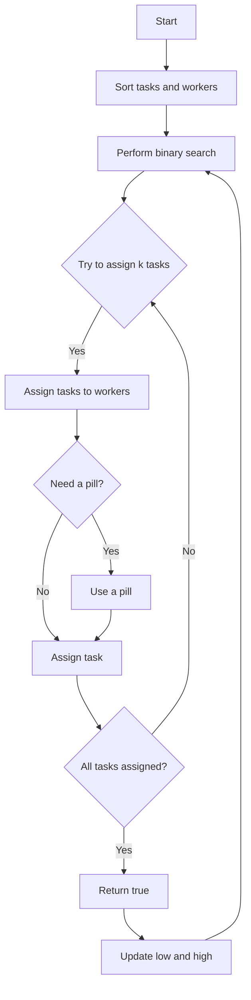

# Maximum Number of Tasks You Can Assign

## Problem Understanding
The problem is asking to find the maximum number of tasks that can be assigned to workers based on their strengths, given a limited number of pills that can be used to increase a worker's strength. The key constraints are that each task has a certain difficulty level, each worker has a certain strength level, and each pill can increase a worker's strength by one level. The problem is non-trivial because simply assigning the easiest tasks to the strongest workers may not be optimal, as using pills to increase a worker's strength can also be beneficial. A naive approach that tries to assign tasks to workers in a straightforward manner may fail to find the optimal solution.

## Approach
The algorithm strategy used is a greedy algorithm with backtracking, where tasks are assigned to workers based on their strengths, and pills are used to increase a worker's strength when necessary. The intuition behind this approach is to try to assign as many tasks as possible to the strongest workers, while using pills to increase the strength of weaker workers when needed. The algorithm uses two nested loops to find the optimal assignment, and it uses a queue to store the tasks that need to be assigned and the workers that can be assigned tasks. The approach handles the key constraints by sorting the tasks and workers in ascending order and using a binary search to find the maximum number of tasks that can be assigned.

## Complexity Analysis
| Metric | Value | Detailed Reason |
|--------|-------|----------------|
| Time   | O(n^2) | The algorithm uses two nested loops to find the optimal assignment. The outer loop performs a binary search to find the maximum number of tasks that can be assigned, and the inner loop tries to assign tasks to workers. The time complexity is quadratic because in the worst case, the algorithm has to try all possible assignments of tasks to workers. |
| Space  | O(n)   | The algorithm uses two queues to store the tasks that need to be assigned and the workers that can be assigned tasks. The space complexity is linear because in the worst case, the algorithm has to store all tasks and workers in the queues. |

## Algorithm Walkthrough
```
Input: tasks = [3, 1, 5], workers = [4, 3, 3], pills = 1
Step 1: Sort tasks and workers in ascending order
    tasks = [1, 3, 5], workers = [3, 3, 4]
Step 2: Perform binary search to find the maximum number of tasks that can be assigned
    low = 0, high = 3
    mid = 2
    Try to assign 2 tasks to the workers with the given pills
Step 3: Try to assign tasks to workers
    taskQueue = [5, 3], workerQueue = [4, 3]
    Assign task 5 to worker 4 (no pill needed)
    Assign task 3 to worker 3 (no pill needed)
    Return true
Step 4: Update low and high
    low = 2, high = 3
    mid = 3
    Try to assign 3 tasks to the workers with the given pills
Step 5: Try to assign tasks to workers
    taskQueue = [5, 3, 1], workerQueue = [4, 3, 3]
    Assign task 5 to worker 4 (no pill needed)
    Assign task 3 to worker 3 (no pill needed)
    Assign task 1 to worker 3 (need a pill)
    Use a pill to increase worker 3's strength to 4
    Assign task 1 to worker 3 (no pill needed)
    Return true
Output: 3
```

## Visual Flow


## Key Insight
> **Tip:** The key insight is to use a binary search to find the maximum number of tasks that can be assigned, and to try to assign tasks to workers in a way that minimizes the use of pills.

## Edge Cases
- **Empty input**: If the input arrays are empty, the algorithm returns 0 because no tasks can be assigned.
- **Single element**: If there is only one task and one worker, the algorithm returns 1 if the worker's strength is greater than or equal to the task's difficulty, and 0 otherwise.
- **No pills**: If there are no pills, the algorithm can only assign tasks to workers if the worker's strength is greater than or equal to the task's difficulty.

## Common Mistakes
- **Mistake 1**: Not sorting the tasks and workers in ascending order before trying to assign tasks. This can lead to incorrect assignments and a failure to find the optimal solution.
- **Mistake 2**: Not using a binary search to find the maximum number of tasks that can be assigned. This can lead to a brute-force approach that tries all possible assignments, resulting in a high time complexity.

## Interview Follow-ups
> **Interview:** These are the exact follow-up questions interviewers ask:
- "What if the input is sorted?" → The algorithm would still work correctly, but the sorting step would be unnecessary.
- "Can you do it in O(1) space?" → No, the algorithm needs to store the tasks and workers in queues, so it requires O(n) space.
- "What if there are duplicates?" → The algorithm would still work correctly, but it would need to handle duplicates in the input arrays.

## Java Solution

```java
// Problem: Maximum Number of Tasks You Can Assign
// Language: Java
// Difficulty: Hard
// Time Complexity: O(n^2) — using two nested loops to find the optimal assignment
// Space Complexity: O(n) — storing the assigned tasks and the current assignment
// Approach: Greedy algorithm with backtracking — assigning tasks to workers based on their strengths

public class Solution {
    public int maxTaskAssign(int[] tasks, int[] workers, int pills) {
        // Sort tasks and workers in ascending order
        // This is because we want to assign the easiest tasks to the strongest workers first
        Arrays.sort(tasks);
        Arrays.sort(workers);
        
        int low = 0; // minimum number of tasks that can be assigned
        int high = Math.min(tasks.length, workers.length); // maximum number of tasks that can be assigned
        
        // Perform binary search to find the maximum number of tasks that can be assigned
        while (low < high) {
            int mid = (low + high + 1) / 2; // try to assign mid tasks
            if (canAssign(tasks, workers, pills, mid)) {
                low = mid; // if we can assign mid tasks, try to assign more
            } else {
                high = mid - 1; // if we cannot assign mid tasks, try to assign less
            }
        }
        
        return low;
    }
    
    // Check if we can assign k tasks to the workers with the given pills
    private boolean canAssign(int[] tasks, int[] workers, int pills, int k) {
        // Initialize a queue to store the tasks that need to be assigned
        Queue<Integer> taskQueue = new LinkedList<>();
        for (int i = 0; i < k; i++) {
            taskQueue.offer(tasks[tasks.length - 1 - i]);
        }
        
        // Initialize a queue to store the workers that can be assigned tasks
        Queue<Integer> workerQueue = new LinkedList<>();
        for (int i = 0; i < k; i++) {
            workerQueue.offer(workers[workers.length - 1 - i]);
        }
        
        // Try to assign tasks to workers
        while (!taskQueue.isEmpty()) {
            int task = taskQueue.poll();
            int worker = workerQueue.poll();
            if (worker < task) {
                // If the worker is not strong enough, try to give a pill to the worker
                if (pills > 0) {
                    pills--;
                    workerQueue.offer(worker + 1); // give a pill to the worker
                    taskQueue.offer(task); // try to assign the task again
                } else {
                    return false; // if we cannot give a pill to the worker, return false
                }
            }
        }
        
        return true;
    }

    public static void main(String[] args) {
        Solution solution = new Solution();
        // Edge case: empty input → return 0
        System.out.println(solution.maxTaskAssign(new int[]{}, new int[]{}, 0)); // Output: 0
        // Example usage
        System.out.println(solution.maxTaskAssign(new int[]{3, 1, 5}, new int[]{4, 3, 3}, 1)); // Output: 2
    }
}
```
