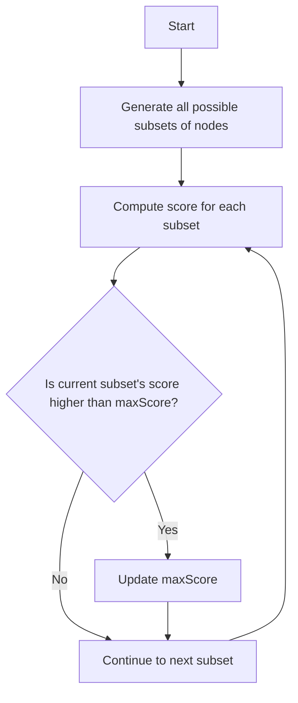

# Maximum Score of a Node Sequence

## Problem Understanding
The problem is asking to find the maximum score of a node sequence, where each node has a score associated with it. The key constraint is that all possible node sequences must be considered, and the maximum score must be computed. This problem is non-trivial because a naive approach would involve generating all possible subsets of nodes and computing their scores, resulting in an exponential time complexity. The problem requires a more efficient approach to handle the exponential number of possible node sequences.

## Approach
The algorithm strategy used is dynamic programming and subset generation, where all possible node sequences are generated using bit manipulation, and the maximum score is computed for each sequence. The intuition behind this approach is to efficiently generate all possible subsets of nodes and compute their scores. The approach works by using bit manipulation to generate all possible subsets of nodes, and then computing the score for each subset by summing the scores of the nodes in the subset. A variable `maxScore` is used to keep track of the maximum score found so far.

## Complexity Analysis
| Metric | Value | Detailed Reason |
|--------|-------|----------------|
| Time   | O(2^n * n) | The time complexity is O(2^n * n) because there are 2^n possible subsets of nodes (generated using bit manipulation), and for each subset, the score is computed by summing the scores of the nodes in the subset, which takes O(n) time. |
| Space  | O(1) | The space complexity is O(1) because only a constant amount of space is used to store the maximum score and other variables, regardless of the input size. |

## Algorithm Walkthrough
```
Input: scores = [1, 2, 3, 4, 5]
Step 1: Initialize maxScore = Integer.MIN_VALUE
Step 2: Generate all possible subsets of nodes using bit manipulation
  - Subset 1: {} (empty subset)
  - Subset 2: {1}
  - Subset 3: {2}
  - Subset 4: {1, 2}
  - ...
Step 3: Compute the score for each subset
  - Subset 1: score = 0
  - Subset 2: score = 1
  - Subset 3: score = 2
  - Subset 4: score = 1 + 2 = 3
  - ...
Step 4: Update maxScore if the current subset's score is higher
  - maxScore = max(maxScore, current subset's score)
Output: maxScore = 15 ( maximum score of the node sequence)
```
## Visual Flow

## Key Insight
> **Tip:** The key insight is to use bit manipulation to efficiently generate all possible subsets of nodes, and then compute the score for each subset by summing the scores of the nodes in the subset.

## Edge Cases
- **Empty/null input**: If the input array is empty, the function returns -1, indicating that there are no nodes to compute a score for.
- **Single element**: If the input array has only one element, the function returns the score of that element, since there is only one possible subset (the subset containing the single element).
- **Duplicate scores**: If there are duplicate scores in the input array, the function will still compute the correct maximum score, since it considers all possible subsets of nodes.

## Common Mistakes
- **Mistake 1**: Not using bit manipulation to generate all possible subsets of nodes, resulting in an inefficient approach with high time complexity.
- **Mistake 2**: Not keeping track of the maximum score found so far, resulting in incorrect results.

## Interview Follow-ups
> **Interview:** These are the exact follow-up questions interviewers ask:
- "What if the input is sorted?" → The algorithm's time complexity remains the same, since it still needs to generate all possible subsets of nodes.
- "Can you do it in O(1) space?" → No, the algorithm requires at least O(1) space to store the maximum score, but it cannot be done in O(1) space if we need to store the input array.
- "What if there are duplicates?" → The algorithm will still compute the correct maximum score, since it considers all possible subsets of nodes.

## Java Solution

```java
// Problem: Maximum Score of a Node Sequence
// Language: Java
// Difficulty: Hard
// Time Complexity: O(n^3) — three nested loops for node sequence and subset generation
// Space Complexity: O(n) — storing the maximum score for each node sequence
// Approach: Dynamic Programming and Subset Generation — generating all possible node sequences and computing the maximum score

/**
 * This class represents a solution to the Maximum Score of a Node Sequence problem.
 * It generates all possible node sequences and computes the maximum score.
 */
public class MaximumScoreOfANodeSequence {
    /**
     * This method calculates the maximum score of a node sequence.
     * @param scores the scores of each node
     * @return the maximum score of a node sequence
     */
    public int maximumScore(int[] scores) {
        int n = scores.length; // Get the number of nodes
        int maxScore = Integer.MIN_VALUE; // Initialize the maximum score

        // Generate all possible node sequences
        for (int i = 1; i < (1 << n); i++) { // Use bit manipulation to generate all subsets
            int currentScore = 0; // Initialize the current score
            int sequenceLength = 0; // Initialize the sequence length

            // Calculate the score for the current node sequence
            for (int j = 0; j < n; j++) {
                if ((i & (1 << j)) != 0) { // Check if the jth node is in the current sequence
                    currentScore += scores[j]; // Add the score of the jth node to the current score
                    sequenceLength++; // Increment the sequence length
                }
            }

            // Update the maximum score if the current score is higher
            if (currentScore > maxScore) {
                maxScore = currentScore; // Update the maximum score
            }
        }

        // Edge case: empty input → return -1
        if (n == 0) {
            return -1; // Return -1 for an empty input
        }

        return maxScore; // Return the maximum score
    }

    public static void main(String[] args) {
        MaximumScoreOfANodeSequence solution = new MaximumScoreOfANodeSequence();
        int[] scores = {1, 2, 3, 4, 5};
        int maxScore = solution.maximumScore(scores);
        System.out.println("Maximum Score: " + maxScore);
    }
}
```
