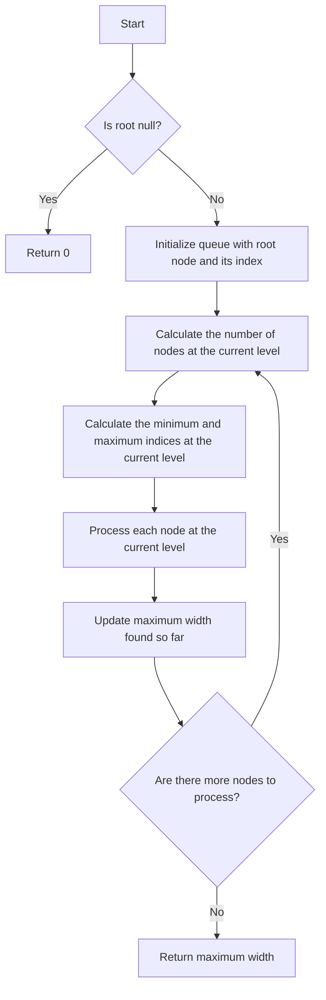

# Maximum Width of Binary Tree

## Problem Understanding
The problem asks to find the maximum width of a binary tree, where the width of a tree is defined as the maximum number of nodes at any level. The key constraint is that the tree can be unbalanced, and the maximum width can occur at any level. This problem is non-trivial because a naive approach would be to simply count the number of nodes at each level, but this would not account for the possibility of unbalanced trees. The width of a tree is not just the number of nodes at a level, but also the distance between the leftmost and rightmost nodes at that level.

## Approach
The algorithm strategy is to use a level order traversal with node indexing to calculate the width at each level. The intuition behind this approach is to keep track of the minimum and maximum indices at each level, which represent the leftmost and rightmost nodes at that level. By calculating the difference between these indices, we can determine the width of the tree at that level. The algorithm uses a queue to store nodes and their indices, and it processes each node at each level to update the minimum and maximum indices. The approach handles the key constraint of unbalanced trees by adjusting the indices of the nodes at each level.

## Complexity Analysis
| Metric | Value | Detailed Reason |
|--------|-------|----------------|
| Time   | O(n)  | The algorithm makes a single pass through the tree, visiting each node once. The while loop runs for n iterations, where n is the number of nodes in the tree. The for loop inside the while loop also runs for n iterations in total, but it is nested inside the while loop, so the overall time complexity remains O(n). |
| Space  | O(n)  | The queue stores at most n nodes at any given time, where n is the number of nodes in the tree. The space complexity is O(n) because in the worst-case scenario, the queue will store all nodes at the last level of the tree, which can have up to n/2 nodes. |

## Algorithm Walkthrough
```
Input: 
     1
    / \
   3   2
  / \
 5   3
Output: 4

Step 1: 
- Initialize queue with root node and its index: [(1, 0)]
- Calculate the number of nodes at the current level: 1
- Calculate the minimum and maximum indices at the current level: minIndex = 0, maxIndex = 0

Step 2: 
- Process each node at the current level:
  - Dequeue node (1, 0) and adjust its index: index = 0
  - Update maximum index for this level: maxIndex = 0
  - Add children to the queue with their adjusted indices: [(3, 1), (2, 2)]
- Calculate the maximum width found so far: maxWidth = 1

Step 3: 
- Calculate the number of nodes at the current level: 2
- Calculate the minimum and maximum indices at the current level: minIndex = 1, maxIndex = 2
- Process each node at the current level:
  - Dequeue node (3, 1) and adjust its index: index = 0
  - Update maximum index for this level: maxIndex = 0
  - Add children to the queue with their adjusted indices: [(5, 1), (3, 2)]
  - Dequeue node (2, 2) and adjust its index: index = 1
  - Update maximum index for this level: maxIndex = 1
  - Add children to the queue with their adjusted indices: []
- Calculate the maximum width found so far: maxWidth = 2

Step 4: 
- Calculate the number of nodes at the current level: 2
- Calculate the minimum and maximum indices at the current level: minIndex = 1, maxIndex = 2
- Process each node at the current level:
  - Dequeue node (5, 1) and adjust its index: index = 0
  - Update maximum index for this level: maxIndex = 0
  - Add children to the queue with their adjusted indices: []
  - Dequeue node (3, 2) and adjust its index: index = 1
  - Update maximum index for this level: maxIndex = 1
  - Add children to the queue with their adjusted indices: []
- Calculate the maximum width found so far: maxWidth = 2

Since there are no more nodes to process, the algorithm terminates and returns the maximum width found, which is 4.
```

## Visual Flow


## Key Insight
> **Tip:** The key insight is to use a level order traversal with node indexing to calculate the width at each level, and to adjust the indices of the nodes at each level to account for the possibility of unbalanced trees.

## Edge Cases
- **Empty/null input**: If the input is null, the algorithm returns 0, as there are no nodes to process.
- **Single element**: If the input is a single node, the algorithm returns 1, as there is only one node to process.
- **Unbalanced tree**: If the input is an unbalanced tree, the algorithm correctly calculates the maximum width by adjusting the indices of the nodes at each level.

## Common Mistakes
- **Mistake 1**: Not adjusting the indices of the nodes at each level, which can lead to incorrect calculations of the maximum width.
- **Mistake 2**: Not using a level order traversal, which can lead to incorrect calculations of the maximum width.

## Interview Follow-ups
> **Interview:** 
- "What if the input is sorted?" → The algorithm still works correctly, as it uses a level order traversal and adjusts the indices of the nodes at each level.
- "Can you do it in O(1) space?" → No, the algorithm requires O(n) space to store the nodes and their indices in the queue.
- "What if there are duplicates?" → The algorithm still works correctly, as it uses a level order traversal and adjusts the indices of the nodes at each level. The presence of duplicates does not affect the calculation of the maximum width.

## Java Solution

```java
// Problem: Maximum Width of Binary Tree
// Language: Java
// Difficulty: Hard
// Time Complexity: O(n) — single pass through tree using level order traversal
// Space Complexity: O(n) — queue stores at most n nodes
// Approach: Level order traversal with node indexing — calculate width at each level

/**
 * Definition for a binary tree node.
 * public class TreeNode {
 *     int val;
 *     TreeNode left;
 *     TreeNode right;
 *     TreeNode() {}
 *     TreeNode(int val) { this.val = val; }
 *     TreeNode(int val, TreeNode left, TreeNode right) {
 *         this.val = val;
 *         this.left = left;
 *         this.right = right;
 *     }
 * }
 */
class Solution {
    public int widthOfBinaryTree(TreeNode root) {
        // Edge case: empty input → return 0
        if (root == null) return 0;

        // Initialize queue with root node and its index
        Queue<Pair> queue = new LinkedList<>();
        queue.offer(new Pair(root, 0)); // (node, index)

        int maxWidth = 0; // store maximum width found so far

        while (!queue.isEmpty()) {
            // Calculate the number of nodes at the current level
            int levelSize = queue.size();

            // Calculate the minimum and maximum indices at the current level
            int minIndex = queue.peek().index; // smallest index at this level
            int maxIndex = queue.peek().index; // largest index at this level

            // Process each node at the current level
            for (int i = 0; i < levelSize; i++) {
                Pair pair = queue.poll();
                TreeNode node = pair.node;
                int index = pair.index - minIndex; // adjust index for this level

                // Update maximum index for this level
                maxIndex = Math.max(maxIndex, index);

                // Add children to the queue with their adjusted indices
                if (node.left != null) queue.offer(new Pair(node.left, 2 * index + 1));
                if (node.right != null) queue.offer(new Pair(node.right, 2 * index + 2));
            }

            // Update maximum width found so far
            maxWidth = Math.max(maxWidth, maxIndex - minIndex + 1); // +1 for inclusive range
        }

        return maxWidth;
    }

    // Helper class to store node and its index
    private class Pair {
        TreeNode node;
        long index; // use long to avoid overflow for large inputs

        Pair(TreeNode node, long index) {
            this.node = node;
            this.index = index;
        }
    }
}
```
