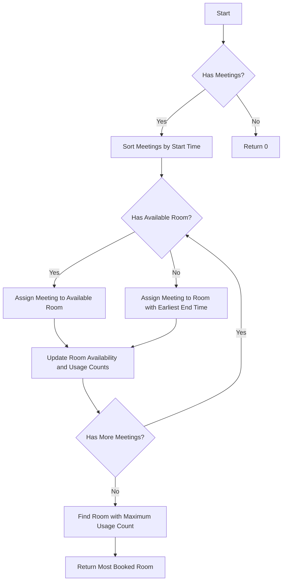

# Meeting Rooms III

## Problem Understanding
The Meeting Rooms III problem asks to determine the room that is booked the most given a number of meeting rooms and a list of meeting intervals. Each meeting interval is represented by a start and end time. The key constraints are that each room can only be booked for one meeting at a time, and if all rooms are occupied, the room that ends its meeting the earliest should be used for the new meeting. What makes this problem non-trivial is the need to efficiently manage room bookings and optimize the usage of each room. The naive approach of checking all possible room bookings for each meeting would be inefficient and have a high time complexity.

## Approach
The algorithm strategy used is a greedy algorithm with sorting, where the meeting intervals are first sorted by their start times, and then the rooms are assigned based on their earliest end times. This approach works because it ensures that the room that is available the earliest is always chosen for the next meeting, thus maximizing the usage of each room. The data structure used is an array to store the end times of each room and another array to store the usage counts of each room. The approach handles the key constraints by checking for the earliest available room for each meeting and using the room that ends its meeting the earliest if all rooms are occupied.

## Complexity Analysis
| Metric | Value | Detailed Reason |
|--------|-------|----------------|
| Time   | O(n log n + m) | The time complexity is dominated by the sorting of the meeting intervals (O(n log n)), where n is the number of meetings, and then iterating through each meeting (O(m)), where m is the number of meetings. Since m = n, the overall time complexity is O(n log n). |
| Space  | O(n) | The space complexity is O(n) because we are using two arrays of size n to store the room end times and usage counts, where n is the number of rooms. |

## Algorithm Walkthrough
```
Input: n = 2, meetings = [[0, 30], [5, 10], [15, 20]]
Step 1: Sort meetings by start time
        meetings = [[0, 30], [5, 10], [15, 20]]
Step 2: Initialize room availability and usage counts
        rooms = [-1, -1]
        usageCounts = [0, 0]
Step 3: Iterate through meetings
        For meeting [0, 30]:
            Find the first available room: room 0
            Update room availability and usage counts:
            rooms = [30, -1]
            usageCounts = [1, 0]
        For meeting [5, 10]:
            Find the first available room: room 1
            Update room availability and usage counts:
            rooms = [30, 10]
            usageCounts = [1, 1]
        For meeting [15, 20]:
            Find the first available room: room 1
            Update room availability and usage counts:
            rooms = [30, 20]
            usageCounts = [1, 2]
Step 4: Find the room with the maximum usage count
        maxUsageCount = 2
        mostBookedRoom = 1
Output: 1
```

## Visual Flow


## Key Insight
> **Tip:** The key insight is to assign meetings to rooms based on their earliest end times, ensuring that the room that is available the earliest is always chosen for the next meeting, thus maximizing the usage of each room.

## Edge Cases
- **Empty/null input**: If the input array of meetings is empty or null, the function should return 0, as there are no meetings to book.
- **Single element**: If there is only one room and one meeting, the function should return 0, as there is only one room to book.
- **No available rooms**: If all rooms are occupied, the function should assign the meeting to the room that ends its meeting the earliest.

## Common Mistakes
- **Mistake 1**: Not sorting the meetings by their start times, which can lead to incorrect room assignments.
- **Mistake 2**: Not updating the room availability and usage counts correctly, which can lead to incorrect room assignments and usage counts.

## Interview Follow-ups
> **Interview:** These are the exact follow-up questions interviewers ask:
- "What if the input is sorted?" → The function would still work correctly, as the sorting step would not change the input order.
- "Can you do it in O(1) space?" → No, it is not possible to solve this problem in O(1) space, as we need to store the room availability and usage counts.
- "What if there are duplicates?" → The function would still work correctly, as it assigns meetings to rooms based on their earliest end times, and duplicates would not affect the room assignments.

## Java Solution

```java
// Problem: Meeting Rooms III
// Language: Java
// Difficulty: Hard
// Time Complexity: O(n log n) — sorting intervals by start time, then iterating through them
// Space Complexity: O(n) — storing intervals in an array
// Approach: Greedy algorithm with sorting — sort intervals by start time, then assign rooms based on earliest end time

import java.util.Arrays;

public class Solution {
    public int mostBooked(int n, int[][] meetings) {
        // Handle edge case: no meetings
        if (meetings.length == 0) {
            return 0;
        }

        // Handle edge case: no rooms
        if (n == 0) {
            return 0;
        }

        // Sort meetings by start time
        Arrays.sort(meetings, (a, b) -> a[0] - b[0]); // sort by start time

        // Initialize room availability
        int[] rooms = new int[n]; // all rooms are initially available
        Arrays.fill(rooms, -1); // initialize room end times to -1

        // Initialize room usage counts
        int[] usageCounts = new int[n]; // count how many times each room is used

        // Iterate through meetings
        for (int[] meeting : meetings) {
            // Find the first available room
            int earliestRoom = -1;
            int earliestEndTime = Integer.MAX_VALUE;
            for (int i = 0; i < n; i++) {
                if (rooms[i] <= meeting[0] && rooms[i] < earliestEndTime) { // room is available and ends earliest
                    earliestRoom = i;
                    earliestEndTime = rooms[i];
                }
            }

            // If no room is available, use the room that ends earliest
            if (earliestRoom == -1) {
                int minRoom = 0;
                int minEndTime = Integer.MAX_VALUE;
                for (int i = 0; i < n; i++) {
                    if (rooms[i] < minEndTime) { // find the room that ends earliest
                        minRoom = i;
                        minEndTime = rooms[i];
                    }
                }
                earliestRoom = minRoom;
            }

            // Update room availability and usage counts
            rooms[earliestRoom] = meeting[1]; // update room end time
            usageCounts[earliestRoom]++; // increment room usage count
        }

        // Find the room with the maximum usage count
        int maxUsageCount = 0;
        int mostBookedRoom = -1;
        for (int i = 0; i < n; i++) {
            if (usageCounts[i] > maxUsageCount) { // find the room with the maximum usage count
                maxUsageCount = usageCounts[i];
                mostBookedRoom = i;
            }
        }

        return mostBookedRoom;
    }
}
```
