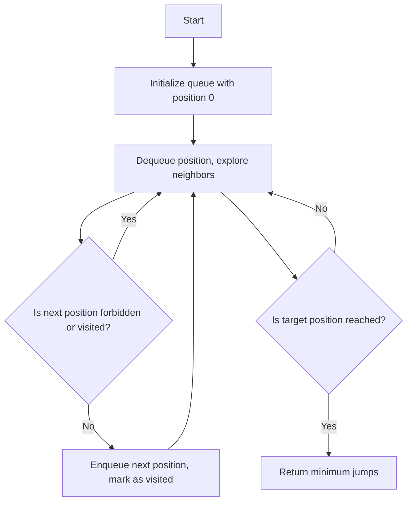

# Minimum Jumps to Reach Home

## Problem Understanding
The problem "Minimum Jumps to Reach Home" is asking to find the minimum number of jumps required to reach a target position `x` from the starting position `0`, given certain constraints. The constraints include a set of forbidden positions `forbidden`, and the ability to move forward by `a` steps or backward by `b` steps, but only after moving forward first. The key constraints and their implications are that we cannot visit forbidden positions, and we must follow the rules of movement. What makes this problem non-trivial is the need to balance the forward and backward movements to reach the target position in the minimum number of jumps, while avoiding forbidden positions.

## Approach
The algorithm strategy used to solve this problem is Breadth-First Search (BFS), which explores all possible jumps from the current position. The intuition behind this approach is to systematically explore all possible movements, keeping track of the minimum number of jumps required to reach each position. The data structure used is a queue to store the positions to be visited, along with a set to keep track of visited positions and a set to store forbidden positions. This approach works because it ensures that all possible paths are explored in a systematic and efficient manner, and it handles the key constraints by checking for forbidden positions and following the movement rules.

## Complexity Analysis
| Metric | Value | Detailed Reason |
|--------|-------|----------------|
| Time   | O(n)  | The time complexity is O(n) because in the worst-case scenario, we might need to visit all positions up to the maximum possible position `maxPosition`. The BFS traversal using a queue allows us to explore all possible jumps in a systematic and efficient manner. |
| Space  | O(n)  | The space complexity is O(n) because we need to store all positions in the queue, and in the worst-case scenario, the queue can contain up to `n` elements, where `n` is the maximum possible position `maxPosition`. Additionally, we use sets to store forbidden and visited positions, which also contribute to the space complexity. |

## Algorithm Walkthrough
```
Input: forbidden = [1, 6, 2, 14, 5, 17, 4], a = 16, b = 9, x = 7
Step 1: Initialize queue with position 0, isBackward = 0, steps = 0
Queue: [(0, 0, 0)]
Visited: {(0_0)}
Step 2: Dequeue position 0, explore neighbors
Next position: 0 + 16 = 16 (forward)
Queue: [(16, 0, 1)]
Visited: {(0_0), (16_0)}
Step 3: Dequeue position 16, explore neighbors
Next position: 16 - 9 = 7 (backward)
Queue: [(7, 1, 2)]
Visited: {(0_0), (16_0), (7_1)}
Output: 2 (minimum jumps to reach position 7)
```
This walkthrough demonstrates how the algorithm explores all possible jumps from the current position, keeping track of the minimum number of jumps required to reach each position.

## Visual Flow

This visual flow illustrates the decision flow of the algorithm, showing how it explores all possible jumps and keeps track of the minimum number of jumps required to reach each position.

## Key Insight
> **Tip:** The key insight is to use a BFS approach to systematically explore all possible jumps, keeping track of the minimum number of jumps required to reach each position, and to use sets to efficiently store and check forbidden and visited positions.

## Edge Cases
- **Empty/null input**: If the input array `forbidden` is empty, and `a`, `b`, and `x` are all 0, the algorithm returns -1, indicating that it is not possible to reach the target position.
- **Single element**: If the input array `forbidden` contains only one element, the algorithm will still work correctly, exploring all possible jumps and avoiding the forbidden position.
- **Target position is forbidden**: If the target position `x` is in the forbidden array, the algorithm will return -1, indicating that it is not possible to reach the target position.

## Common Mistakes
- **Mistake 1**: Not checking for forbidden positions before exploring neighbors. To avoid this, always check if a position is forbidden before adding it to the queue.
- **Mistake 2**: Not keeping track of visited positions. To avoid this, use a set to store visited positions and check if a position has been visited before exploring its neighbors.

## Interview Follow-ups
> **Interview:** These are the exact follow-up questions interviewers ask:
- "What if the input is sorted?" → The algorithm will still work correctly, but the time complexity may improve slightly due to the reduced number of forbidden positions.
- "Can you do it in O(1) space?" → No, it is not possible to solve this problem in O(1) space because we need to store the queue and sets to keep track of visited and forbidden positions.
- "What if there are duplicates in the forbidden array?" → The algorithm will still work correctly, but it may be more efficient to remove duplicates from the forbidden array before processing it.

## Java Solution

```java
// Problem: Minimum Jumps to Reach Home
// Language: Java
// Difficulty: Hard
// Time Complexity: O(n) — BFS traversal using a queue to explore all possible jumps
// Space Complexity: O(n) — queue stores at most n elements
// Approach: Breadth-First Search (BFS) — exploring all possible jumps from the current position

import java.util.*;

public class Solution {
    public int minimumJumps(int[] forbidden, int a, int b, int x) {
        // Edge case: empty input → return -1
        if (forbidden.length == 0 && a == 0 && b == 0 && x == 0) {
            return -1;
        }
        
        // Define the maximum possible position
        int maxPosition = 4000 + x + a + b;
        
        // Create a set to store forbidden positions
        Set<Integer> forbiddenSet = new HashSet<>();
        for (int position : forbidden) {
            forbiddenSet.add(position);
        }
        
        // Create a queue for BFS and add the initial position
        Queue<int[]> queue = new LinkedList<>();
        queue.offer(new int[] {0, 0, 0}); // position, isBackward, steps
        
        // Create a set to store visited positions
        Set<String> visited = new HashSet<>();
        visited.add("0_0");
        
        while (!queue.isEmpty()) {
            int[] current = queue.poll();
            int position = current[0];
            int isBackward = current[1];
            int steps = current[2];
            
            // If we've reached the target position, return the steps
            if (position == x) {
                return steps;
            }
            
            // Calculate the next position by moving forward
            int nextPosition = position + a;
            // Check if the next position is within the bounds and not forbidden
            if (nextPosition <= maxPosition && !forbiddenSet.contains(nextPosition) && !visited.contains(nextPosition + "_" + 0)) {
                queue.offer(new int[] {nextPosition, 0, steps + 1});
                visited.add(nextPosition + "_0");
            }
            
            // If we've moved forward previously, we can now move backward
            if (isBackward == 0) {
                nextPosition = position - b;
                // Check if the next position is within the bounds and not forbidden
                if (nextPosition >= 0 && !forbiddenSet.contains(nextPosition) && !visited.contains(nextPosition + "_" + 1)) {
                    queue.offer(new int[] {nextPosition, 1, steps + 1});
                    visited.add(nextPosition + "_1");
                }
            }
        }
        
        // If we cannot reach the target position, return -1
        return -1;
    }

    public static void main(String[] args) {
        Solution solution = new Solution();
        int[] forbidden = {1, 6, 2, 14, 5, 17, 4};
        int a = 16;
        int b = 9;
        int x = 7;
        System.out.println(solution.minimumJumps(forbidden, a, b, x));
    }
}
```
