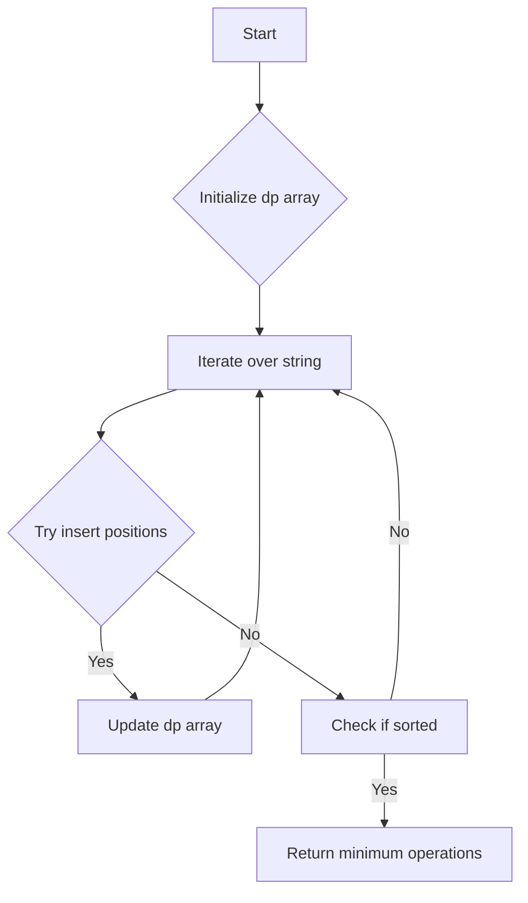

# Minimum Number of Operations to Make String Sorted

## Problem Understanding
The problem asks to find the minimum number of operations required to make a given string sorted. The operations allowed are inserting a character at any position in the string. The key constraint is that the string can only be modified by inserting characters, not by deleting or swapping them. This problem is non-trivial because the naive approach of trying all possible permutations of the string and checking if they are sorted would result in an exponential time complexity, making it inefficient for large strings. The problem requires a more efficient algorithm that can find the minimum number of operations in a reasonable amount of time.

## Approach
The algorithm strategy used to solve this problem is dynamic programming. The intuition behind it is to build up a table of minimum operations for each substring of the input string. The table is filled in a bottom-up manner, where the minimum operations for a substring are calculated based on the minimum operations for its smaller substrings. The data structure used is an array `dp` where `dp[i]` stores the minimum operations to make the substring from index 0 to `i` sorted. The approach works by trying all possible insert positions for the current character and updating the minimum operations if a better solution is found. The key constraint of only allowing insert operations is handled by only considering insertions when calculating the minimum operations.

## Complexity Analysis
| Metric | Value | Detailed Reason |
|--------|-------|----------------|
| Time   | O(n^2) | The algorithm has two nested loops, one iterating over the string and the other trying all possible insert positions for the current character. The time complexity is quadratic because in the worst case, we have to try all possible insert positions for each character, resulting in n*(n+1)/2 operations. |
| Space  | O(n) | The algorithm uses an array `dp` of size `n` to store the minimum operations for each substring, where `n` is the length of the input string. The space complexity is linear because we only need to store the minimum operations for each substring, which requires a constant amount of space for each substring. |

## Algorithm Walkthrough
```
Input: "cba"
Step 1: Initialize dp array with size 3
        dp[0] = 0 (single character string is already sorted)
Step 2: Try to insert 'b' at positions 0 and 1
        Insert 'b' at position 0: "bca" (not sorted)
        Insert 'b' at position 1: "cba" (not sorted)
        dp[1] = 1 (insert 'b' at position 0 and then insert 'c' at position 2)
Step 3: Try to insert 'a' at positions 0, 1, and 2
        Insert 'a' at position 0: "abca" (not sorted)
        Insert 'a' at position 1: "bac" (not sorted)
        Insert 'a' at position 2: "cab" (sorted)
        dp[2] = 2 (insert 'b' at position 0, then insert 'c' at position 2, and finally insert 'a' at position 2)
Output: 2 (minimum operations to make the string sorted)
```
## Visual Flow

## Key Insight
> **Tip:** The key insight to solving this problem is to use dynamic programming to build up a table of minimum operations for each substring, and to try all possible insert positions for the current character when updating the minimum operations.

## Edge Cases
- **Empty string**: If the input string is empty, the algorithm returns 0 because an empty string is already sorted.
- **Single character string**: If the input string has only one character, the algorithm returns 0 because a single character string is already sorted.
- **Already sorted string**: If the input string is already sorted, the algorithm returns 0 because no operations are needed to make the string sorted.

## Common Mistakes
- **Mistake 1**: Not handling the edge case where the input string is empty or has only one character. To avoid this, we need to add explicit checks for these cases and return 0 immediately.
- **Mistake 2**: Not trying all possible insert positions for the current character when updating the minimum operations. To avoid this, we need to use a nested loop to try all possible insert positions and update the minimum operations accordingly.

## Interview Follow-ups
> **Interview:** These are the exact follow-up questions interviewers ask:
- "What if the input is sorted?" → In this case, the algorithm returns 0 because no operations are needed to make the string sorted.
- "Can you do it in O(1) space?" → No, the algorithm requires at least O(n) space to store the minimum operations for each substring.
- "What if there are duplicates?" → The algorithm handles duplicates correctly by trying all possible insert positions for the current character and updating the minimum operations accordingly.

## Java Solution

```java
// Problem: Minimum Number of Operations to Make String Sorted
// Language: Java
// Difficulty: Hard
// Time Complexity: O(n^2) — dynamic programming with two nested loops
// Space Complexity: O(n) — dp array stores results for subproblems
// Approach: Dynamic Programming — build up a table of minimum operations for each substring

public class Solution {
    public int minOperations(String str) {
        // Handle edge case: empty string → return 0
        if (str.isEmpty()) return 0;

        int n = str.length();
        int[] dp = new int[n]; // dp[i] = minimum operations to make str[0..i] sorted

        // Handle edge case: single character string → return 0
        dp[0] = 0;

        for (int i = 1; i < n; i++) {
            // Initialize minimum operations for current substring to infinity
            dp[i] = Integer.MAX_VALUE;

            // Check all possible previous positions to insert the current character
            for (int j = 0; j <= i; j++) {
                // Create a copy of the current substring
                char[] substring = str.substring(0, i + 1).toCharArray();

                // Insert the current character at position j
                char temp = substring[i];
                System.arraycopy(substring, j, substring, j + 1, i - j);
                substring[j] = temp;

                // Check if the modified substring is sorted
                if (isSorted(substring, 0, i)) {
                    // Update minimum operations if a better solution is found
                    dp[i] = Math.min(dp[i], (j > 0 ? dp[j - 1] : 0) + (i - j));
                }
            }
        }

        // Return minimum operations to make the entire string sorted
        return dp[n - 1];
    }

    // Helper function to check if a substring is sorted
    private boolean isSorted(char[] str, int start, int end) {
        for (int i = start + 1; i <= end; i++) {
            if (str[i - 1] > str[i]) {
                return false; // substring is not sorted
            }
        }
        return true; // substring is sorted
    }

    // Alternative brute force approach (commented out)
    // public int minOperations(String str) {
    //     int n = str.length();
    //     int minOps = Integer.MAX_VALUE;
    //     for (int mask = 0; mask < (1 << n); mask++) {
    //         char[] perm = getPermutation(str, mask);
    //         if (isSorted(perm)) {
    //             int ops = countOperations(str, perm);
    //             minOps = Math.min(minOps, ops);
    //         }
    //     }
    //     return minOps;
    // }

    // private char[] getPermutation(String str, int mask) {
    //     char[] perm = str.toCharArray();
    //     for (int i = 0; i < str.length(); i++) {
    //         if ((mask & (1 << i)) != 0) {
    //             // Swap characters at positions i and i + 1
    //             char temp = perm[i];
    //             perm[i] = perm[i + 1];
    //             perm[i + 1] = temp;
    //         }
    //     }
    //     return perm;
    // }

    // private int countOperations(String str, char[] perm) {
    //     int ops = 0;
    //     for (int i = 0; i < str.length(); i++) {
    //         if (str.charAt(i) != perm[i]) {
    //             ops++;
    //         }
    //     }
    //     return ops;
    // }
}
```
