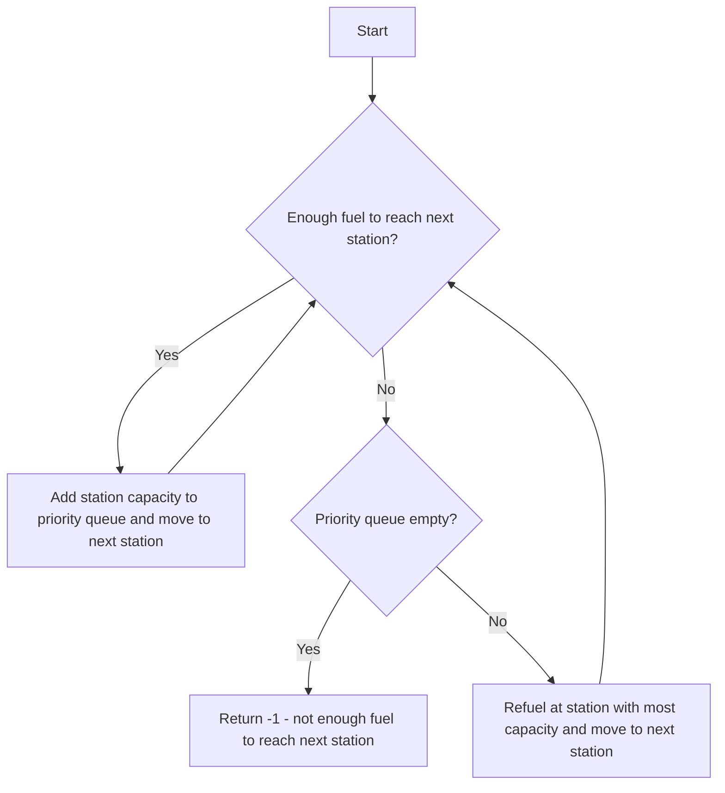

# Minimum Number of Refueling Stops

## Problem Understanding
The problem is asking for the minimum number of refueling stops required to reach a target destination, given a starting fuel level and a list of stations with their distances from the starting point and their fuel capacities. The key constraint is that we can only refuel at the stations, and we must refuel at the station with the most capacity if we don't have enough fuel to reach the next station or the target. This problem is non-trivial because a naive approach would be to refuel at every station, but this may not be necessary if we have enough fuel to reach the next station. The problem requires a greedy algorithm to determine the optimal refueling strategy.

## Approach
The algorithm strategy used to solve this problem is a greedy algorithm with a priority queue. At each stop, we choose the station with the most capacity to refuel at. We use a priority queue to store the capacities of the stations, and we iterate through the stations, refueling at the station with the most capacity if we don't have enough fuel to reach the next station or the target. This approach works because it ensures that we are always refueling at the station with the most capacity, which maximizes the distance we can travel before needing to refuel again. We use a priority queue to store the capacities of the stations, which allows us to efficiently determine the station with the most capacity.

## Complexity Analysis
| Metric | Value | Detailed Reason |
|--------|-------|----------------|
| Time   | O(n log n) | The algorithm iterates through the stations, and for each station, it checks if we need to refuel. If we do, it polls the station with the most capacity from the priority queue, which takes O(log n) time. Since we do this for each station, the total time complexity is O(n log n). |
| Space  | O(n) | The algorithm uses a priority queue to store the capacities of the stations. In the worst case, the priority queue can store up to n elements, where n is the number of stations. Therefore, the space complexity is O(n). |

## Algorithm Walkthrough
```
Input: target = 1000, startFuel = 500, stations = [[250, 100], [300, 200], [400, 300]]
Step 1: Initialize variables - fuel = 500, stops = 0, index = 0
Step 2: Iterate through the stations - index = 0, fuel = 500, stations[0][0] = 250
  - Since fuel >= stations[0][0], add stations[0][1] to the priority queue and move to the next station
  - pq = [100], fuel = 250, index = 1
Step 3: Iterate through the stations - index = 1, fuel = 250, stations[1][0] = 300
  - Since fuel < stations[1][0], refuel at the station with the most capacity
  - pq.poll() = 100, fuel = 350, stops = 1, index = 1
  - Since fuel >= stations[1][0], add stations[1][1] to the priority queue and move to the next station
  - pq = [200], fuel = 50, index = 2
Step 4: Iterate through the stations - index = 2, fuel = 50, stations[2][0] = 400
  - Since fuel < stations[2][0], refuel at the station with the most capacity
  - pq.poll() = 200, fuel = 250, stops = 2, index = 2
  - Since fuel >= stations[2][0], add stations[2][1] to the priority queue and move to the next station
  - pq = [300], fuel = -150, index = 3
Step 5: Since fuel < target, refuel at the station with the most capacity
  - pq.poll() = 300, fuel = 150, stops = 3, index = 3
Output: stops = 3
```

## Visual Flow


## Key Insight
> **Tip:** The key to solving this problem is to use a priority queue to efficiently determine the station with the most capacity, allowing us to maximize the distance we can travel before needing to refuel again.

## Edge Cases
- **Empty/null input**: If the input is empty or null, the algorithm will return -1, indicating that it is not possible to reach the target destination.
- **Single element**: If there is only one station, the algorithm will refuel at that station if we don't have enough fuel to reach the target destination.
- **No refueling stations**: If there are no refueling stations, the algorithm will return -1 if we don't have enough fuel to reach the target destination.

## Common Mistakes
- **Mistake 1**: Not checking if the priority queue is empty before polling an element, which can lead to a NullPointerException. To avoid this, we should always check if the priority queue is empty before polling an element.
- **Mistake 2**: Not updating the fuel level correctly after refueling at a station, which can lead to incorrect results. To avoid this, we should always update the fuel level correctly after refueling at a station.

## Interview Follow-ups
> **Interview:** These are the exact follow-up questions interviewers ask:
- "What if the input is sorted?" → The algorithm will still work correctly, but the time complexity will be O(n) because we can avoid using the priority queue.
- "Can you do it in O(1) space?" → No, we cannot do it in O(1) space because we need to store the capacities of the stations in a data structure, which requires O(n) space.
- "What if there are duplicates?" → The algorithm will still work correctly, but we may need to modify the algorithm to handle duplicates correctly. For example, we can use a Set to store the capacities of the stations to avoid duplicates.

## Java Solution

```java
// Problem: Minimum Number of Refueling Stops
// Language: Java
// Difficulty: Hard
// Time Complexity: O(n log n) — sorting and using a priority queue
// Space Complexity: O(n) — priority queue stores at most n elements
// Approach: Greedy algorithm with a priority queue — at each stop, choose the one with the most capacity

import java.util.*;

class Solution {
    public int minRefuelStops(int target, int startFuel, int[][] stations) {
        // Edge case: not enough fuel to reach the first station
        if (startFuel < target) {
            return -1;
        }

        // Initialize a priority queue to store the capacities of the stations
        PriorityQueue<Integer> pq = new PriorityQueue<>((a, b) -> b - a); // max heap

        // Initialize variables to keep track of the current fuel and the number of stops
        int fuel = startFuel;
        int stops = 0;
        int index = 0;

        // Iterate through the stations
        while (index < stations.length || fuel < target) {
            // If we don't have enough fuel to reach the next station or the target, refuel at the station with the most capacity
            if (fuel < stations[index][0]) {
                if (pq.isEmpty()) {
                    // Edge case: not enough fuel to reach the next station and no more stations to refuel at
                    return -1;
                }
                fuel += pq.poll();
                stops++;
            }

            // If we have reached the end of the stations, break the loop
            if (index >= stations.length) {
                break;
            }

            // If we have enough fuel to reach the next station, add its capacity to the priority queue and move to the next station
            if (fuel >= stations[index][0]) {
                pq.offer(stations[index][1]);
                fuel -= stations[index][0];
                index++;
            }
        }

        // If we have enough fuel to reach the target, return the number of stops
        if (fuel >= target) {
            return stops;
        }

        // Edge case: not enough fuel to reach the target even after refueling at all stations
        return -1;
    }

    public static void main(String[] args) {
        Solution solution = new Solution();
        int target = 1000;
        int startFuel = 500;
        int[][] stations = {{250, 100}, {300, 200}, {400, 300}};
        System.out.println(solution.minRefuelStops(target, startFuel, stations));
    }
}
```
