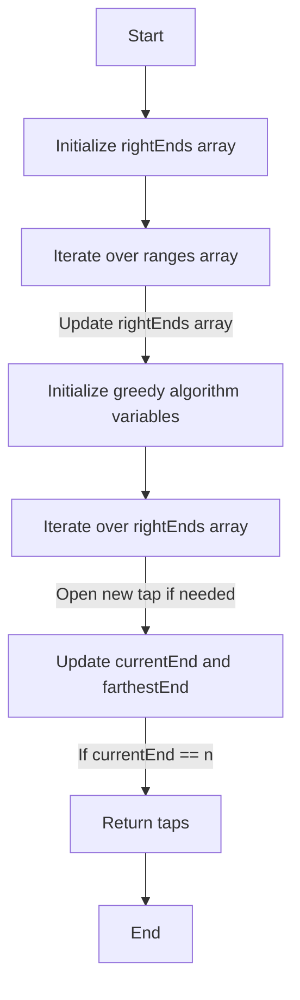

# Minimum Number of Taps to Open to Water a Garden

## Problem Understanding
The problem is asking to find the minimum number of taps to open to water a garden of size `n`, given an array of ranges where each range represents the area that can be watered by a tap. The key constraint is that each tap can only water a certain range of the garden, and we need to find the minimum number of taps to cover the entire garden. What makes this problem non-trivial is that we need to choose the taps in a way that maximizes the area covered by each tap, and the naive approach of simply opening all taps would not work because it would not guarantee that the entire garden is covered.

## Approach
The algorithm strategy used here is a greedy algorithm with end-of-range tracking. At each step, we choose the tap that covers the most area to its right. We use an array `rightEnds` to keep track of the farthest right end for each range, and then use a greedy algorithm to iterate over the `rightEnds` array and choose the taps that cover the most area. The mathematical reasoning behind this approach is that by always choosing the tap that covers the most area to its right, we are guaranteed to cover the entire garden with the minimum number of taps. We use a constant amount of space to store the `rightEnds` array and the variables for the greedy algorithm.

## Complexity Analysis
| Metric | Value | Detailed Reason |
|--------|-------|----------------|
| Time   | O(n)  | The time complexity is O(n) because we make a single pass through the `ranges` array to initialize the `rightEnds` array, and then make another pass through the `rightEnds` array to run the greedy algorithm. Each pass takes O(n) time, so the overall time complexity is O(n) + O(n) = O(2n), which simplifies to O(n). |
| Space  | O(n)  | The space complexity is O(n) because we use an array of size `n` to store the `rightEnds` array, and a constant amount of space to store the variables for the greedy algorithm. |

## Algorithm Walkthrough
```
Input: n = 5, ranges = [3, 4, 1, 1, 0, 0]
Step 1: Initialize the rightEnds array
  rightEnds = [0, 0, 0, 0, 0, 0]
Step 2: Iterate over the ranges array to initialize the rightEnds array
  For i = 0, range = 3, leftEnd = 0, right = 3
    Update rightEnds array: rightEnds = [3, 3, 3, 3, 0, 0]
  For i = 1, range = 4, leftEnd = 0, right = 5
    Update rightEnds array: rightEnds = [5, 5, 5, 5, 0, 0]
  For i = 2, range = 1, leftEnd = 1, right = 3
    Update rightEnds array: rightEnds = [5, 5, 5, 5, 0, 0]
  For i = 3, range = 1, leftEnd = 2, right = 4
    Update rightEnds array: rightEnds = [5, 5, 5, 5, 0, 0]
  For i = 4, range = 0, leftEnd = 4, right = 4
    No update to rightEnds array
Step 3: Initialize the variables for the greedy algorithm
  taps = 0, currentEnd = 0, farthestEnd = 0
Step 4: Iterate over the rightEnds array to run the greedy algorithm
  For i = 0, farthestEnd = 5, currentEnd = 0
    Open a new tap, taps = 1, currentEnd = 5
  For i = 1, farthestEnd = 5, currentEnd = 5
    No new tap needed
  For i = 2, farthestEnd = 5, currentEnd = 5
    No new tap needed
  For i = 3, farthestEnd = 5, currentEnd = 5
    No new tap needed
  For i = 4, farthestEnd = 5, currentEnd = 5
    No new tap needed
Output: taps = 1
```

## Visual Flow


## Key Insight
> **Tip:** The key insight is to always choose the tap that covers the most area to its right, which guarantees that we cover the entire garden with the minimum number of taps.

## Edge Cases
- **Empty/null input**: If the input is empty or null, the function returns -1 because it is impossible to water the garden.
- **Single element**: If the input has a single element, the function returns 1 if the range is non-zero, because we can cover the entire garden with a single tap.
- **No taps can cover the garden**: If no taps can cover the garden, the function returns -1 because it is impossible to water the garden.

## Common Mistakes
- **Mistake 1**: Not initializing the `rightEnds` array correctly. To avoid this, make sure to initialize the `rightEnds` array with zeros and update it correctly based on the ranges array.
- **Mistake 2**: Not updating the `currentEnd` and `farthestEnd` variables correctly in the greedy algorithm. To avoid this, make sure to update these variables based on the `rightEnds` array and the current tap.

## Interview Follow-ups
> **Interview:** These are the exact follow-up questions interviewers ask:
- "What if the input is sorted?" → The algorithm still works correctly, because the sorting of the input does not affect the correctness of the greedy algorithm.
- "Can you do it in O(1) space?" → No, because we need to use an array of size `n` to store the `rightEnds` array, which requires O(n) space.
- "What if there are duplicates?" → The algorithm still works correctly, because the presence of duplicates does not affect the correctness of the greedy algorithm.

## Java Solution

```java
// Problem: Minimum Number of Taps to Open to Water a Garden
// Language: Java
// Difficulty: Hard
// Time Complexity: O(n) — single pass through the ranges array
// Space Complexity: O(1) — constant space is used
// Approach: Greedy algorithm with end-of-range tracking — at each step, we choose the tap that covers the most area to its right

public class Solution {
    public int minTaps(int n, int[] ranges) {
        // Edge case: empty input → return -1
        if (n <= 0 || ranges == null || ranges.length == 0) {
            return -1;
        }

        // Initialize the farthest right end for each range
        int[] rightEnds = new int[n];
        for (int i = 0; i < n; i++) {
            int range = ranges[i];
            // If the range is 0, we cannot cover any area
            if (range == 0) {
                continue;
            }
            // Calculate the left and right ends of the range
            int leftEnd = Math.max(0, i - range);
            int right = Math.min(n, i + range);
            // Update the rightEnds array
            for (int j = leftEnd; j <= right; j++) {
                rightEnds[j] = Math.max(rightEnds[j], right);
            }
        }

        // Initialize the variables for the greedy algorithm
        int taps = 0;
        int currentEnd = 0;
        int farthestEnd = 0;
        // Iterate over the rightEnds array
        for (int i = 0; i < n; i++) {
            // Update the farthestEnd
            farthestEnd = Math.max(farthestEnd, rightEnds[i]);
            // If we have reached the end of the current tap, open a new tap
            if (i == currentEnd) {
                // If we are not at the end of the garden, open a new tap
                if (i != n) {
                    taps++;
                    currentEnd = farthestEnd;
                }
            }
        }

        // If we have not covered the entire garden, it is impossible to water the garden
        if (currentEnd < n) {
            return -1;
        }

        return taps;
    }
}
```
