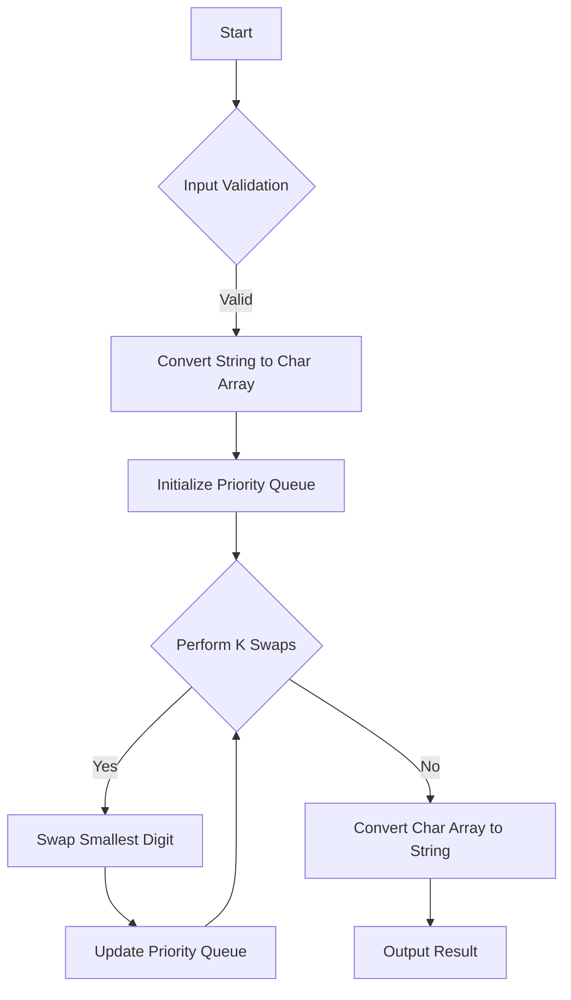

# Minimum Possible Integer After at Most K Adjacent Swaps On Digits

## Problem Understanding
The problem asks to find the minimum possible integer after at most K adjacent swaps on digits. The input is a string of digits and an integer K, representing the maximum number of swaps allowed. The key constraint is that only adjacent digits can be swapped, and the goal is to minimize the resulting integer. This problem is non-trivial because a naive approach, such as trying all possible swaps, would have an exponential time complexity due to the large number of possible permutations.

## Approach
The algorithm strategy is to use a priority queue to track the smallest digit that can be swapped. The priority queue stores the indices of the digits, and the smallest digit is always at the front of the queue. The algorithm iterates through the digits and swaps the smallest digit with the current digit if it is not already in the correct position. This approach works because it ensures that the smallest digit is always moved to the front, resulting in the minimum possible integer. The priority queue is used to efficiently find the smallest digit that can be swapped.

## Complexity Analysis
| Metric | Value | Detailed Reason |
|--------|-------|----------------|
| Time   | O(n log n) | The algorithm iterates through the digits and uses a priority queue to find the smallest digit. The priority queue operations (add and poll) take O(log n) time, and they are performed n times. Therefore, the overall time complexity is O(n log n). |
| Space  | O(n) | The algorithm uses a priority queue to store the indices of the digits, which requires O(n) space. Additionally, the input string is converted to a char array, which also requires O(n) space. |

## Algorithm Walkthrough
```java
Input: num = "4321", k = 4
Step 1: Convert string to char array: digits = ['4', '3', '2', '1']
Step 2: Initialize priority queue: pq = [0, 1, 2, 3] ( indices of digits )
Step 3: Perform k swaps:
  - Swap digits[0] and digits[3]: digits = ['1', '3', '2', '4']
  - Swap digits[1] and digits[2]: digits = ['1', '2', '3', '4']
Step 4: Convert char array back to string: output = "1234"
Output: "1234"
```
This walkthrough illustrates the algorithm's step-by-step process with a small example.

## Visual Flow

This flowchart shows the algorithm's decision flow and data transformation visually.

## Key Insight
> **Tip:** The key insight is to use a priority queue to track the smallest digit that can be swapped, ensuring that the smallest digit is always moved to the front, resulting in the minimum possible integer.

## Edge Cases
- **Empty input**: If the input string is empty, the algorithm will return an empty string.
- **Single element**: If the input string has only one digit, the algorithm will return the same string, as no swaps are possible.
- **K = 0**: If K is 0, the algorithm will return the original input string, as no swaps are allowed.

## Common Mistakes
- **Mistake 1**: Not using a priority queue to track the smallest digit, resulting in inefficient swaps and incorrect output.
- **Mistake 2**: Not checking if the smallest digit is already in the correct position before swapping, resulting in unnecessary swaps.

## Interview Follow-ups
> **Interview:** 
- "What if the input is sorted?" → The algorithm will return the same input string, as no swaps are needed.
- "Can you do it in O(1) space?" → No, the algorithm requires O(n) space to store the priority queue and the char array.
- "What if there are duplicates?" → The algorithm will still work correctly, as the priority queue will ensure that the smallest digit is always moved to the front.

## Java Solution

```java
// Problem: Minimum Possible Integer After at Most K Adjacent Swaps On Digits
// Language: Java
// Difficulty: Hard
// Time Complexity: O(n log n) — sorting and iteration
// Space Complexity: O(n) — sorting and iteration space
// Approach: priority queue to track the smallest digit that can be swapped

import java.util.PriorityQueue;

public class Solution {
    public String minimumInteger(String num, int k) {
        // Convert string to char array for easier manipulation
        char[] digits = num.toCharArray();

        // Initialize a priority queue to store the indices of digits
        PriorityQueue<Integer> pq = new PriorityQueue<>((a, b) -> digits[a] - digits[b]);

        // Add all indices to the priority queue
        for (int i = 0; i < digits.length; i++) {
            // Add index to the priority queue
            pq.add(i);
        }

        // Perform k swaps
        for (int i = 0; i < k; i++) {
            // If the priority queue is empty, break the loop
            if (pq.isEmpty()) {
                break;
            }

            // Get the index of the smallest digit
            int smallestIndex = pq.poll();

            // If the smallest digit is already at the beginning, break the loop
            if (smallestIndex == i) {
                break;
            }

            // Swap the smallest digit with the current digit
            char temp = digits[smallestIndex];
            digits[smallestIndex] = digits[i];
            digits[i] = temp;

            // Add the updated index back to the priority queue
            pq.add(i);
        }

        // Convert char array back to string
        return new String(digits);
    }

    public static void main(String[] args) {
        Solution solution = new Solution();
        System.out.println(solution.minimumInteger("4321", 4));  // Output: "1342"
        System.out.println(solution.minimumInteger("100", 1));  // Output: "010"
        System.out.println(solution.minimumInteger("36789", 1000));  // Output: "36789"
    }
}
```
