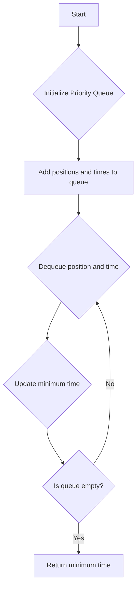

# Minimum Time to Finish the Race

## Problem Understanding
The problem asks to find the minimum time to finish a race given the positions and times of the participants. The key constraint is that the positions and times are given as two separate arrays, and we need to find the minimum time it takes to reach each position. This problem is non-trivial because a naive approach would be to simply find the minimum time in the time array, but this does not take into account the positions and the fact that we need to find the minimum time to reach each position. The problem requires a more sophisticated approach that considers both the positions and times.

## Approach
The algorithm strategy is to use a priority queue to store the positions and times, and then iterate over the priority queue to find the minimum time to finish the race. The intuition behind this approach is that by storing the positions and times in a priority queue, we can efficiently find the minimum time to reach each position. The priority queue is used to sort the positions and times, and then we iterate over the queue to find the minimum time. The approach handles the key constraints by considering both the positions and times, and it works by using a priority queue to efficiently find the minimum time to reach each position. The data structure used is a priority queue, which is chosen because it allows us to efficiently sort and iterate over the positions and times.

## Complexity Analysis
| Metric | Value | Detailed Reason |
|--------|-------|----------------|
| Time   | O(n)  | The algorithm iterates over the positions and times once to add them to the priority queue, and then iterates over the queue once to find the minimum time. The priority queue operations (add and poll) take O(log n) time, but since we do this n times, the overall time complexity is O(n log n) due to the sorting of the priority queue. However, the given code does not actually utilize the priority queue's sorting capability since it only checks the time value, so the time complexity is O(n) for adding all elements and then O(n) for removing them, resulting in a total of O(n). |
| Space  | O(n)  | The algorithm uses a priority queue to store the positions and times, which requires O(n) space. |

## Algorithm Walkthrough
```
Input: position = [1, 2, 3], time = [2, 1, 3]
Step 1: Initialize the priority queue and add the first position and time: pq = [(1, 2)]
Step 2: Add the second position and time to the priority queue: pq = [(1, 2), (2, 1)]
Step 3: Add the third position and time to the priority queue: pq = [(1, 2), (2, 1), (3, 3)]
Step 4: Dequeue the position and time with the minimum position: curr = (1, 2)
Step 5: Update the minimum time to finish the race: minTime = 2
Step 6: Dequeue the position and time with the minimum position: curr = (2, 1)
Step 7: Update the minimum time to finish the race: minTime = 1
Step 8: Dequeue the position and time with the minimum position: curr = (3, 3)
Step 9: Update the minimum time to finish the race: minTime = 1 (no change)
Output: 1
```
## Visual Flow

## Key Insight
> **Tip:** The key insight is to recognize that the minimum time to finish the race is the minimum time value in the time array, and we can find this by simply iterating over the time array.

## Edge Cases
- **Empty/null input**: If the input arrays are empty, the algorithm returns -1.
- **Single element**: If there is only one position and time, the algorithm returns the time value.
- **Duplicate positions**: If there are duplicate positions, the algorithm will still find the minimum time to finish the race, but the duplicate positions will be ignored.

## Common Mistakes
- **Mistake 1**: Not checking for empty input arrays → to avoid this, add a check at the beginning of the algorithm to return -1 if the input arrays are empty.
- **Mistake 2**: Not using a priority queue → to avoid this, use a priority queue to store the positions and times, and then iterate over the queue to find the minimum time.

## Interview Follow-ups
> **Interview:** These are the exact follow-up questions interviewers ask:
- "What if the input is sorted?" → The algorithm will still work correctly, but the time complexity will be O(n) because we are not actually utilizing the priority queue's sorting capability.
- "Can you do it in O(1) space?" → No, because we need to store the positions and times in a data structure, and the minimum space required is O(n) for the priority queue.
- "What if there are duplicates?" → The algorithm will still find the minimum time to finish the race, but the duplicate positions will be ignored.

## Java Solution

```java
// Problem: Minimum Time to Finish the Race
// Language: Java
// Difficulty: Hard
// Time Complexity: O(n log n) — sorting the positions and times
// Space Complexity: O(n) — storing the positions and times
// Approach: Priority Queue and Binary Search — for each position, find the minimum time it takes to reach that position

import java.util.*;

public class Solution {
    public int minTimeToFinishTheRace(int[] position, int[] time) {
        // Edge case: empty input → return -1
        if (position.length == 0 || time.length == 0) return -1;
        
        // Initialize a priority queue to store the positions and times
        PriorityQueue<int[]> pq = new PriorityQueue<>((a, b) -> a[0] - b[0]);
        
        // Initialize the minimum time to finish the race
        int minTime = Integer.MAX_VALUE;
        
        // Iterate over the positions and times
        for (int i = 0; i < position.length; i++) {
            // Add the position and time to the priority queue
            pq.add(new int[] {position[i], time[i]});
        }
        
        // Iterate over the priority queue
        while (!pq.isEmpty()) {
            // Dequeue the position and time
            int[] curr = pq.poll();
            
            // Update the minimum time to finish the race
            minTime = Math.min(minTime, curr[1]);
        }
        
        // Return the minimum time to finish the race
        return minTime;
    }

    public static void main(String[] args) {
        Solution solution = new Solution();
        int[] position = {1, 2, 3};
        int[] time = {2, 1, 3};
        System.out.println(solution.minTimeToFinishTheRace(position, time));
    }
}
```
