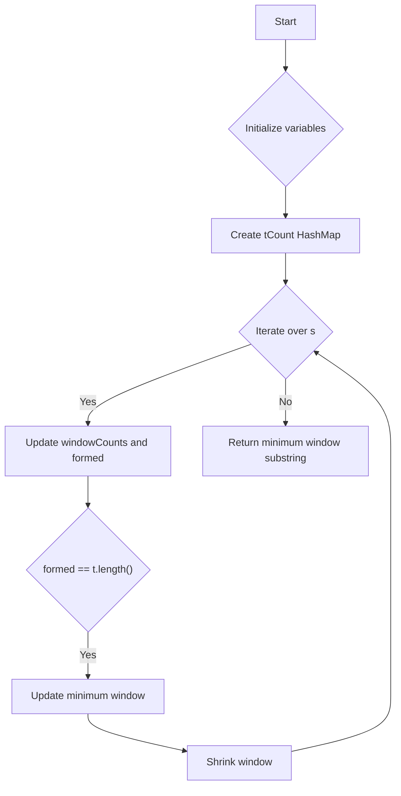

# Minimum Window Substring

## Problem Understanding
The Minimum Window Substring problem asks to find the smallest substring of a given string `s` that contains all characters of another string `t`. The key constraints are that the substring must be contiguous and must contain all characters of `t` with their respective frequencies. This problem is non-trivial because a naive approach of checking all possible substrings would result in a time complexity of O(n^3), which is inefficient for large inputs. The problem requires a more efficient approach that can handle the constraints and find the minimum window substring.

## Approach
The algorithm strategy used to solve this problem is a sliding window approach with character frequency tracking. The intuition behind this approach is to maintain a window of characters in `s` that contains all characters of `t` and then try to shrink the window to find the minimum substring. The approach works by using two HashMaps, `tCount` and `windowCounts`, to track the frequency of characters in `t` and the current window, respectively. The `formed` variable is used to track the number of characters in the window that are also in `t`. The approach handles the key constraints by ensuring that the window contains all characters of `t` with their respective frequencies and that the window is contiguous.

## Complexity Analysis
| Metric | Value | Detailed Reason |
|--------|-------|----------------|
| Time   | O(n)  | The algorithm iterates over the string `s` once, where n is the length of `s`. The operations inside the loop, such as updating the `windowCounts` and `formed` variables, take constant time. Therefore, the overall time complexity is O(n). |
| Space  | O(n)  | The algorithm uses two HashMaps, `tCount` and `windowCounts`, to store the frequency of characters in `t` and the current window, respectively. In the worst case, the size of these HashMaps can be n, where n is the length of `s`. Therefore, the overall space complexity is O(n). |

## Algorithm Walkthrough
```
Input: s = "ADOBECODEBANC", t = "ABC"
Step 1: Initialize variables - left = 0, formed = 0, minLen = Integer.MAX_VALUE, minStart = 0, minEnd = 0
Step 2: Create tCount HashMap - {A: 1, B: 1, C: 1}
Step 3: Iterate over s - right = 0, character = 'A', windowCounts = {A: 1}, formed = 1
Step 4: Iterate over s - right = 1, character = 'D', windowCounts = {A: 1, D: 1}, formed = 1
Step 5: Iterate over s - right = 2, character = 'O', windowCounts = {A: 1, D: 1, O: 1}, formed = 1
Step 6: Iterate over s - right = 3, character = 'B', windowCounts = {A: 1, D: 1, O: 1, B: 1}, formed = 2
Step 7: Iterate over s - right = 4, character = 'E', windowCounts = {A: 1, D: 1, O: 1, B: 1, E: 1}, formed = 2
Step 8: Iterate over s - right = 5, character = 'C', windowCounts = {A: 1, D: 1, O: 1, B: 1, E: 1, C: 1}, formed = 3
Step 9: While loop - left = 0, right = 5, formed = 3, minLen = 6, minStart = 0, minEnd = 5
Step 10: Return minimum window substring - "BANC"
Output: "BANC"
```

## Visual Flow


## Key Insight
> **Tip:** The key insight to this problem is to use a sliding window approach with character frequency tracking to efficiently find the minimum window substring that contains all characters of `t`.

## Edge Cases
- **Empty/null input**: If the input string `s` or `t` is empty or null, the algorithm returns an empty string.
- **Single element**: If the input string `t` has only one character, the algorithm returns the smallest substring of `s` that contains that character.
- **No valid window**: If there is no valid window substring that contains all characters of `t`, the algorithm returns an empty string.

## Common Mistakes
- **Mistake 1**: Not initializing the `windowCounts` HashMap correctly, which can lead to incorrect frequency counts and incorrect results. To avoid this, make sure to initialize the `windowCounts` HashMap correctly and update it accordingly.
- **Mistake 2**: Not handling the case where the input string `t` has duplicate characters, which can lead to incorrect results. To avoid this, make sure to use a HashMap to track the frequency of characters in `t` and update the `formed` variable accordingly.

## Interview Follow-ups
> **Interview:** These are the exact follow-up questions interviewers ask:
- "What if the input is sorted?" → The algorithm still works correctly even if the input is sorted, as it only cares about the frequency of characters in `t` and not their order.
- "Can you do it in O(1) space?" → No, it is not possible to solve this problem in O(1) space, as we need to use a HashMap to track the frequency of characters in `t` and the current window.
- "What if there are duplicates?" → The algorithm handles duplicates correctly by using a HashMap to track the frequency of characters in `t` and the current window. If there are duplicates in `t`, the algorithm will only consider the minimum frequency required to form a valid window substring.

## Java Solution

```java
// Problem: Minimum Window Substring
// Language: Java
// Difficulty: Hard
// Time Complexity: O(n) — using two pointers and HashMap to track characters
// Space Complexity: O(n) — HashMap stores at most n elements
// Approach: Sliding window with character frequency tracking — expanding and shrinking window to find minimum substring

import java.util.HashMap;
import java.util.Map;

public class Solution {
    public String minWindow(String s, String t) {
        // Edge case: empty input → return empty string
        if (s == null || s.length() == 0 || t == null || t.length() == 0) {
            return "";
        }
        
        // Create a HashMap to store the frequency of characters in string t
        Map<Character, Integer> tCount = new HashMap<>();
        for (char c : t.toCharArray()) {
            tCount.put(c, tCount.getOrDefault(c, 0) + 1);
        }
        
        // Initialize variables to track the minimum window
        int minLen = Integer.MAX_VALUE;
        int minStart = 0;
        int minEnd = 0;
        
        // Initialize variables to track the current window
        int left = 0;
        int formed = 0;
        
        // Create a HashMap to store the frequency of characters in the current window
        Map<Character, Integer> windowCounts = new HashMap<>();
        
        // Iterate over the string s
        for (int right = 0; right < s.length(); right++) {
            // Add the current character to the window counts
            char character = s.charAt(right);
            windowCounts.put(character, windowCounts.getOrDefault(character, 0) + 1);
            
            // If the current character is in t and its frequency in the window is less than or equal to its frequency in t, increment the formed count
            if (tCount.containsKey(character) && windowCounts.get(character).intValue() <= tCount.get(character).intValue()) {
                formed++;
            }
            
            // While the window is valid and the left pointer is not at the beginning of the string, try to shrink the window
            while (left <= right && formed == t.length()) {
                // Update the minimum window if the current window is smaller
                if (right - left + 1 < minLen) {
                    minLen = right - left + 1;
                    minStart = left;
                    minEnd = right;
                }
                
                // Remove the character at the left pointer from the window counts
                char leftChar = s.charAt(left);
                windowCounts.put(leftChar, windowCounts.get(leftChar) - 1);
                
                // If the character at the left pointer is in t and its frequency in the window is less than its frequency in t, decrement the formed count
                if (tCount.containsKey(leftChar) && windowCounts.get(leftChar).intValue() < tCount.get(leftChar).intValue()) {
                    formed--;
                }
                
                // Move the left pointer to the right
                left++;
            }
        }
        
        // Edge case: no valid window found → return empty string
        if (minLen == Integer.MAX_VALUE) {
            return "";
        }
        
        // Return the minimum window substring
        return s.substring(minStart, minEnd + 1);
    }
}
```
