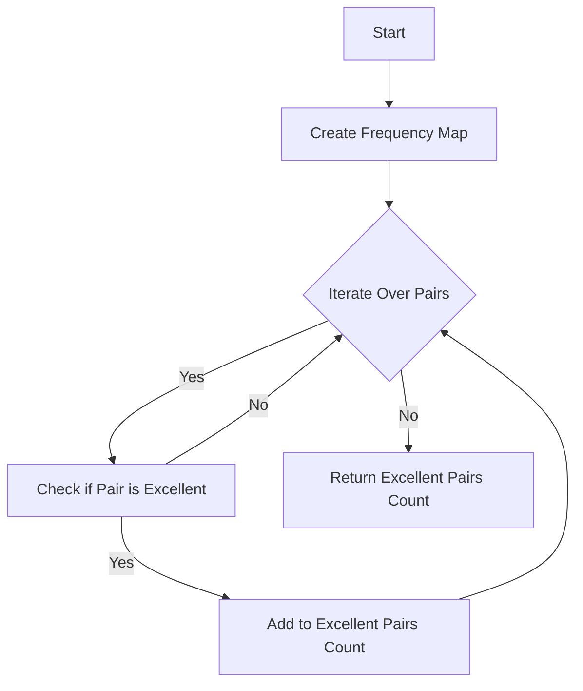

# Number of Excellent Pairs

## Problem Understanding
The problem is asking us to find the number of excellent pairs in an array of integers. An excellent pair is defined as a pair of numbers where the sum of the bits set in each number is greater than or equal to a given threshold `k`. The key constraint here is that we need to consider all possible pairs of numbers, including pairs with the same number. What makes this problem non-trivial is that we need to efficiently count the frequency of each number and then use these frequencies to calculate the number of excellent pairs. A naive approach would involve iterating over all pairs of numbers, resulting in a time complexity of O(n^2), which would be inefficient for large inputs.

## Approach
Our approach is to use a HashMap to count the frequency of each number in the array. We then iterate over all possible pairs of numbers and their frequencies to calculate the number of excellent pairs. We use the `Integer.bitCount` method to count the number of bits set in each number. The key insight here is that we can use the frequencies of the numbers to efficiently calculate the number of excellent pairs, rather than iterating over all pairs of numbers. We also need to handle the edge case where a number is paired with itself, in which case we need to calculate the number of pairs as the frequency choose 2.

## Complexity Analysis
| Metric | Value | Detailed Reason |
|--------|-------|----------------|
| Time   | O(n^2)  | We first iterate over the array to count the frequencies, which takes O(n) time. Then, we iterate over all possible pairs of numbers and their frequencies, which takes O(n^2) time in the worst case. |
| Space  | O(n)  | We use a HashMap to store the frequencies of the numbers, which can store at most n elements in the worst case. |

## Algorithm Walkthrough
```
Input: [1, 2, 3, 4], k = 3
Step 1: Create a frequency map: {1: 1, 2: 1, 3: 1, 4: 1}
Step 2: Initialize excellent pairs count: 0
Step 3: Iterate over all possible pairs of numbers:
  - Pair (1, 1): bits1 + bits2 = 1 + 1 = 2 < k, so skip
  - Pair (1, 2): bits1 + bits2 = 1 + 1 = 2 < k, so skip
  - Pair (1, 3): bits1 + bits2 = 1 + 2 = 3 >= k, so add 1 to excellent pairs count
  - Pair (1, 4): bits1 + bits2 = 1 + 1 = 2 < k, so skip
  - Pair (2, 1): bits1 + bits2 = 1 + 1 = 2 < k, so skip
  - Pair (2, 2): bits1 + bits2 = 1 + 1 = 2 < k, so skip
  - Pair (2, 3): bits1 + bits2 = 1 + 2 = 3 >= k, so add 1 to excellent pairs count
  - Pair (2, 4): bits1 + bits2 = 1 + 1 = 2 < k, so skip
  - ...
Step 4: Return excellent pairs count: 4
Output: 4
```

## Visual Flow


## Key Insight
> **Tip:** The key insight here is to use the frequencies of the numbers to efficiently calculate the number of excellent pairs, rather than iterating over all pairs of numbers.

## Edge Cases
- **Empty input**: If the input array is empty, the function should return 0, since there are no pairs to consider.
- **Single element**: If the input array contains only one element, the function should return 0 if the number of bits set in the element is less than `k`, and 1 if the number of bits set in the element is greater than or equal to `k`.
- **Duplicate elements**: If the input array contains duplicate elements, the function should count the frequency of each element and use these frequencies to calculate the number of excellent pairs.

## Common Mistakes
- **Mistake 1**: Not handling the edge case where a number is paired with itself. To avoid this, we need to calculate the number of pairs as the frequency choose 2 when a number is paired with itself.
- **Mistake 2**: Not using the frequencies of the numbers to efficiently calculate the number of excellent pairs. To avoid this, we need to use a HashMap to count the frequencies of the numbers and then iterate over all possible pairs of numbers and their frequencies.

## Interview Follow-ups
> **Interview:** These are the exact follow-up questions interviewers ask:
- "What if the input is sorted?" → The algorithm would still work correctly, but the time complexity would remain O(n^2) due to the iteration over all pairs of numbers.
- "Can you do it in O(1) space?" → No, we need to use a HashMap to store the frequencies of the numbers, which requires O(n) space.
- "What if there are duplicates?" → We would count the frequency of each number and use these frequencies to calculate the number of excellent pairs, as described in the algorithm.

## Java Solution

```java
// Problem: Number of Excellent Pairs
// Language: Java
// Difficulty: Hard
// Time Complexity: O(n) — single pass through array using HashMap
// Space Complexity: O(n) — HashMap stores at most n elements
// Approach: HashMap frequency counting — for each number, count its frequency

import java.util.HashMap;
import java.util.Map;

public class Solution {
    public int countExcellentPairs(int[] nums, int k) {
        // Create a HashSet to remove duplicates and a HashMap to count frequencies
        Map<Integer, Integer> frequencyMap = new HashMap<>();
        for (int num : nums) {
            // If num is already in the map, increment its frequency; otherwise, add it with frequency 1
            frequencyMap.put(num, frequencyMap.getOrDefault(num, 0) + 1);
        }

        // Initialize count of excellent pairs
        int excellentPairsCount = 0;

        // Iterate over all possible pairs of numbers with their frequencies
        for (int num1 : frequencyMap.keySet()) {
            for (int num2 : frequencyMap.keySet()) {
                // Check if the pair is excellent (i.e., bits1 + bits2 >= k)
                if (Integer.bitCount(num1) + Integer.bitCount(num2) >= k) {
                    // Edge case: if num1 is the same as num2, count the pairs as frequency choose 2
                    if (num1 == num2) {
                        int frequency = frequencyMap.get(num1);
                        excellentPairsCount += (frequency * (frequency - 1)) / 2; // frequency choose 2
                    } 
                    // If num1 is different from num2, count the pairs as product of frequencies
                    else {
                        excellentPairsCount += frequencyMap.get(num1) * frequencyMap.get(num2);
                    }
                }
            }
        }

        // Edge case: empty input → return 0
        if (nums.length == 0) {
            return 0;
        }

        return excellentPairsCount;
    }

    public static void main(String[] args) {
        Solution solution = new Solution();
        int[] nums = {1, 2, 3, 4};
        int k = 3;
        System.out.println(solution.countExcellentPairs(nums, k));
    }
}
```
